# Worldline on G1: build plan

**Status:** plan, revision 2, 2026-09-28. Revised after an adversarial review; §16 lists what changed and which critique items were rejected.

**What is being ported:** Worldline, the runtime at `/Users/nirty/workspace/ludo/ludo-runtime`. It is read-only, and this plan starts from HEAD `cb4ce53`.

**Where it goes:** this directory, `/Users/nirty/workspace/ludo-interview/worldline-g1`. It already contains an empty `git init` and a `.gitignore`.

**Robot API reference:** `/Users/nirty/Downloads/ludi_robot_api_architecture.md`, cited below as "doc §N".

**Evidence tags used throughout:**

| Tag | Meaning |
|---|---|
| **[v]** | Verified in source during planning. The file and line are listed in §15. |
| **[u]** | Unverified. Each one has a named check in a milestone. |
| **[WL]** | A Worldline extension beyond the Ludi doc. |
| **STEPPING STONE** | A labelled bring-up shortcut. It sits behind the same service interface as the target executor, and it is named in every result, in the UI and in eval reports. |

This plan combines three independent designs:

- **contract-first** is the spine. It supplies the `api/` contract, parity profiles and wire protocols.
- **vertical-slice** supplies the two-track schedule, the spikes-first ordering, the authored household scene and the demo flows.
- **robot-stack** supplies the physical execution layer: the body server, halt semantics, carry lock, real-time guard, the failure table and the GR00T session fencing.

Every conflict between the three is resolved in §1.3, with the reason.

## 0. Owner decisions (2026-09-28). These override the rest of this plan where they conflict.

1. **Milestone order.** First: a SONIC-controlled G1 walking in a household scene in Isaac Sim, driven and verified through our own robot API. Worldline integration starts only after that works. The owner's **"M1"** therefore = this plan's **S1 + S3 walking scope + B0**, run as `worldline-g1` M1 (exit criteria E1–E7 in `docs/M1.md` / the M1 workflow). This plan's M0/M1/M2 runtime-port milestones follow it. GR00T (S2/M4/M6) comes after the runtime is on the G1.
2. **Controller: SONIC only.** No AGILE / Isaac-Lab-IK fallback track. If Isaac cannot hold RTF ≥ 1 for the wall-clock deploy, the fallback is still SONIC: in-process lockstep SONIC, or a sim-clock deploy patch (R2 fallbacks).
3. **Scene: AllenAI MolmoSpaces ProcTHOR/iTHOR houses in USD**, the same houses Worldline uses on THOR. This replaces the authored `wl_house` default in §7/§14 Q3. `wl_house` is only a fallback if MolmoSpaces houses are not walkable.
4. **Box: NVIDIA Brev `ludo-g1-brev2`** (Nebius 1× L40S, 16 vCPU, 62 GiB, 484 GB, Ubuntu 24.04, driver 580.173.02), reached through `ludo_robotics_prep_g1/00_infra/` (§14 Q1 resolved). AWS is archived at `_archive/aws_infra/` and is not used.
5. **Cosmos-Reason2-2B licence: accepted.** The backbone is cached on the box (§14 Q16 resolved).
6. **Visual verification + browser streaming are part of M1:** `viz/` provides the recorder (head/chase/top-down mp4 + composite + contact sheet, pulled to the laptop) and a live browser console at 127.0.0.1:8765 (via `00_infra/tunnel.sh 8765`). The Worldline UI reuses this feed later.
7. **Arms vs legs (decision "b", 2026-09-29; `docs/arena_vs_sonic.md`, `docs/arm_tracking.md`, `docs/groot_arms_design.md`).**
   SONIC stays the only body controller. **Legs** = SONIC's planner, driven by navigation (`navigate` → keypoint stand → `go_to` via A*/Nav2); `manipulate` never walks (`navigate(reach_stance)` repositions). **Arms + hands + waist** = the body `arm` op, which streams joint targets into SONIC's planner upper-body override (17-D `upper_body_position` in SONIC's interleaved order + 7-D Dex3 per hand); one arm owner at a time. Executors: `sonic_arm_script` (scripted reach/grasp/lift through the `arm` op, M2b interim), `groot_arms` (GR00T N1.7 fine-tuned to output arm/hand joint chunks → `arm` op at 50 Hz; replaces the token-based `groot_sonic`), `kinematic_attach` (labelled stepping stone for "object stays in hand" until the Dex3 grasp is reliable). The arrival scan's target executor is the waist scan through the `arm` op.
8. **Build order after M2a (2026-09-29): integrate and test the whole loop first.** Nav2 is **deferred**: `go_to` stays on A* + pure pursuit, and the Nav2 backend stays in the tree, untouched. GR00T demo collection and fine-tuning (M6, L4) are **deferred** too. The next build is one combined milestone: **M2b live integration + `groot_arms` + GR00T in the Worldline loop**, tested end to end. GR00T runs an **off-the-shelf** checkpoint that already outputs G1 arm + Dex3 hand joints: `nvidia/GN1x-Tuned-Arena-G1-Static-PickNPlace` (N1.7; `docs/arena_vs_sonic.md`). It was trained on one apple-to-plate scene, so in a house it is expected to move the arms plausibly but usually **not** complete the grasp. The test therefore proves the plumbing and the control semantics (arm lease, cancel, halt, stale chunk, policy down, hand-off to the labelled fallback), not skill success. Every pass is reported per executor; the scripted and attach executors stay labelled STEPPING STONE.
9. **G0 arm tracking: conditional GO (2026-09-29; `docs/arm_tracking.md`, commit 875b542).** SONIC stays balanced with the arms driven, standing and walking (0 falls, all walks and 180° turns succeeded). Raw tracking misses the pre-set bar (latency 127-215 ms, held-pose palm error 17-52 mm); with the body's correction loop on and chunks sent 0.15 s early it is 2-13 mm held and 9-17 mm RMS while carrying, but the scripted reach-grasp-lift stays at 22-28 mm RMS. Conditions: the correction loop stays on; `groot_arms` sends each chunk about 0.15 s (7 steps) ahead; wrist pitch is treated as about ±0.1 rad (SONIC barely moves it); waist pitch is not commanded. Open defects before GR00T runs: `stop {arms: true}` does not stick while the owner keeps streaming (D1); a halt never touches the arms (D2; needs the halt latch: hold the measured pose, never open the hands); a watchdog-ended session reports `succeeded`; the Dex3 thumb joints do not move in P1 (asset problem, blocks real grasps). Lead decisions for the zero-shot test: **OD1** two cameras (an Arena-matched `ego_view` for GR00T, rendered only during GR00T sessions, plus a System 1 head camera); **OD2** not needed while fine-tuning is deferred; **OD3** PolicyServer on the dev box, tunnelled to the main box; **OD4** the checkpoint's own task (apple, left hand).
10. **Wave-1 exit-bar decisions (lead, 2026-09-29; `docs/M2b_wave1.md` on branch `m2b-wave1`).** (a) **P1.6 visibility:** P1 instance segmentation agrees exactly with gt-geometric on 66% of views (Jaccard 0.84); every inspected disagreement favoured the render. Segmentation is therefore the source of truth for glances, scans and the GR00T view check; gt-geometric stays for cheap callers. The 90% agreement bar is replaced by a 20-view hand audit in wave 2. (b) **P1.4 RTF bar:** p10 ≥ 0.98 (the walk_diagnosis timing gate), not 1.0; measured 0.993-0.997 with head + ego_view. (c) **R.7** (measured walk speed and stop times into `PROFILES['sonic']`/`config/g1.yaml`, workspace calibration) is a wave-2 task; it is also the fix for E-1's reachability failures (13/17 on lite). (d) Live runs follow walk_diagnosis rules 1 and 3: a run with another GPU job or heartbeats during motion is marked INVALID, except runs that deliberately measure the GR00T client's load.
11. **OD3 revised by the owner (2026-09-29): the GR00T PolicyServer runs on the MAIN box** (127.0.0.1:5550, no tunnel), next to Isaac and the SONIC deploy; the dev box stays off. The SONIC timing gate with GR00T inference active is measured standing (where GR00T runs) and walking (informational); if it fails standing, mitigate (CPU pinning away from the deploy, inference rate, CUDA MPS) before GR00T runs are trusted.
12. **OD3 back to the dev box (owner, 2026-09-29), superseding item 11.** Measured on the main box with GR00T local: standing with inference, RTF p10 0.84-0.97 and irregular leg-target windows 0.39-0.57 (bar 0.98 / 0.15) even with CPU pinning and 15/10 Hz cameras; GPU time-slicing between Isaac, the TensorRT deploy and GR00T plus the client's CPU load break SONIC's wall-clock timing. The PolicyServer therefore runs on the dev box `ludo-g1-arena` and is reached through the OD3 tunnel; the timing gate is re-measured with the remote server (the client, the ego_view render and the request encoding stay on the main box and must still pass the gate).
13. **Clock mode (owner, 2026-09-29; `docs/simtime_options.md`).** Stay on the wall clock for the interview POC (option A): the unmodified deploy, GR00T off-box, CPU pinning and the timing gate. If the gate still fails with the PolicyServer on the dev box, or GR00T must share the main box, apply option B: a `--sim-clock` scheduling patch to `gear_sonic_deploy` (lockstep with P1; policy, planner and observation code unchanged; off by default). Longer term: option D (switchable wall/lockstep for the whole stack), built from B.

---

## Contents

1. Summary
2. Definition of done
3. System architecture
4. Repository layout and port table
5. The robot/tool API
6. Services (typed interfaces)
7. The sim stack
8. System 1 and the observation path
9. Eval suite and UI
10. Test strategy
11. Milestones
12. Risks, fallbacks and honesty labels
13. The later no-GT stage
14. Open questions
15. Appendix: cited sources
16. Revision notes

---

## 1. Summary

### 1.1 What we are building

We are building **Worldline on G1**: Worldline's runtime driving a Unitree G1 humanoid in an Isaac Sim household.

**What stays from Worldline:**

- **System 1** keeps both of its live paths:
  - Jev (TypeSafe) labels every user message in 80–200 ms.
  - A Gemini Live observer watches camera frames that pass a frame gate.
- **System 2** is an LLM planner that makes exactly one tool call per turn.
- **The runtime** checks every call, keeps belief separate from ground truth, computes layout relations and runs a goal check. It also keeps spatial, episodic and procedural memory, and runs a persona, a narrator, a live web UI and a 17-scenario eval.

**What changes:**

- **Environment:** AI2-THOR is replaced by **Isaac Sim 5.1 / Isaac Lab 2.3.2**, running an authored household scene.
- **Robot:** the THOR agent is replaced by a **Unitree G1** (29 DoF plus Dex3 hands).
- **Body control:** every body motion goes through **GEAR-SONIC**. That covers walking, waist scans, arm reaching, and decoding GR00T motion tokens.
- **Manipulation:** it comes from **GR00T N1.7** with the `UNITREE_G1_SONIC` embodiment. Each action step is a 64-D SONIC motion token plus 7+7 hand joints, over a 40-step horizon. These tokens are whole-body motion latents, so during a `manipulate` GR00T drives the whole body through SONIC, not only the arm and gripper. This departs from doc §15; it is recorded in §5.11 and `docs/parity.md`.
- **Tools:** Worldline's `say/navigate/look/reachability/pick/place/recall/wait` become the doc's six tools: `speak`, `list_locations`, `navigate`, `check_reachability`, `manipulate`, `wait_and_observe`. `recall` stays as a [WL] extension.
- **Execution model:** it adopts the doc's execution objects, generation IDs, result envelopes, context events, tool-state machine and service boundaries. This redesign is part of the main build, not a later stage.

**Ground truth.** Isaac ground truth is allowed as a hint, as ProcTHOR ground truth is today. That includes object ids and poses, visibility, receptacles, rooms, reachability geometry and success signals. It is read in exactly one layer (`world/` on the runtime side, `isaac_host/gt_server.py` in the simulator), so a perception stack can replace it later (§13).

### 1.2 Architecture in one paragraph

There are five processes on one L40S box. The task names an AWS g6e.2xlarge (8 vCPU). The prep repo's live tooling (`00_infra/`) currently drives a Brev/Nebius L40S (16 vCPU, 64 GB) instead, because the AWS G-instance quota is stuck. §3.4 covers both boxes.

**P1 `wl-isaac`** runs Isaac Sim 5.1:

- the house and the G1, with PhysX at 200 Hz;
- a **Unitree DDS bridge**, so the simulated G1 looks to the controller exactly like the real one;
- a head camera for System 1 and the UI, an ego camera (D435 mount) for GR00T, and a one-off top-down render;
- a **ground-truth server**.

**P2 `wl-sonic`** is the **unmodified C++ `gear_sonic_deploy`** in `zmq_manager` mode, in `sim`. It is the same binary as on the real G1.

**P3 `wl-body`** is the **SONIC controller bridge (BodyServer)**:

- It is the *only* binder of SONIC's input port 5556.
- It owns the body through leases fenced by execution id, generation and control epoch.
- It runs a 50 Hz path follower that sends SONIC `planner` messages for walking, and an arm-script and carry-lock layer.
- It runs a **VlaStreamer**, a fork of `run_vla_inference.py`, which streams GR00T token chunks into SONIC as protocol-v4 `pose` messages.
- A user "stop" becomes a balance-preserving HOLD latch. It is never the deploy's `command{stop}`, which collapses the robot **and ends the deploy process** (§6.6). A fall in sim is also handled without `command{stop}` (§7.3.3).

**P4 `wl-policy`** is the Isaac-GR00T PolicyServer, one per resident checkpoint.

**P5 `wl-runtime`** is Worldline:

- the harness, System 1 and System 2, the UI and memory;
- the **services** behind the Ludi tools: `NavigationService`, `ManipulationService` (with a skill registry and the GR00T execution layer), `ObservationService`, `SpeechService`, and locations;
- a `RobotBridge` façade.

The **`WorldModel`** client in P5 is the only ground-truth reader on the runtime side.

The same contract runs on four profiles. In each one the tool schemas, prompt, envelopes and harness rules are identical; only the executors differ:

- `lite`: pure Python on the Mac;
- `bringup`: Isaac with a kinematic base and attach grasp, both STEPPING STONE;
- `sonic`: SONIC walking plus SONIC arm-script reaching with a ground-truth attach grasp, the grasp being the STEPPING STONE;
- `full`: SONIC walking plus GR00T manipulation.

A fifth profile, `real_g1`, is a parity skeleton.

### 1.3 Decisions and conflict resolutions

| # | Topic | Decision | From | Rejected alternative | Reason |
|---|---|---|---|---|---|
| 1 | Plan spine | `api/` contract package (stdlib only, imported by the py3.11 runtime, the py3.12 body server and the py3.11 Isaac process) plus parity profiles | contract-first | Services defined ad hoc per process | The API redesign is part of the main build; one contract keeps sim and real parity testable (doc §33) |
| 2 | Schedule | Two tracks: **R** (Mac/CPU, no GPU) and **S** (GPU spikes first: SONIC-in-Isaac, GR00T→SONIC, scene/RTF) | vertical-slice | Strictly linear M0..Mn | The GPU quota is pending, and the riskiest unknowns are physical |
| 3 | SONIC integration | Isaac DDS bridge plus **unmodified** `gear_sonic_deploy` (`zmq_manager`, `sim`) | all three | In-process SONIC in Isaac Lab (kept as the §7.3.6 contingency); MuJoCo physics with Isaac rendering | Same binary, DDS and ZMQ as the real robot. SONIC was trained in Isaac PhysX at dt 0.005 with implicit PD |
| 4 | Who owns 5556 | One **BodyServer** process is the sole binder. It holds a lease and mode machine, and runs the path follower in-process at 50 Hz | robot-stack + vertical-slice | Runtime-side follower at 20 Hz (contract-first) | `run_vla_inference.py:392` **binds** 5556 [v], so planner and token publishers must be muxed. Keeping 50 Hz control out of the asyncio LLM process avoids jitter. On a real robot this process is the onboard "locomotion + VLA executor" box |
| 5 | Halt | Latch HOLD: cut tokens or the arm script, then planner IDLE, and reject stale epochs. The receipt's `stopped` means "latched" (acknowledged within 30 ms); `at_rest` is reported separately. **Never** send `command{stop}` for a user stop | robot-stack + contract-first | `command{stop}` | `command{stop}` sets `operator_state.stop` (`zmq_manager.hpp:341-360` [v]). The main loop then exits, `Stop()` joins every thread and writes `CreateDampingCommand()`, and `main` returns 0 (`g1_deploy_onnx_ref.cpp:2718-2745, 4513-4534` [v]). The robot collapses **and the deploy process is gone**; a second `command{start}` has nobody to receive it. Leaving that state always needs a P2 restart |
| 6 | Scene | Authored **SceneSpec household `wl_house`** with variants `a/b/k` in the roles of ProcTHOR H40, H15 and Kitchen 10. Object and furniture meshes come from the MolmoSpaces THOR asset library where they load, else primitive proxies (labelled). MolmoSpaces ProcTHOR house import comes later (M7), through the same `scene_desc.json` | vertical-slice (layout) + contract-first/robot-stack (assets) | MolmoSpaces `procthor-train-40/15` + `FloorPlan10` as the primary eval homes | A deterministic, G1-reachable layout that is tuned once for SONIC walkability and RTF. The eval needs exact facts (alarm clock in the bedroom, no banana, stove between two counters). MolmoSpaces has four unverified dependencies: the house-index mapping, `InteractiveScene` reverting collision groups, a Lab 2.3.1 pin, and 0.16 m shelves |
| 7 | Cameras | **`head`**: sim-added, on the torso at about 1.35 m, 90° HFOV, 15° down. Used by System 1, the UI, scans and visibility. **`ego`**: at the `d435_link` pose, which `tools/build_g1_usd.py` adds to the training URDF (§7.2), 640×480, for GR00T. **`top`**: rendered once per scene. `system1.camera: head\|ego` is switchable | robot-stack | Ego only (contract-first, vertical-slice) | The ego camera is pitched about 44° down and sees floor 0.56–3.3 m ahead and nothing above about 1.3 m, which would starve the Gemini observer. Ludi's own robot adds a head panorama camera (doc §1, §45), so a wide head camera is *closer* to the doc. It is labelled as sim-added in `docs/parity.md` |
| 8 | Looking without a neck | `look` is **not** a planner tool. It is replaced by: an automatic arrival scan after every successful keypoint `navigate`; `wait_and_observe`, which always starts with an observation (`timeout_s=0` means "look once"); and internal verify/reconcile looks. A scan is two rows of waist yaw −35°/0/+35°: waist pitch 0°, then waist pitch +20° (down). It is sent through the planner's `upper_body_position` (17 DoF, `zmq_manager.hpp:885-913` [v], in SONIC's interleaved order, §6.6). Absence is asserted only for positions inside the 3-D view frustum (§5.10). **Every** `ToolResult` carries the `observation_id` of the latest glance (§5.3) | all three | Keep `look` as a 7th tool | Doc §42/§45/§51: every result is followed by an observation. The glance is a cached 10 Hz GT perception snapshot: no motion and no new render. `WL_LOOK_TOOL=1` re-adds `look` if the eval regresses |
| 9 | Object identity | `object_type` is required and its enum comes from the registry (doc §13/§49). `object_id` [WL] is optional, with its enum from belief. Reachability binds an instance and pick inherits it | all three | Type-only | Belief, the goal check and eval need instance ids (`alarm_clock_1`) |
| 10 | Registry vocabulary | The fallback skills' `object_types` are a **fixed THOR pickupable vocabulary** (`config/vocab/pickupable_types.yaml`), never the scene catalog | contract-first | `*pickupable` = scene catalog types (robot-stack) | Deriving the enum from scene GT would tell the planner which types exist, e.g. "no banana", and break the `missing_object` scenario |
| 11 | Manipulation backends | `groot` (target); `sonic_arm_script` (SONIC reaches with its arms through planner-mode upper-body targets, then a GT attach; STEPPING STONE); `kinematic_attach` (bring-up only). The `full` profile's `groot_then_script` policy records both attempts in one execution | robot-stack + vertical-slice | A single "attach fallback" (contract-first) | In the `sonic` profile every motion is still SONIC's, so only the grasp is faked. That is honest and exercises the real body |
| 12 | Carry | **CarryLock**: after a grasp, every planner message carries the post-grasp 17-DoF upper body and hand joints. The upper body is read from `g1_debug.body_q` (MuJoCo order) through `body/joint_map.UPPER_BODY_FROM_MUJOCO` (§6.6), never as a contiguous slice | robot-stack | Hand-only hold | Without it the first step's arm swing drops the object |
| 13 | Profiles | `lite`, `bringup`, `sonic`, `full`, `real_g1` (skeleton) | robot-stack names + contract-first parity | `isaac_stage_a/b` | The names say what is real |
| 14 | Mac backend | `lite` world, body and executors: pure Python, reading the same SceneSpec | all three | — | Lets M0/M1 land before the GPU quota |
| 15 | Status vocabulary | Lowercase envelope statuses everywhere (`succeeded, failed, cancelled, timed_out, rejected` plus the execution states `queued, running, cancelling, dropped`), renamed mechanically in one commit | contract-first | Keep `SUCCEEDED/ABORTED` | One vocabulary; `ABORTED` becomes `failed` and its `reason` is kept |
| 16 | Place target | Optional; defaults to the surface at the current keypoint. It must be served from the current keypoint, otherwise `rejected: navigate to X first`. Place never walks | all three | Auto-navigate | One action per turn (doc §29 flow) |
| 17 | Directly preceded (doc §12) | The newest successful `check_reachability` for this `object_type` (and bound `object_id`) must be the last execution with a `sense`, `body` or `wait` resource. Only `speak`, `list_locations` and `recall` may sit between. No base motion since, and the time-to-live is `REACH_FRESH_S=30`. There is **no exemption**: `manipulate` never moves the base itself (#26), and a `navigate(reach_stance)` reposition is base motion, so it must be followed by a new check | contract-first | `wait_and_observe(0)` allowed between (vertical-slice) | A scan moves the waist, so it counts as motion |
| 18 | Halt transport | Dedicated PUSH halt lane (5612, `NOBLOCK`), then a poll for `body.halted{epoch}` on the event SUB for up to 30 ms | vertical-slice + contract-first | A request/reply round trip | Never blocked behind a queued command |
| 19 | Timing | Wall clock, `SimClock(1.0)`. Isaac must run at RTF ≥ 1. A lowstate heartbeat thread plus a render governor. `DEGRADED` below 0.95 and `UNSAFE` below 0.85 | robot-stack | Sim-time lockstep | The deploy has wall-clock threads only, and `CheckSafety()` stops control when lowstate is more than 500 ms old (`g1_deploy_onnx_ref.cpp:299,2797` [v]) |
| 20 | Physics device | CPU PhysX first (one robot); GPU as an A/B test | all three | — | No GPU sync cost for a single environment; measured in S1/S3 |
| 21 | GR00T checkpoints | The community cloudwalk `UNITREE_G1_SONIC` bottle checkpoint is **plumbing only** (unofficial; Inspire-hand data vs Dex3 deploy). The target skill is fine-tuned **off-box** on Isaac-collected demos (M6) | all three | Treat the community checkpoint as a skill | Zero-shot domain and hand mismatch |
| 22 | Tool timeouts | Navigate: `clamp(1.8·path_m/v + 12, 20, 240)`. Manipulate: `skill.max_duration_s + 10`. Cancel grace: 3.0 s for body tools, 1.5 s for others, then `halt()` | robot-stack | 2.5 s grace | SONIC deceleration and the token blend take up to about 1.5 s |
| 23 | `sim/` package | Keep the name (`clock.py`, `log.py`); delete `goals.py` | robot-stack | Rename to `core/` | Pure churn across about 10 importers |
| 24 | Keys | New repo `.env` (from `.env.example`, filled by the user) or `~/.config/ludo-g1/secrets.env` (installed on the box by the box's `secrets.sh`). Keys: `GEMINI_API_KEY`, `ANTHROPIC_API_KEY`, `TYPESAFE_API_KEY`, and **`HF_TOKEN`**, which every GR00T N1.7 checkpoint needs for the gated Cosmos-Reason2-2B backbone. `ludo-runtime/.env` is **never** read or copied, and `.env*` is never rsynced | all three | — | Hard constraint |
| 25 | GR00T's reach (doc §15 deviation) | `UNITREE_G1_SONIC` tokens are whole-body latents decoded by SONIC, so GR00T drives all 29 DoF plus hands during `manipulate`. The **semantic** boundary is kept: `manipulate` never resolves keypoints, plans paths or walks. SONIC is one exclusive body resource (one lease). Base drift caused by a skill is reported in `data.base_shift_m` and invalidates reachability | review | Claim "arm + gripper only" | That is how the embodiment works. The deviation is listed in §5.11 and `docs/parity.md` |
| 26 | Reposition (doc §9 handoff) | `check_reachability` judges **only from the current pose**. If the object could be manipulated from a stance within `approach_max_m`, it returns `reachable=false, reason="needs_reposition"` together with that stance. The planner then calls `navigate(location="reach_stance")`, which NavigationService executes as a short SONIC reposition (§6.3). The planner then checks reachability again. `manipulate` has **no approach phase** | review | An `approach` phase inside `manipulate` (rev. 1) | This keeps doc §9's flow exactly: reachable=false → navigate/reposition → check again → manipulate. The `reach_stance` enum value is [WL] |
| 27 | Enum lifetime (doc §49) | Tool enums are **frozen per session**. They change only when a skill is loaded or unloaded, which happens at session start. A skill that turns unhealthy stays in the enum and is rejected at CAPABILITY with `policy unavailable: …` | review | Recompute per body mode and health (rev. 1) | Stable schemas keep provider prompt caching valid and stop types vanishing mid-task |
| 28 | Falls in sim | Detect → FAULT → band on + planner IDLE (the deploy stays alive) → **soft recovery** (§7.3.3). `command{stop}` is sent only by `estop()`: the operator kill button in any profile, or a detected fall on `real_g1`. An ESTOP is always followed by a supervised P2 restart (≥ 30 s) | review | `command{stop}` on every fall, then `command{start}` (rev. 1) | The deploy exits on `command{stop}` (#5), so rev. 1's recovery could not work |
| 29 | Box | `ops/box.sh` hides the box. `BOX=brev` (now) wraps `ludo_robotics_prep_g1/00_infra/*`. `BOX=aws` wraps the archived AWS SSM tooling, which is restored from `/Users/nirty/workspace/ludo-interview/_archive/aws_infra/00_infra_aws` when the quota lands. CPU pinning has an 8-vCPU and a 16-vCPU layout (§3.4) | review | Hard-code `00_infra` as "AWS" (rev. 1) | `00_infra/lib.sh` drives the Brev box (`gpu-l40s-a.1gpu-16vcpu-64gb`); the AWS scripts were archived on 2026-09-28 |
| 30 | Prompt parity (doc §33) | The tool descriptions and `SYSTEM` are one template. Only **numeric slots** (speeds, durations, heights) differ per profile, and `test_parity` diffs the text with numbers masked | review | Free-form per-profile text | Doc §33 wants the same prompt in sim and on the real robot. Numbers must differ because the bodies differ (kinematic vs SONIC); this is a recorded deviation |

---

## 2. Definition of done

### 2.1 Completion levels

| Level | Profile | What is real | What is labelled STEPPING STONE |
|---|---|---|---|
| **L0 Contract** | `lite` (Mac) | New tool API, harness, System 1/2, UI, eval | Everything physical (pure Python) |
| **L1 API on Isaac** | `bringup` | Isaac scene, G1 model, cameras, GT world model, System 1 on Isaac frames | Kinematic base motion along the navgrid path; kinematic attach grasp |
| **L2 SONIC body** | `sonic` | **All body motion by SONIC**: walking, waist scans, arm reaching, carrying | GT attach at the moment of grasp (`sonic_arm_script`) |
| **L3 GR00T in the loop** | `full` | GR00T→SONIC tokens execute `manipulate` for registered types; cancel, halt, stale-chunk and policy-down handling are proven | Success is reported honestly; the community checkpoint is expected to fail the task |
| **L4 Target** | `full` | A GR00T skill trained on Isaac data succeeds ≥ 50 % on ≥ 1 household type inside the fetch demo, with `executor=groot_sonic` and no fallback | Nothing in the demo path. Unregistered types still use the labelled script |

**The build is done at L4.** L2 is the minimum bar for an interview demo.

### 2.2 Demo flows

Each flow must pass 3 times in a row on the stated profile, in `wl_house`, with `SYSTEM1=brains.system1_jev:create`, which runs Jev and Gemini Live together.

| ID | Flow | Utterances | Must show | Profiles |
|---|---|---|---|---|
| F1 | Fetch (doc §28 + §29) | "Bring me the alarm clock." | `list_locations` (optional) → `navigate` → arrival scan → `check_reachability(alarm_clock)`. If it returns `needs_reposition`: → `navigate(reach_stance)` → `check_reachability` again (doc §9). Then → `manipulate(pick, arm=preferred_arm)` → verify glance → `navigate(user)` → `manipulate(place, target=user surface)` → verify → `delivered` → `speak`. The envelope names the executor | lite, bringup, sonic, full |
| F2 | GR00T fetch | "Bring me the bottle." (then the M6 type) | `skill=groot.pick.*`, the ego stream, the GR00T strip in the UI (inference latency, chunk index, max \|token\|), and the honest outcome | full (L3: plumbing; L4: success) |
| F3 | Mid-task correction (doc §30) | "Bring me a book." … while walking or grasping: "No, the alarm clock instead." | Jev `correction` → generation g→g+1 → the harness cancels (SONIC → HOLD ≤ 1.5 s, or token stream cut ≤ 20 ms, then HOLD ≤ 1.3 s) → cancelled result recorded with `late=true` → hands UNKNOWN → reconcile scan → new plan. **No stale chunk is published after the cancel ack** | all |
| F4 | Stop mid-stride / resume | "Stop." … "Okay, carry on." | The keyword lane calls `halt()` before any model runs. Receipt `stopped:true` in < 30 ms; the robot stays upright and is at rest within 1.5 s. "I've stopped." is said exactly once. Resume bumps the epoch and continues from belief | all |
| F5 | Layout goal (WL) | "Move the spatula to the other side of the stove." (`@k`) | The LAYOUT line; `manipulate(place, goal=…)`; `goal_check ok` | all |
| F6 | Question mid-task | During F1: "What are you holding right now?" | `speak` while NAVIGATING; the body is not interrupted | all |
| F7 | Policy down | Kill P4, then "Bring me the bottle." | New call: `rejected("policy unavailable: …")`, or a labelled `groot_then_script` fallback. Running call: `failed(policy_unavailable)` ≤ 3 s, then HOLD | full |
| F8 | Late result is world information | Correction arrives while a pick is finishing | `late=true`; pose applied; hand UNKNOWN; no "done" spoken | all |

### 2.3 Eval pass bars (details in §9)

| Suite | lite | bringup | sonic | full |
|---|---|---|---|---|
| Worldline 17 scenarios | ≥ 15/17 | ≥ 14/17 | ≥ 14/17 | ≥ 14/17, and at L4 ≥ 1 of #1/#7/#13 passes with `executor=groot_sonic` |
| G1 stack scenarios (§9.3, 14 total) | the lite-applicable subset ≥ 7/7 | ≥ 9 applicable | ≥ 12/14 | ≥ 13/14 |

Passes are reported **per profile and per executor**. A pass achieved through a STEPPING STONE executor is never reported as a target pass.

### 2.4 Invariants (always true; each has a test in §10)

1. A user stop never collapses the robot. `command{stop}` is sent only by `estop()`: the operator kill button in any profile, or a detected fall on `real_g1`. In sim, a fall uses the band plus soft recovery while the deploy stays alive. Every ESTOP is followed by a supervised P2 restart and counts toward the recovery limit.
2. Exactly one process binds 5556. Exactly one body lease is active at a time.
3. Every `ToolResult` carries `executor` and, for manipulation, `skill`. STEPPING STONE executors are visible in the prompt's ACTIONS line (`[fallback]`), the UI (amber badge) and eval JSON.
4. A result whose `generation` is older than the current intent is marked `late`, applied as world information, and never counted as progress. Chunks tagged with an old session are dropped before publication.
5. `agent/`, `brains/` and `llmkit/` never import `world/`, `isaac_host/` or `body/`. The planner prompt never renders `perception` or `robot_state`.
6. Soak: 30 minutes of persona `optimize` on `wl_house@a` in `full`, with no crash, RTF p5 ≥ 0.98, zero uninjected falls, and VRAM drift < 1 GB.
7. `git -C /Users/nirty/workspace/ludo/ludo-runtime status --porcelain` is unchanged by this work, and `ludo-runtime/.env` is never opened.
8. Every 17-D `upper_body_position` sent to SONIC is built by `body/joint_map.py` (`UPPER_BODY_FROM_MUJOCO`), never by slicing `body_q`. `test_body_wire` pins it against the upstream index list.
9. Tool schemas (names, arguments, enum values) do not change within a session.

---

## 3. System architecture

### 3.1 Diagram

```mermaid
flowchart LR
  subgraph LAPTOP["Laptop"]
    BR["Browser: Worldline UI"]
  end
  subgraph P5["P5 wl-runtime (py3.11, worldline-g1/.venv)"]
    UIS["ui.server HTTP/WS 8765"]
    S1["System 1: Jev router + Gemini Live observer + FrameGate"]
    S2["System 2 planner (llmkit), one tool call per turn"]
    HAR["Harness: validate (doc 21), executions, generations, stop lane, belief, layout + goal check, memory, persona, narrator"]
    SVC["Services: Locations, Navigation, Manipulation (SkillRegistry, Reachability), Observation, Speech"]
    WMC["world/: WorldModel client (ONLY GT reader)"]
    BCL["robot/body_client.py"]
  end
  subgraph P3["P3 wl-body (py3.12, WBC .venv_inference)"]
    BS["BodyServer: lease, mode machine, halt latch, watchdogs"]
    PF["PathFollower 50 Hz"]
    AS["ArmScript + CarryLock + waist scan"]
    VS["VlaStreamer (fork of run_vla_inference)"]
    MUX["SonicMux (sole binder of 5556)"]
  end
  subgraph P2["P2 wl-sonic: gear_sonic_deploy C++ / TensorRT 10.13"]
    DEP["zmq_manager input; planner 10 Hz; control 50 Hz; writer 500 Hz"]
  end
  subgraph P4["P4 wl-policy: Isaac-GR00T PolicyServer"]
    GR["GR00T N1.7, UNITREE_G1_SONIC, port 5550"]
  end
  subgraph P1["P1 wl-isaac: Isaac Sim 5.1 + Isaac Lab 2.3.2 (py3.11)"]
    PHY["PhysX 200 Hz, RtPacer, RenderGovernor"]
    DDS["G1DdsBridge (unitree_sdk2py, CycloneDDS on lo)"]
    CAM["CameraRig: head, ego (d435_link), top"]
    GTS["GtServer: REP 5600, PUB 5601"]
  end
  CLOUD["Gemini Live, TypeSafe Jev, planner LLM API"]
  BR -- "WS over SSH/SSM tunnel" --> UIS
  UIS --- HAR
  S1 --- HAR
  S2 --- HAR
  S1 -- "HTTPS/WSS" --> CLOUD
  S2 -- "HTTPS" --> CLOUD
  HAR --> SVC
  SVC --> WMC
  SVC --> BCL
  BCL -- "DEALER 5610, SUB 5611, PUSH halt 5612" --> BS
  WMC -- "REQ 5600, SUB 5601, SUB 5602 frames" --> GTS
  BS --> PF & AS & VS
  PF & AS & VS --> MUX
  MUX -- "PUB 5556: command / planner / pose v4" --> DEP
  DEP -- "PUB 5557: g1_debug" --> BS
  VS -- "REQ 5550" --> GR
  CAM -- "PUB 5565: ego_view (gear_sonic msgpack)" --> VS
  GTS -- "gt.pose 50 Hz" --> PF
  DEP -- "DDS rt/lowcmd, rt/dex3/*/cmd" --> DDS
  DDS -- "DDS rt/lowstate, rt/secondary_imu, rt/dex3/*/state" --> DEP
  CAM -- "PUB 5602: head/ego/top frames" --> WMC
```



### 3.2 Processes, rates and transports

| Proc | Command (full forms in §7.8) | Environment | Owns | Rates |
|---|---|---|---|---|
| **P1 `wl-isaac`** | `python -m isaac_host.app --scene wl_house@a --profile full --headless --enable_cameras` | `/work/envs/isaaclab` (py3.11) plus `unitree_sdk2py` and CycloneDDS 0.10.2 (source build, `CYCLONEDDS_HOME`), `pyzmq`, `msgpack`, `simplejpeg` | Stage, physics, DDS bridge, cameras, elastic band, attach, GT server | Physics 200 Hz (dt 0.005). Lowstate every step, plus a 5 ms heartbeat during hitches. Cameras governed (§3.4). `gt.pose` 50 Hz, `gt.objects` 10 Hz, visibility 5 Hz, `sim.health` 1 Hz |
| **P2 `wl-sonic`** | `deploy.sh --input-type zmq_manager --output-type all --zmq-host localhost sim` (answer the `[Y/n]` prompt) | Built by lab 02 `setup.sh`, TensorRT **10.13.3.9** | Whole-body control | Wall-clock threads: input 100, control 50, planner 10, writer 500 Hz |
| **P3 `wl-body`** | `$WBC_DIR/.venv_inference/bin/python -m body.server --config config/stack.yaml` | WBC `.venv_inference` py3.12 with the PR #258 patch. The `kinematic` backend and the tests also run in the py3.11 `.venv` | Sole binder of 5556; leases; PathFollower; ArmScript; CarryLock; VlaStreamer | Planner messages 50 Hz; tokens 50 Hz; inference trigger 2.5 Hz |
| **P4 `wl-policy-<skill>`** | `uv run python gr00t/eval/run_gr00t_server.py --model-path $CKPT --embodiment-tag UNITREE_G1_SONIC --host 127.0.0.1 --port 5550 --device cuda:0` | Isaac-GR00T uv py3.12 | One checkpoint (second on 5552) | About 2.5 requests/s; about 128 ms eager / 38 ms TensorRT on an L40 (groot brief, **not measured on the L40S** [u]) |
| **P5 `wl-runtime`** | `.venv/bin/python -m ui.server --host 127.0.0.1 --port 8765 --profile full --scene wl_house@a` | `worldline-g1/.venv` py3.11 | Harness, System 1/2, services, WorldModel client, UI | Fusion 10 Hz; System 1 feed 4 Hz (≤ 1 frame/s to Gemini); UI frames 5 Hz |
| P6 `wl-exporter` (M6 only) | `run_data_exporter.py` | WBC `.venv_data_collection` | Demo recording | 50 Hz |

### 3.3 Ports (all on 127.0.0.1; written to `config/ports.env`)

| Port | Role | Binder |
|---|---|---|
| 5550 / 5552 | GR00T PolicyServer 1 / 2 (REP) | P4 |
| 5551 | Reserved: lab-02 timing and delay proxy (`instrument.py`, reused as `tools/delay_proxy.py`) | test only |
| 5555 | **Do not use.** DCGM `nv-hostengine` holds it on the DLAMI (`02_…/closedloop.env:25-28` [v]). `lib/versions.env` still says `SONIC_CAMERA_PORT=5555`; override it | — |
| 5556 | SONIC input: `command`, `planner`, `pose` topics | **P3 only** |
| 5557 | SONIC `g1_debug` state (PUB) | P2 |
| 5565 | Ego camera, gear_sonic `sensor_server` format | P1 |
| 5600 | WorldRPC (REP) | P1 |
| 5601 | World PUB: `gt.pose`, `gt.objects`, `gt.events`, `sim.health` | P1 |
| 5602 | Frames PUB: `frame.head`, `frame.ego`, `frame.top` | P1 |
| 5610 | BodyControl (ROUTER) | P3 |
| 5611 | Body events (PUB) | P3 |
| 5612 | Halt lane (PULL) | P3 |
| 8765 | UI HTTP/WS, reached with `ops/box.sh tunnel 8765` (Brev: `00_infra/tunnel.sh`; AWS: the restored `00_infra_aws/tunnel.sh` over SSM) | P5 |

### 3.4 GPU, CPU and RAM budget (1× L40S 48 GB, 64 GiB; 8 vCPU on AWS g6e.2xlarge, 16 vCPU on the Brev/Nebius box)

**Which box.** Both candidate boxes have the same GPU and RAM; they differ only in vCPU count and tooling.

| `BOX` | Machine | Tooling (wrapped by `ops/box.sh {start,secrets,push,pull,tunnel,ssh}`) | Status on 2026-09-28 |
|---|---|---|---|
| `brev` (default now) | Nebius `gpu-l40s-a.1gpu-16vcpu-64gb`, `ludo-g1-brev2` | `ludo_robotics_prep_g1/00_infra/{start,secrets,sync_wl,tunnel,ssh}.sh` (`lib.sh:1-6` [v]) | Live; the lab stack is being built there |
| `aws` (task's named target) | g6e.2xlarge, 8 vCPU, R580 DLAMI | `/Users/nirty/workspace/ludo-interview/_archive/aws_infra/00_infra_aws/{start,resize,secrets,sync,tunnel}.sh` (`config.env:7`, `resize.sh:3` [v]). To revive: copy it back, repoint `$INFRA_DIR/bootstrap` at `00_infra/bootstrap` (archive README), then run `resize.sh g6e.2xlarge` once the quota lands | Archived; quota stuck in a support case |

Track S can start on the Brev L40S **now**, which removes most of R19. The demo box is open question 1 (§14).

None of the numbers below has been measured yet. They are checked in S1, S3, S3.5 and M4.

| Consumer | VRAM | GPU load | RAM |
|---|---|---|---|
| P1 Isaac (one house, 43-DoF G1, head and ego at 640×480, instance-id annotator on head, top rendered once) | 6–12 GB | 20–50 % (RTX) | 12–16 GB |
| P4 GR00T N1.7-3B plus Cosmos-Reason2-2B backbone, bf16, eager | 8–12 GB each (docs say "16 GB+ minimum"); at most 2 resident | bursts at 2.5 Hz (≈ 10–33 % duty) | about 10 GB |
| P2 deploy (TensorRT) | < 2 GB | < 5 % | 1–2 GB |
| P3, P5 | 0 | — | about 3 GB |
| **Total** | **≈ 16–26 GB with one checkpoint, ≤ 38 GB with two** | | **≈ 30 / 64 GiB** |

**Fine-tuning** needs about 35 GB per GPU (GR00T `hardware_recommendation.md:53`) and **does not fit** next to the stack. It runs off-box.

**RenderGovernor** (`isaac_host/rt_pacer.py`) sets camera rates from the `body.mode` events on 5611:

| Body mode | ego | head | Reason |
|---|---|---|---|
| HOLD | 5 Hz | 5 Hz | Idle; System 1 samples ≤ 1 Hz |
| LOCOMOTION | 5 Hz | 10 Hz | The frame gate needs new views; GR00T is idle |
| ARM_SCRIPT | 10 Hz | 5 Hz | — |
| VLA_TOKENS | 30 Hz | 2 Hz | GR00T needs a frame ≤ 33 ms old; System 1 treats this window as `expected` |

**CPU pinning** (`ops/pin_cpus.sh`, which picks the layout from `nproc`). Both layouts assume SMT sibling pairs (i, i+n/2); check with `lscpu -e=CPU,CORE` [u] and remap if that is wrong. Rules: P2 gets a physical core to itself; P3 gets real-time priority below P2; P4's host threads never share a vCPU with P3; P5 never touches P2's core.

| Process | 8 vCPU (AWS) | 16 vCPU (Brev) | Notes |
|---|---|---|---|
| P1 Isaac | {0, 1, 4, 5} | {0–4, 8–12} | |
| P2 deploy | {3, 7} | {7, 15} | `chrt -f 80`, which needs root or `CAP_SYS_NICE` |
| P3 BodyServer | {2} | {6} | `chrt -f 50`, so its 50 Hz loops preempt P4/P5 on a shared core |
| P4 GR00T host threads | {6} | {5, 13} | `OMP_NUM_THREADS=2`, `torch.set_num_threads(2)`; the Qwen3-VL processor stays inside this set |
| P5 runtime | {2, 6}, `nice +5` | {14}, `nice +5` | Never on P2's cores |

On 8 vCPU, P3 shares physical core {2, 6} with P4 and P5, protected only by priority. S2.5 therefore measures P3's publish-interval p99, which must be < 5 ms; above that, move to `g6e.4xlarge` or the 16-vCPU box (R9). Verify with `pidstat -t 1` during the S1, S3.5 and M3 soaks.

### 3.5 The real-time constraint and how it is enforced

The deploy has no sim-time mode. If lowstate is more than 500 ms old, `CheckSafety()` fails and the control thread sets `operator_state.stop` (`g1_deploy_onnx_ref.cpp:299, 2797-2812, 3874-3877` [v]). That means damping, the robot collapses, and the **deploy process exits** (§1.3 #5). Enforcement:

- **`RtLoop`** steps physics against a wall-clock schedule, never faster than real time. It publishes `rtf` over 1 s and 10 s windows, plus **step-interval p99** and the p99 step overrun. Mean RTF hides jitter from renders on the physics thread, so the gates use the p99 values too.
- **`LowstateHeartbeat`** re-publishes the last lowstate every 5 ms whenever physics has not produced a new one. The robot is frozen in sim time during a hitch, so the repeated state is consistent. Whether the deploy tolerates repeated states is checked by `test_lowstate_gap.py` (S1) [u].
- **The heartbeat and the GIL** [u, S1.3]. The heartbeat is a Python thread inside the Kit process. If `app.update()` or a render holds the GIL during a hitch, which is exactly when the heartbeat is needed, the thread cannot publish. S1.3 forces render stalls of 300, 450 and 600 ms (`test_heartbeat_under_stall`) and requires a lowstate **inter-arrival p99 < 20 ms** at the deploy.
  - If it fails, switch to `isaac_host/dds_sidecar.py`. This separate process is the **sole** DDS endpoint: it publishes lowstate and secondary IMU from a `multiprocessing.shared_memory` ring that P1 writes every physics step, re-publishes the last state every 5 ms, and writes `rt/lowcmd` and Dex3 commands back into shared memory.
  - The sidecar is also R10's fallback if CycloneDDS will not build inside the Isaac Python.
- **Heavy GT operations** (scene load, occupancy map, catalog export, top render) are allowed only while the elastic band is on. Otherwise `GtServer` answers `busy:controller_active`.
- **Health states:**

  | State | Trigger | Effect |
  |---|---|---|
  | `DEGRADED` | RTF < 0.95 for 5 s | Walking capped at 0.3 m/s; `manipulate` rejected with `policy unavailable: sim below real time` |
  | `UNSAFE` | RTF < 0.85 for 3 s | Body to HOLD; band engaged; every body tool rejected |

- **Mitigation order if RTF < 1:**
  1. CPU PhysX.
  2. The governor.
  3. `RenderCfg(rendering_mode="performance", antialiasing_mode="Off", enable_dl_denoiser=False)` (fields exist in Isaac Lab 2.3.2 `sim/simulation_cfg.py`).
  4. Box colliders for furniture; drop decor colliders.
  5. Ego at 424×318 (GR00T resizes to 256 anyway).
  6. The §7.3.6 contingency.

### 3.6 Startup and shutdown (`ops/stack.sh up <profile> <scene@variant>`)

Each process runs in its own tmux window with a private `TMUX_TMPDIR`, as in lab 02. `ops/stack.sh` exports `OMNI_KIT_ACCEPT_EULA=YES` into every window. The box's `/etc/profile.d/ludo.sh` sets it too (`00_infra/host/smoke_host.sh:166` [v]), but tmux windows do not always source it.

**Preflight** (`ops/preflight.sh`, run by `stack.sh up` before anything starts):

- `HF_TOKEN` is present.
- `nvidia/Cosmos-Reason2-2B` is in the HF cache. It is gated behind a click-through and every N1.7 checkpoint loads it; without it P4 dies with `GatedRepoError` (`lib/versions.env:30` [v]). Otherwise run `hf download nvidia/Cosmos-Reason2-2B` once.
- The checkpoints in `config/skills.yaml` are cached.
- The TensorRT engine for the deploy is built.
- Ports 5550–5612 and 8765 are free.
- The GPU driver is R580.

Startup:

1. **P1** loads the scene USD and fixtures and spawns the G1 at the start pose with the **band on**, a pelvis spring to z = 0.80 m.
   - It warms every camera with 60 renders, so shaders never compile while the deploy is live.
   - It loads or builds the occupancy map (cached in `runs/isaac_cache/<scene>/omap.npz`) and exports `catalog.json`, then publishes `sim.health{state:"READY_BAND"}`.
2. **P4** starts in parallel. A checkpoint load takes more than a minute.
3. **P3** starts, binds 5556 and begins streaming planner IDLE at 50 Hz. Nobody is listening yet, which is harmless.
4. **P2** starts once lowstate is flowing, and waits for `command{start}`. There is **no** "planner message within 5 s" rule. The only 5 s timer, `PLANNER_INIT_TIMEOUT`, starts **after** `command{start}`: it waits for the planner model to produce `planner_motion`, needs no message from P3, and on expiry sets `stop`, so the deploy exits (`zmq_manager.hpp:488-565` [v]).
5. **P3** sees the deploy's `robot_config` on 5557 and sends `command{start:1, stop:0, planner:1}`, still streaming IDLE. The deploy republishes `robot_config` while in INIT and WAIT_FOR_CONTROL, but publishes `g1_debug` only once in CONTROL (`g1_deploy_onnx_ref.cpp:3838-3857, 4003` [v]). WAIT_FOR_CONTROL already runs `CheckSafety()`, so the lowstate heartbeat must be live before P2 starts.
   - It waits for `g1_debug` to show `planner_motion` running and 2 s of stability. If the planner init times out, P2 has exited: the supervisor restarts it once, and a second failure aborts `stack.sh up`.
   - It sends `band{release, ramp_s:1.5}` to P1, watches pelvis height and tilt for 3 s, and publishes `body.ready`.
6. **P5** starts. `RobotBridge.lookup_keypoints()` is built from the world model, and the runtime starts.

`ops/stack.sh down` reverses this order:

1. P5 stops.
2. P3 sends planner IDLE.
3. The band goes on.
4. P2 receives `command{stop}`. It damps and exits, and the band catches the collapse.
5. P1 stops.

In the `bringup` and `lite` profiles, P2 and P4 are not started.

---

## 4. Repository layout and port table

### 4.1 Creation (M0; the source stays read-only)

```bash
SRC=/Users/nirty/workspace/ludo/ludo-runtime
DST=/Users/nirty/workspace/ludo-interview/worldline-g1       # already has git init + .gitignore
TMP=$(mktemp -d)
git -C "$SRC" status --porcelain > "$TMP/src_status.before"    # read-only
git -C "$SRC" rev-parse HEAD > "$TMP/PROVENANCE"                # cb4ce53… (read-only)
# Exactly the 60 tracked files at HEAD. Untracked .env, .venv-thor/ and runs/ cannot be included by construction.
mkdir -p "$TMP/src" && git -C "$SRC" archive --format=tar HEAD | tar -x -C "$TMP/src"
test "$(cd "$TMP/src" && find . -type f | wc -l | tr -d ' ')" = 60
cat "$TMP/src/.gitignore" >> "$DST/.gitignore" && rm "$TMP/src/.gitignore"
rsync -a "$TMP/src/" "$DST/"
mkdir -p "$DST/docs" && cp "$TMP/PROVENANCE" "$DST/docs/PROVENANCE"
printf 'runs/\nassets/usd/\nscenes/*/cache/\n.env\n.env.*\n!.env.example\n.venv*/\noutputs/\n' >> "$DST/.gitignore"
cd "$DST" && git add -A && git commit -m "Import Worldline from ludo-runtime@$(cut -c1-7 docs/PROVENANCE): all 60 tracked files, untouched"
git -C "$SRC" status --porcelain | diff - "$TMP/src_status.before"   # must print nothing
```

- The first commit is the **untouched import of all 60 tracked files**, including `thor/`, `baseline/` and `sim/goals.py`. The THOR behaviour that `world/mapgen.py`, `world/where.py` and `isaac_host/visibility.py` port therefore sits in the new repo's history to diff against. Those files are deleted in a later commit (M1.9), once their behaviour is ported and tested. `PLAN.md` is committed with the import.
- **Keys.** `.env.example` lists the key names only: `GEMINI_API_KEY=`, `ANTHROPIC_API_KEY=`, `TYPESAFE_API_KEY=`, `HF_TOKEN=`.
- `tests/system1_live_check.load_env()` is changed to read, in order:
  1. `$WORLDLINE_ENV`;
  2. `<repo>/.env`;
  3. `~/.config/ludo-g1/secrets.env`, which the box's `secrets.sh` installs from the laptop's `~/.config/ludo-g1/secrets.env` [v] (it also installs `HF_TOKEN` into `/work/hf-cache/token`).
- **Push to the box** with `ops/box.sh push`. On Brev this wraps the existing `00_infra/sync_wl.sh push` (laptop `worldline-g1/` → `/work/worldline-g1`), which already mirrors this tree. M2.3 extends its excludes to `.git outputs __pycache__ .venv*/ runs/ assets/usd/ scenes/*/cache/ .env .env.*`.
  - It **never uses `--delete`**. Box-side `runs/` holds memory, episodes, `procedures.json`, the Isaac cache and eval results, and the eval's scenario ordering depends on them.
  - Keys reach the box only through `secrets.sh`.
  - On AWS, `ops/box.sh push` runs the same rsync over the restored SSM SSH config.

### 4.2 Target tree

Markers: **K** kept as-is, **A** adapted, **R** rewritten, **N** new.

```
worldline-g1/
  PLAN.md  README.md(R)  pyproject.toml(N)  .env.example(N)  .gitignore(A)
  api/                (N) THE CONTRACT: stdlib only, importable from py3.11 and py3.12
    tools.py results.py reasons.py summaries.py execution.py events.py state_machine.py
    observation.py services.py skills.py types.py wire.py schemas/*.json(generated)
  agent/              (A) runtime: harness, belief, layout, memory, persona, narrator, procedures, recall
    + validate.py(N) context.py(N) compactor.py(N, M7)
  brains/             (A/K) interface, composite, frame_gate, system1, system1_jev
  llmkit/             (A/K) brain, client
  sim/                (K) clock.py log.py            (goals.py deleted → api/execution.py)
  robot/              (N) RobotBridge façade + runtime-side services and clients
    bridge.py(G1Robot) factory.py profile.py body_client.py health.py lite_body.py
  services/           (N) locations.py navigation.py manipulation.py reachability.py observation.py
                          speech.py skills.py
    executors/        sonic_walk.py kinematic_nav.py groot_sonic.py sonic_arm_script.py
                      kinematic_attach.py lite.py
  world/              (N) the ONLY GT readers on the runtime side
    model.py(Protocol) isaac_client.py lite_world.py scene_spec.py mapgen.py nav_grid.py
    where.py coords.py frames.py sim_control.py perception.py(stub, §13)
  body/               (N) BodyServer: runs in WBC .venv_inference (py3.12); protocol/lease/follower import in 3.11
    server.py sonic_mux.py lease.py modes.py locomotion.py reposition.py heading.py arm_script.py ik.py
    joint_map.py(UPPER_BODY_FROM_MUJOCO, hand order) carry.py vla_streamer.py policy_pool.py health.py
    kinematic_backend.py
  isaac_host/         (N) runs inside Isaac Sim 5.1 python (/work/envs/isaaclab, py3.11)
    app.py rt_pacer.py scene_builder.py scene_loader.py g1_asset.py dds_bridge.py joint_map.py
    dds_sidecar.py(fallback, §3.5) band.py cameras.py gt_server.py visibility.py omap.py attach.py
    kinematic.py recovery.py smoke.py
    scenes/flat_lab.py
  scenes/             (N) wl_house.yaml  assets.yaml  wl_flat_lab.yaml
  config/             (N) stack.yaml g1.yaml skills.yaml cameras.yaml ports.env vocab/pickupable_types.yaml
                          profiles/{lite,bringup,sonic,full,real_g1}.yaml
  ui/                 (A) server.py index.html robot_map.py views/{plan.js(A),diagram.js(R),memory.js(K)}
                          interactive_user.py(K) recorder.py(K)
  eval/               (A/K) suite.py evolve.py system1_routes.py system1_load.py + scenes.yaml(N) stack_suite.py(N)
  tests/              unit/ contract/ body/ box/ fakes/ + kept tests (§10)
  tools/              (N) build_g1_usd.py measure_rtf.py calibrate_workspace.py collect_demos.py
                          delay_proxy.py fit_scene_transform.py(M7) export_catalog.py
  ops/                (N) box.sh(brev|aws wrapper) stack.sh preflight.sh supervisor.py health.py pin_cpus.sh
                          soak.sh demo.sh record.sh setup_box.sh setup_mac.sh
  docs/               architecture.md(R) api.md(N, generated) parity.md(N) runbook.md(N) PROVENANCE(N)
                      robot-harness-landscape.md(K) shared-belief-research.md(K)
  runs/               (gitignored; starts empty: memory/ episodes/ procedures.json isaac_cache/ eval/ frames/)
```

### 4.3 Environments

| Env | Python | Contents | Used by |
|---|---|---|---|
| `worldline-g1/.venv` (Mac and box) | 3.11 | numpy 2.x, scipy, pillow, pyzmq, msgpack, websockets, google-genai 2.25.0, typesafe_sdk 0.7.2, httpx2, pyyaml, pytest | P5, `lite`, unit/contract tests, BodyServer `kinematic` backend |
| `/work/envs/isaaclab` | 3.11 | Isaac Sim 5.1 + Isaac Lab 2.3.2 (resolve `ISAACLAB_REF` first: `v2.3.2` needs a setuptools<82/flatdict workaround; the alternative is `main` at a pinned SHA, §14), `unitree_sdk2py` + CycloneDDS 0.10.2 (unitree_sim_isaaclab recipe `doc/isaacsim5.1_install.md:72-131`), pyzmq, msgpack, simplejpeg | P1 |
| WBC `.venv_inference` | 3.12 | PR #258 patch (`02_…/patches/wbc-pr258-inference-py312.patch` [v]), gr00t client, gear_sonic utils | P3 (`sonic`, `full`) |
| Isaac-GR00T uv env | 3.12 | — | P4 |
| WBC `.venv_data_collection` | 3.10 | — | P6 (M6) |

### 4.4 Port table: every tracked file in `ludo-runtime@cb4ce53` (60 files)

All 60 arrive untouched in commit 1 (§4.1). "Delete" below means a later commit, after the behaviour is ported.

| File | Decision | Reason / what changes |
|---|---|---|
| `.gitignore` | **Adapt** | Merged into the existing one; add `runs/`, `assets/usd/`, `scenes/*/cache/`, `.env`, `.env.*` (except `.env.example`), `.venv*/`, `outputs/` |
| `README.md` | **Rewrite** | G1/SONIC/GR00T architecture, profiles, runbook pointer |
| `agent/__init__.py` | **Keep** | `create_runtime(robot, user, brain, clock)` is unchanged. `robot` is now a `RobotBridge` |
| `agent/episodes.py` | **Keep** (small) | `KEEP` gains `tool_result, rejection, visual_observation, goal_check, body_mode, safety_event, stale_result` |
| `agent/fused_state.py` | **Adapt** | `RobotObservationAdapter.sample()` reads the new telemetry, which gains `body{mode, lease, upright, rtf, carry}`. `rtf` jitter is excluded from the fingerprint. `Directive` gains `replaces_task`, stored but not rendered. Events are fed from `ContextBus`. New priorities: `safety_event` P0, `capability_changed` P2, `body_mode` P3. `OBSERVATION_PERIOD_S` stays 0.1 |
| `agent/harness.py` | **Adapt (heavy; every rule kept)** | Tool renames. `BODY={"navigate","manipulate"}`, `SENSE={"check_reachability"}`, `INSTANT={"speak","list_locations","recall"}`, `WAIT={"wait_and_observe"}`. One `body` resource. `_check` becomes `agent/validate.py` (§5.7), including alias resolution and the `reach_stance` rule. Dispatch goes through `robot.start(execution)`. Arrival scan after a keypoint navigate; glance after `reach_stance`. `wait_and_observe` semantics (§5.1). `_finish` consumes `ToolResult`: `late` is computed here and applied with `dataclasses.replace`; `e.data` stays a real mutable field (§5.4). `safety_event` handling. Timeouts come from the services and the registry. The stop lane is unchanged apart from the receipt. **Every tool-name literal is rewritten**, not only line 318: 294 (`place` → `manipulate` + `action=="place"`), 318 and 326 (`say`), 682–707 and 741 (`wait`/`say`/`recall`), 828 (`navigate`, `to` → `location`), 845/861/881 (`place`/`pick`), 884 (`reachability`), 956 (resources). `test_tool_vocab` guards the rest (§10) |
| `agent/layout.py` | **Keep** | Pure. Its `(x, z)` and yaw `atan2(dx, dz)` convention is guaranteed by `world/coords.py` |
| `agent/memory.py` | **Keep** (small) | `VOLATILE_TYPES` merged with `config/vocab/pickupable_types.yaml` (THOR snake_case, same names) |
| `agent/model.py` | **Adapt** | `SYSTEM` becomes one template whose only per-profile parts are **numeric slots** (speeds, durations, heights; §1.3 #30). Rules and the delivery recipe are rewritten for the new tools (§5.13). ACTIONS rendered from envelopes. `say` literals at 177, 199, 244 and 350 become `speak`. `robot_state`/`perception` still never rendered |
| `agent/mutants.py` | **Adapt** | The same 7 mutants on the new names. `ForgetCancelledGrasp` applies to `manipulate`. `TrustSuccess` uses a single 60 s timeout. `NoWaitForChunk` becomes "no reconcile gate, body-busy ignored" |
| `agent/narrator.py` | **Adapt** | Tool names. New lines: "Walking (SONIC)…", "Grasping with GR00T…", "[fallback] attaching…", "Stuck, replanning", "Fell". Reads `data.executor` |
| `agent/persona.py` | **Adapt** | Drive tool tuples: `ask=("speak",)`, `map/refresh=("navigate","wait_and_observe","speak")`, `ready=("navigate","speak")`, `glance=("wait_and_observe",)`. `GOAL_TIMEOUT_S` 75→150 and `STUCK_S` 10→20 (humanoid speed). `is_done` is unchanged because the arrival scan sets `looked[kp]`. `ready` compares `robot_at` against the **resolved** user keypoint, never the alias `user` |
| `agent/procedures.py` | **Adapt** | `step_of`: `check_reachability:ok\|<reason>`, `manipulate:pick:ok\|<status>`, `observe` → `look`/`verify`, `speak`/`ask`. `tasks_of` counts navigate/manipulate |
| `agent/recall.py` | **Keep** | — |
| `agent/skills.py` | **Adapt** | `run_goal` becomes `run_execution(robot, clock, execution, timeout, on_handle)`: start, then on timeout cancel, then wait `cancel_grace_s` (3.0 s body, 1.5 s other), then `robot.halt()`. `SpeechQueue` drives `SpeechService`, and `drop_before_epoch` is wired into resume. Its writes `item.entry.data = …` (176, 185) keep working because `Execution.data` is a real field. `navigate_timeout` delegates to `NavigationService.timeout_s()`, which resolves aliases first |
| `agent/state.py` | **Adapt** (small) | `apply_perception` accepts `where="hand:<arm>"` directly, which fixes the one-closed-gripper rule for two-handed G1; the old path is kept as a fallback. `ActionHandle` wraps `ExecutionHandle`. Resources `{"body"}\|{"sense"}\|{"speech"}`. `apply_look` → `apply_observation`. The data shape is unchanged except that `pos` may carry a third element, the height. `in_view` becomes a 3-D frustum test when the view has `vfov`/`cam_h` and the position has a height (the object's own, or the surface height from the map); otherwise it keeps the 2-D path, so the old tests pass (§5.10). `apply_navigate` now receives real `blocked_edge` values |
| `baseline/__init__.py`, `baseline/agent/__init__.py`, `baseline/agent/harness.py` | **Delete in M1.9** | Crashes on its first look (reads `v["x"]`/`v["depth"]`, which THOR items lack). The mutants provide the ablations. Removed from `AGENTS` |
| `brains/__init__.py` | **Keep** | — |
| `brains/composite.py` | **Keep** | — |
| `brains/frame_gate.py` | **Adapt** (params) | `FrameGateConfig`, whose defaults are today's constants so the old tests pass. G1 presets (§8.3). `decide(..., stationary: bool\|None=None)` |
| `brains/interface.py` | **Adapt** | `KINDS`, the `System1` protocol and `BrainInput` are kept; `BrainInput` gains `tool_results`. `TOOLS`/`BODY_TOOLS`/`SENSE_TOOLS` are re-exported from `api.tools`. `HistoryEntry = api.execution.Execution`, whose `data`, `status` and `t_start` are real mutable fields and whose `id`/`created_for`/`tool` are read-only aliases (§5.4). `BELIEF_EXAMPLE` updated |
| `brains/system1.py` | **Keep** (+1 line) | `OBSERVER_SYSTEM` += "The robot's own arms, hands and anything they hold may appear at the edges of the frame; never report them." |
| `brains/system1_jev.py` | **Adapt** (small) | `set_vocabulary(types)` adds registry and vocabulary types to `TARGET_WORDS`. Everything else is unchanged |
| `docs/architecture.md` | **Rewrite** | G1 architecture, sequence diagrams, contract |
| `docs/robot-harness-landscape.md`, `docs/shared-belief-research.md` | **Keep** | Marked "historical (THOR era)" |
| `eval/evolve.py` | **Keep** | World-independent |
| `eval/suite.py` | **Adapt** | Scenes, ids, the user surface and expected layout lines come from `eval/scenes.yaml`. `--profile`, `--time-scale`. `started("pick")` → `started("manipulate", action="pick")`, which matches `Execution.action`. `executors_used` recorded per scenario. Fixture assertions run before each scenario and **fail if an eval variant uses a primitive proxy** for any visible prim (§7.1). `THING_WORDS` and the #14 check are unchanged |
| `eval/system1_load.py` | **Adapt** | Loads captured G1 head frames `runs/frames/g1_*.jpg` instead of `../.playwright-mcp/thor_*.png` |
| `eval/system1_routes.py` | **Keep** | 45 routing cases, simulator-independent |
| `llmkit/__init__.py`, `llmkit/client.py` | **Keep** | — |
| `llmkit/brain.py` | **Adapt** | `tool_schemas(ctx)` delegates to `api.tools.json_schemas(ctx)`, with enums filled by argument name (§5.2). The unknown-tool fallback and the `reason` extra move to `wait_and_observe`. A reply with more than one call is rejected (§5.7) |
| `sim/__init__.py`, `sim/clock.py`, `sim/log.py` | **Keep** | Wall clock; the EventLog stays GT-only and the runtime must not read it |
| `sim/goals.py` | **Delete in M1.9** | Replaced by `api/execution.py` (`Execution`, `ExecutionHandle`, `Rejected`) |
| `tests/system1_live_check.py` | **Adapt** | Env loading order (§4.1). Never reads ludo-runtime |
| `tests/system1_stub.py` | **Keep** | — |
| `tests/test_frame_gate.py` | **Keep** | Plus the new `tests/unit/test_frame_gate_g1.py` |
| `tests/test_layout.py` | **Keep** | — |
| `tests/test_narrator.py` | **Adapt** | Tool names |
| `tests/test_robot_presence.py` | **Rewrite** | → `tests/contract/test_robot_contract.py`, parametrized over backends |
| `tests/test_system1.py`, `tests/test_system1_jev.py` | **Keep** | — |
| `thor/__init__.py`, `thor/robot.py`, `thor/world.py`, `thor/procthor.py` | **Delete in M1.9** (port behaviour first; kept in commit 1 for diffing) | `_layout_surfaces/_name_objects/_name_landmarks/snake/_place_points` → `world/mapgen.py`; `_where` → `world/where.py`; `_seen` → `isaac_host/visibility.py`; skills → `services/*` + executors; `room_at` → `world/scene_spec.py`. **Fixed THOR drift:** FOV now explicit (horizontal); landmark `near` same room only; place honours cancel in every chunk; reachability honours halt |
| `ui/__init__.py`, `ui/interactive_user.py`, `ui/recorder.py` | **Keep** | — |
| `ui/index.html` | **Adapt** | §9.4 |
| `ui/robot_map.py` | **Adapt** | `free` from `NavGrid` at 0.25 m; `VIEW_M=2.5`; FOV 90 (head) or ±(45+35)° during scans; the near edge of the frustum is drawn per scan row |
| `ui/server.py` | **Adapt (heavy)** | `Session.start` calls `robot.factory.build(profile, scene)`, which returns `(world, robot, frames)`. Truth from `WorldModel.truth()`. System 1 couplings renamed (§8.4), including line 350 (`say`) and 539 (`navigate`/`look` + `SUCCEEDED`). Body, stack and execution payloads. `--profile`. `slow_sim_call` → `sim.health`. Kill-controller button. Baseline removed from `AGENTS`. `SYSTEM1` defaults to `brains.system1_jev:create`. `_send_cameras` (553-565) no longer re-renders `top` per `frame_rev`: it sends the static furniture render once, and the client draws object glyphs and the robot from truth (§9.4) |
| `ui/views/diagram.js` | **Rewrite** | New process and contract diagram |
| `ui/views/memory.js` | **Keep** | — |
| `ui/views/plan.js` | **Adapt** | Route, lookahead and stuck markers; `grid_step` from the layout; head/ego frustums; executor badges |
| *(untracked)* `.env`, `.venv-thor/`, `runs/` | **Not copied** | `.env` is never read. `runs/` starts empty; scene names are new, so there is no THOR memory to carry over |

---

## 5. The robot/tool API

### 5.1 Planner-facing tools (`api/tools.py`, the only definition)

```python
@dataclass(frozen=True)
class Arg:
    type: Literal["string", "number"]; description: str; optional: bool = False
    enum: tuple[str, ...] | None = None
    enum_from: Literal["locations","surfaces","skill_types"] | None = None   # filled once per session
    minimum: float | None = None; maximum: float | None = None

@dataclass(frozen=True)
class ToolSpec:
    name: str
    kind: Literal["instant", "sense", "physical", "wait"]   # dispatch + state machine
    resources: frozenset[str]                               # {"body"} | {"sense"} | {"speech"} | {"wait"} | {}
    description: str                                        # template, filled from RobotProfile/registry
    args: dict[str, Arg]
    extension: bool = False                                 # [WL]

TOOL_SPECS: dict[str, ToolSpec]
def json_schemas(ctx: "SchemaContext") -> list[dict]        # provider-neutral JSON Schema, one per tool
```

| Tool | Kind / resources | Description as the planner sees it | Arguments (required in **bold**) |
|---|---|---|---|
| `speak` | instant / speech | "Say something to the user. Speech is queued and played in order; it never blocks walking or manipulation." | **`text`** "One or two short sentences." |
| `list_locations` | instant / — | "List the named places the robot can walk to, nearest first, with walking distance from where it is now." | `query` "Optional filter, e.g. 'kitchen' or 'table'." |
| `navigate` | physical / body | "Walk to a named location (about {s_per_m:.1f} s per metre). Whatever the hands hold stays held. The robot looks around when it arrives. location='reach_stance' takes the short step that the last check_reachability asked for (up to {approach_max_m:.2f} m); it does not look around." | **`location`** enum=locations ∪ {`reach_stance`}; `timeout_s` (lowers the default only) |
| `check_reachability` | sense / sense | "Check whether an object of this type is visible from where the robot stands now, within arm reach from this exact pose, and which arm to use. Required right before every pick. If it says needs_reposition, call navigate(location='reach_stance') and check again." | **`object_type`** enum=skill_types; `object_id` [WL] string, checked against belief (C9): "Which one, when BELIEF has several." |
| `manipulate` | physical / body | "Run a trained manipulation skill from where the robot stands; it never walks (a pick takes about {t_pick:.0f} s, a place about {t_place:.0f} s). pick needs a successful check_reachability for the same object right before it. place puts the held object on target, which must be a surface served from where the robot stands (default: the surface here). When the request says where it should end up, pass goal: the runtime checks it after the place." | **`action`** enum=[pick, place]; **`object_type`** enum=skill_types; `arm` enum=[left, right] (omitted → the reachability's `preferred_arm`; for `either`, the free hand, else right; for place, the holding hand); `target` enum=surfaces ∪ {user}; `object_id` [WL]; `goal` [WL] string (today's `place.goal` text: 'on X', 'next to X', 'left of X', 'right of X', 'between X and Y', 'other side of X from Y', 'across from X', 'near X', 'in X') |
| `wait_and_observe` | wait / wait | "Take a fresh look from where the robot is, then hold still and keep observing until something changes (the user speaks, an action finishes, something new is seen) or timeout_s passes. timeout_s=0 just looks once." | `timeout_s` number [0, 60], default 10; `reason` "Why, in a few words." |

Descriptions are templates, and only numeric slots such as `{s_per_m}`, `{t_pick}` and `{approach_max_m}` may vary by profile (§1.3 #30).
| `recall` [WL] | instant / — | Unchanged from Worldline | **`query`** |

**`wait_and_observe` semantics.** The doc does not define `WAITING` exits (§46); this settles them.

1. The call starts a `wai-*` execution. It first runs an internal observation (`obs-*`):
   - a **scan**, only if **no body lease is held** (no navigate, manipulate or reposition running), the robot is stationary at a keypoint, and the last scan there is more than 5 s old;
   - otherwise a **glance**. During MANIPULATING this means the waist never twists mid-grasp, and the call can never fail with `body_busy`.
2. If the observation changed belief, the call returns `changed` immediately, with a summary such as `"saw book_2 on bedroom_desk_1; alarm_clock_1 no longer on bedroom_dresser_1a"`.
3. If `timeout_s=0` and nothing changed, it returns `unchanged`, which maps to the envelope **`succeeded`** with `data.status="unchanged"`. A routine "look once" is not a failure-like status in ACTIONS or `procedures.step_of`.
4. Otherwise it waits for a wake source:
   - an utterance;
   - an execution finishing;
   - a System 1 observation;
   - a perception `rev` that changed belief.

   The first one found returns `changed(summary=why)`. If none arrives, it returns `timed_out`.
5. **Quiet rule:** a `timed_out` or `unchanged` wakes the planner only if a request is open or an own goal is active. Two consecutive no-change results put the harness to sleep until an external wake (Worldline rule 7: "retries need new information").
6. `cancelled` happens on correction, stop or own-goal drop.

**Generated JSON for `manipulate`.** Enums are filled once per session and then frozen (§5.2). Optional args are omitted from `required`; `["string","null"]` unions are never used.

```json
{"name": "manipulate",
 "description": "Run a trained manipulation skill from where the robot stands; it never walks (a pick takes about 12 s, a place about 8 s). pick needs ...",
 "parameters": {"type": "object",
   "properties": {
     "action": {"type": "string", "enum": ["pick", "place"]},
     "object_type": {"type": "string", "enum": ["alarm_clock", "apple", "banana", "book", "bottle", "mug", "spatula", "..."]},
     "arm": {"type": "string", "enum": ["left", "right"], "description": "The arm check_reachability preferred."},
     "target": {"type": "string", "enum": ["kitchen_counter_1a", "kitchen_dining_table_1b", "user", "..."]},
     "object_id": {"type": "string", "description": "An id from BELIEF, e.g. alarm_clock_1"},
     "goal": {"type": "string", "description": "Where the request wants it: 'on X', 'next to X', ..."}},
   "required": ["action", "object_type"]}}
```

`additionalProperties:false` is emitted only for Anthropic. `test_schema_providers.py` checks that the Anthropic, Gemini and OpenAI request builders all accept the schemas.

### 5.2 Enum sources and provider rules

`llmkit/brain.py` fills enums by argument name, **once per session** (Invariant 9).

| Argument | Source |
|---|---|
| `location` | `map.keypoints` (surface stretches + `start`) ∪ room keypoints (`kitchen`, `bedroom`, …) ∪ `user` (alias for `people.user.keypoint`) ∪ `reach_stance` (§1.3 #26) |
| `target` | `map.surfaces` ∪ `user` (resolves to `deliver_to_surface`) |
| `object_type` | `SkillRegistry.loaded_object_types()`: the union over the skills **loaded** in this profile's registry at session start (doc §13/§49). Health does not change it. An unhealthy skill (PolicyServer down, SONIC not running, RTF `DEGRADED`) is rejected at CAPABILITY with `policy unavailable: …`, and a `capability_changed` event plus a NOTE tell the planner. Loading a new skill ends the session's schema generation: `capability_changed{schema_rev+1}`, and the next brain call uses the new schemas |
| `object_id` | **No enum.** It is a plain string, described as "an id from BELIEF, e.g. alarm_clock_1", and checked against belief at the ENUM stage (C9). An enum here would change with every sighting and break Invariant 9 |

**Alias resolution** (`agent/validate.py`, before the ENUM stage):

- `user` → `people.user.keypoint` for `location`, and → `deliver_to_surface` for `target`.
- A room name → that room's keypoint (§6.3).
- `reach_stance` → the stance from the newest `check_reachability` (STATE rule, §5.7).
- The args are **rewritten** to the real keypoint before the execution is created. C8a, C8b, `navigate_timeout`, persona `ready` and belief `robot_at` therefore only ever see real keypoints.
- `lookup_keypoints()` gives every room keypoint a full entry (`room`, `edges`, `xy`, `yaw`), so the Dijkstra in `list_locations` and the timeouts cover rooms.

Other rules:

- Exactly one tool call is forced per reply.
- If a provider returns more than one call, the first is kept and a synthetic `rejected` result (`two action tools in one turn`, doc §21) is recorded for the rest.
- An unknown tool name becomes `wait_and_observe(timeout_s=10, reason=<model text>)`.

### 5.3 Result envelope and typed results (`api/results.py`, doc §41 plus Worldline fields)

```python
EnvelopeStatus = Literal["succeeded", "failed", "cancelled", "timed_out", "rejected"]

@dataclass(frozen=True)
class ToolResult:                 # the ONLY result shape the harness consumes
    tool: str
    execution_id: str | None      # None only for schema-stage rejections
    status: EnvelopeStatus
    summary: str                  # one line for the planner (api/summaries.py)
    data: dict                    # asdict(typed result) + extras
    generation: int               # = intent_version sampled before the brain call
    control_epoch: int
    source: Literal["brain", "harness", "persona"]
    t_start: float; t_end: float
    observation_id: str | None = None   # doc §42/§51: the latest glance, attached to EVERY result (see below)
    late: bool = False            # generation < current at completion. Set only by the harness in _finish,
                                  # via dataclasses.replace(result, late=True), before the result is stored

@dataclass class SpeakResult:        status: Literal["queued","failed"]; utterance_id: str              # doc §4.1
@dataclass class NamedLocation:      name: str; distance_m: float | None; type: Literal["surface","room","person","start"]
                                     room: str | None = None; desc: str | None = None; height_m: float | None = None
                                     too_high: bool = False; too_low: bool = False                      # doc §5.1 + [WL]
@dataclass class NavigateResult:     execution_id: str; status: EnvelopeStatus; location: str; reason: str | None
                                     at: str | None = None; between: list[str] | None = None; blocked_edge: list[str] | None = None
                                     executor: Literal["sonic_walk","kinematic_nav","lite"] = "sonic_walk"
                                     path_len_m: float = 0.0; walked_m: float = 0.0; duration_s: float = 0.0
                                     replans: int = 0; settle_s: float = 0.0; observation_id: str | None = None   # doc §6.1 + [WL]
                                     kind: Literal["keypoint","reposition"] = "keypoint"; final_err_m: float = 0.0
@dataclass class ReachabilityResult: reachable: bool; visible: bool; preferred_arm: Literal["left","right","either","none"]
                                     reason: str | None; object_type: str = ""; object_id: str | None = None
                                     suggest_location: str | None = None     # a keypoint (too_far) or "reach_stance" (needs_reposition)
                                     stance: dict | None = None              # {x, y, yaw} world (REP-103) + {dx, dy, dyaw} from here
                                     distance_m: float | None = None; height_m: float | None = None; skill_id: str | None = None
@dataclass class ManipulationResult: execution_id: str; status: EnvelopeStatus; skill: str; object_type: str; reason: str | None
                                     action: Literal["pick","place"] = "pick"; arm: str | None = None; object_id: str | None = None
                                     target: str | None = None; holding: bool | None = None
                                     executor: Literal["groot_sonic","sonic_arm_script","kinematic_attach","lite"] = "groot_sonic"
                                     phase: str | None = None; inferences: int = 0; chunks_dropped: dict = field(default_factory=dict)
                                     attempts: list[dict] = field(default_factory=list); duration_s: float = 0.0
                                     base_shift_m: float = 0.0     # base motion caused by whole-body GR00T tokens (§1.3 #25)
@dataclass class WaitResult:         status: Literal["changed","unchanged","timed_out","cancelled"]; observation_id: str
                                     summary: str | None; changes: list[str] = field(default_factory=list)   # doc §18.1
```

**Observation on every result** (doc §42/§51). `ObservationService` keeps a rolling **glance record**, `obs-g<rev>`, which is the 10 Hz GT perception snapshot of the head camera with `views=[]`. `api.results.finish()` stamps its id on every `ToolResult`: speak, list_locations, recall, check_reachability and rejections included. Creating it costs nothing (no render, no motion), and it never marks anything absent. Results that ran a real observation (the arrival scan, a verify, `wait_and_observe`) stamp that observation instead. The planner still reads observations through BELIEF, LOOKED AT and NOTICED, which are rebuilt every turn.

**Envelope mapping:**

| Source | Envelope |
|---|---|
| speak `queued` | `succeeded` with `data.speech="queued"`; the speech lifecycle follows as events |
| `check_reachability` that ran | always `succeeded`, including `reachable=false` (as today) |
| wait `changed` / `unchanged` / `timed_out` / `cancelled` | `succeeded` / `succeeded` (`data.status="unchanged"`) / `timed_out` / `cancelled` |
| speech `dropped` | `cancelled` with `reason="superseded (generation N)"` |
| THOR `ABORTED`, GR00T grasp failure | `failed` with the reason kept |

**Reason codes** (`api/reasons.py`). Each is an enum value with a one-line hint for the planner.

| Area | Codes |
|---|---|
| Navigation | `unknown_location, no_path, blocked, halted, cancelled, fell, stuck, timeout, body_busy, nav_unhealthy, sim_slow, no_reach_stance, stance_not_reached` |
| Reachability | `base_moving, not_found, not_seen_here, in_hand, inside_or_on_<x>, too_high, too_low, needs_reposition, too_far, out_of_workspace, hand_full, no_skill, policy_unavailable` |
| Manipulation | `grasp_failed, grasp_missed, object_dropped, not_in_ego_view, no_surface_here, target_not_here, no_room_on_surface, no_room_in_reach, halted, fell, policy_stall, policy_out_of_bounds, policy_unavailable, controller_unavailable, timeout` |

**Summary examples** (`api/summaries.py`):

- `arrived at bedroom_dresser_1a (6.2 m, 17 s, sonic_walk); looked: sees alarm_clock_1, book_2`
- `alarm_clock_1 visible, reachable with the right arm (0.41 m)`
- `book_1 not reachable from here: too_far (0.9 m); try bedroom_bed_1b`
- `alarm_clock_1 visible but not reachable from this exact pose: needs_reposition (0.22 m); navigate(location='reach_stance'), then check again`
- `picked alarm_clock_1 with the right hand [sonic.script.pick.v0, fallback], 9.1 s; verifying`
- `rejected (state): pick needs a successful check_reachability for alarm_clock right before it`

### 5.4 Execution objects and IDs (`api/execution.py`, doc §23 superset)

```python
ExecStatus = Literal["queued","running","cancelling","succeeded","failed","cancelled","timed_out","rejected","dropped"]
PREFIX = {"speak":"spk","list_locations":"loc","navigate":"nav","check_reachability":"rch",
          "manipulate":"man","wait_and_observe":"wai","recall":"rec","observe":"obs"}

@dataclass
class Execution:                       # replaces HistoryEntry
    execution_id: str                  # f"{PREFIX[tool]}-{seq:06d}", unique per session
    tool_name: str; args: dict         # args AFTER alias resolution (§5.2)
    action: str | None                 # manipulate: "pick" | "place"; navigate: "keypoint" | "reposition"; else None
    generation: int                    # intent_version sampled BEFORE the brain call
    control_epoch: int
    source: Literal["brain","harness","persona"]; tag: str | None
    resources: frozenset[str]
    status: ExecStatus = "queued"      # real field: the harness and SpeechQueue assign it
    data: dict = field(default_factory=dict)   # real, mutable field. _finish copies result.data here, and the
                                               # SpeechQueue writes `item.entry.data = …` (skills.py:176,185)
    executor: str | None = None        # "sonic_walk" | "kinematic_nav" | "groot_sonic" | "sonic_arm_script" | ...
    t_created: float = 0.0; t_started: float | None = None; t_ended: float | None = None
    cancel_reason: str | None = None; result: ToolResult | None = None   # the frozen envelope
    # read-only aliases for the existing agent/ code (tool returns the NEW name; old literals are linted, §10):
    id = property(lambda s: s.execution_id); created_for = property(lambda s: s.generation)
    tool = property(lambda s: s.tool_name)
    finished = property(lambda s: s.status not in ("queued","running","cancelling"))
    @property
    def t_start(self) -> float: return self.t_started if self.t_started is not None else self.t_created   # harness.py:881
    @property
    def t_end(self) -> float | None: return self.t_ended
    @t_end.setter
    def t_end(self, v): self.t_ended = v                                # harness._finish assigns e.t_end

class ExecutionHandle(Protocol):
    execution_id: str
    def status(self) -> ExecStatus: ...
    def cancel(self, reason: str = "cancelled") -> None: ...   # a request: idempotent, never blocks
    async def result(self) -> ToolResult: ...                  # ALWAYS resolves (shielded)
    @property
    def done(self) -> bool: ...
    @property
    def cancel_requested(self) -> bool: ...

class Rejected(Exception):                                     # replaces sim.goals.GoalRejected
    def __init__(self, stage: str, code: str, message: str): ...
```

**Invariants** (checked in `test_execution.py`):

- **I1.** `result()` always resolves: after `cancel()`, a halt, a service timeout, or a process crash (as `failed/internal_error`).
- **I2.** Cancel before start gives `cancelled` with reason `"cancelled before start"`.
- **I3.** Terminal statuses are immutable. There is exactly one `tool_result` event per execution. `ToolResult` is frozen; `late` and `observation_id` are set with `dataclasses.replace` **before** the result is stored or emitted. `Execution.data` is the mutable working copy, and writes such as `e.data["late"] = True` (harness.py:1028) land there, never in the frozen envelope.
- **I4.** `generation` and `control_epoch` never change after creation.
- **I5.** A result finishing with a generation older than the current one gets `late=True`. It is applied to pose and hands and never counted as progress.

### 5.5 Generations and epochs (doc §24, kept exactly as Worldline does it)

| Trigger | `generation` (= `intent_version`) | `control_epoch` | Cancels |
|---|---|---|---|
| Request while idle | +1 | — | — |
| Request while busy | — | — | — |
| Correction | +1 | +1 | Every execution with an older generation; `speech.drop_older_than`; hands of cancelled manipulations → UNKNOWN |
| Stop, or "hold on" labelled stop | — | +1 | Executions holding `body`; `speech.cut_all()`; **`halt()` first** |
| Resume | — | +1 (also clears the body's halt latch) | — |
| Constraint | — | +1 | — |
| Own goal dropped | — | +1 | Persona executions |

**The fence chain.** Every layer tags and checks:

1. `ExecutionManager.create()` stamps `{execution_id, generation, control_epoch}`.
2. Services pass all three in every BodyServer command.
3. `Lease{lease_id, owner=execution_id, generation, control_epoch, mode}`.
4. A `VlaSession` carries the same tags, and every inference result is tagged.

BodyServer rules:

- A command whose `execution_id` is not the lease owner is dropped (`body.stale_command`).
- After a halt, commands with `control_epoch ≤ halt_epoch` are rejected with `halted` until resume bumps the epoch.
- `acquire` while a lease is active is rejected with `body_busy`. This is a second fence behind validation rule C7.

On the runtime side, an event for an unknown or finished execution becomes a `stale_result` context event and is never applied as progress. This is Worldline's stronger version of the doc's "ignore": late results are world information.

### 5.6 Cancellation and halt semantics

| Tool / executor | `cancel()` does | Worst case to terminal | Terminal `data` |
|---|---|---|---|
| navigate / `sonic_walk` | PathFollower sends IDLE with the current facing, and waits for speed < 0.05 m/s or 1.5 s | ≤ 1.5 s | `cancelled`; `at` if within 0.30 m of a keypoint, else `between=[start_kp, to]` |
| navigate / `kinematic_nav` (STEPPING STONE) | Stops at the next 20 ms tick | ≤ 0.1 s | same |
| navigate(`reach_stance`) / `sonic_walk` reposition | IDLE with the current facing; settle | ≤ 1.0 s | `cancelled`; `at` stays the keypoint the stance belongs to |
| manipulate / `groot_sonic`, not holding | Stop inference and the chunk consumer; hold the last token 0.2 s; blend to the skill's initial token over 0.5–1.0 s; `command{start:1,planner:1}`; planner IDLE | ≤ 1.3 s; **zero tokens published after the cancel ack** | `cancelled`, `holding:false`, `phase`, `inferences` |
| manipulate / `groot_sonic`, holding (GT) | Freeze the current token 0.3 s; engage CarryLock from `g1_debug` q; `to_planner()` | ≤ 1.0 s | `cancelled`, `holding:true`; belief gets a hand hint |
| manipulate / `sonic_arm_script` | Stop the trajectory at its current point; CarryLock if attached | ≤ 0.5 s | `cancelled`, `holding` |
| manipulate / `kinematic_attach` (STEPPING STONE) | Checked between phases | ≤ 1 s | `cancelled`, `holding` |
| check_reachability, observe | Immediate | ≤ 0.05 s | `cancelled` |
| wait_and_observe | Immediate | 0 | `cancelled` |
| speak | Cut at the next poll | ≤ 0.05 s | `cancelled`, `played` |

**`RobotBridge.halt() -> dict`** is synchronous and blocks for at most 30 ms:

1. It sends `{"op":"halt","epoch":n}` on PUSH 5612 with `NOBLOCK`.
2. It polls SUB 5611 for `body.halted{epoch:n}`.
3. It returns `{"accepted": True, "stopped": <acked within 30 ms>, "at_rest": <speed<0.05>, "mode": "HOLD", "body_epoch": n, "source": "sonic-mux"|"kinematic"|"lite"}`.

If no ack arrives, the harness says "Stopping now.", and `robot/health.py` re-sends the halt every 100 ms until acked. The deploy's own 1 s planner timeout, which returns it to IDLE, is the last backstop (`zmq_manager.hpp:582,623` [v]).

On halt, the BodyServer:

- in LOCOMOTION, sends IDLE at once;
- in VLA_TOKENS, freezes the last token, then `to_planner()` and IDLE, with CarryLock if holding, and **no blend**;
- in ARM_SCRIPT, freezes the script.

It then latches `halt_epoch`. Running body executions end `failed{reason:"halted"}`.

`estop()` is a separate call: band on first (in sim), then `command{stop:1}`. The deploy damps and **exits** (§1.3 #5), and the body goes to ESTOP. The only way out is a supervised P2 restart (§7.3.3 path B). It is used only for the operator kill button in any profile, and for a detected fall on `real_g1`. A fall in sim goes through FAULT and soft recovery instead (§7.3.3 path A).

**`run_execution` escalation.** On timeout: `cancel("timeout")`, then wait `cancel_grace_s` (3.0 s body, 1.5 s other), then `robot.halt()`.

### 5.7 Validation pipeline (`agent/validate.py`, doc §21 order; every Worldline rule re-homed)

```python
class Stage(str, Enum): SCHEMA="schema"; ENUM="enum"; STATE="state"; CAPABILITY="capability"
@dataclass(frozen=True)
class Verdict: ok: bool; stage: Stage | None = None; code: str = ""; message: str = ""   # message is what the planner reads
def validate(call: ToolCall, v: "ValidationContext") -> Verdict   # stages in order; first failure wins
# ValidationContext: belief, executions, tool_state, registry, health, map, task (paused, own_goal, utterances), clock
```

| Stage | Rule (old id from `harness._check`) | Message / code |
|---|---|---|
| SCHEMA | C1 unknown tool | `unknown tool 'x'; use one of: …` |
| SCHEMA | C2 speak with empty text; C3 recall with empty query; missing or wrong-typed argument; `timeout_s` out of range | as today |
| SCHEMA | More than one call in a reply | `two action tools in one turn` (doc) |
| *(resolve)* | Not a check. Aliases are rewritten: `user`, room names, and `reach_stance` (resolved only when the STATE rule below passes) (§5.2) | — |
| ENUM | C8a unknown location (after resolution) | `unknown location 'x'` (doc §48 wording) plus the nearest 5 names. Coordinates are never guessed |
| ENUM | `object_type` not available | `unknown object skill 'x'; skills exist for: …` (doc) |
| ENUM | C9 `object_id` not in belief; id's type ≠ `object_type` | `unknown object …` / `alarm_clock_1 is an alarm_clock, not a book` |
| ENUM | C11 arm not left/right; `target` not a surface or `user`; `action` not pick/place | `invalid arm` (doc) / … |
| STATE | C4 own-goal whitelist; C5 nobody asked and no own goal; C6 paused (physical tools) | as today |
| STATE | C7 body busy (one `body` resource; tool-state machine §5.8) | `already running navigate (nav-000012); wait for it to finish` |
| STATE | C8b same location blocked or `no_path` twice in this generation | as today. Now reachable, because `blocked` and `blocked_edge` are emitted |
| STATE | C10 reachability while between keypoints | as today |
| STATE | `navigate(reach_stance)` needs the newest `check_reachability` to have returned `needs_reposition` with a `stance`, in the same generation, within `REACH_FRESH_S`, with no base motion since | `reach_stance needs a check_reachability that asked for it; call check_reachability first` (`no_reach_stance`) |
| STATE | C12a just placed it and nobody asked since; C12b hand not known empty; C12f two failed grasps of this object in this generation | as today ("…call wait_and_observe first" replaces "look first") |
| STATE | C12c/d/e pick without the directly-preceding reachability (§1.3 #17), `reachable=false`, arm mismatch unless `either` | `pick without reachability check` (doc) / `…can't be reached from here (reason)` / `reachability says to use the right arm` |
| STATE | C13a place without a verified hold of an object of `object_type` (binds that id); C13b no surface here; `target` not served from `robot_at`; C13c `goal` does not parse | as today, plus `target_not_here`: `you are at X; navigate to Y first` |
| CAPABILITY | Navigation health: body mode not `FAULT`/`ESTOP`, deploy alive (`g1_debug` age < 300 ms), localizer fresh, not `UNSAFE` | `navigation stack unavailable (…)` (doc §48) |
| CAPABILITY | Manipulation health: the selected skill's backend is healthy (PolicyServer `ping` < 1 s; SONIC running for `groot`), body upright, RTF not `DEGRADED`. The type stays in the frozen enum either way (§5.2) | Otherwise select the next backend if the profile allows, else `policy unavailable: …` (doc) |

**What a rejection produces:**

- a `rejected` `Execution` and `ToolResult` (`data={stage, code}`);
- a `rejection` event;
- the NOTE `rejected tool(args): message`;
- the same line in ACTIONS, so the rejection is a tool result in context (doc §21).

The `_rejects ≥ 3` limit is kept. The counter now also resets on an accepted `speak` with different text, which fixes today's stuck-at-limit quirk.

The reconcile hold (D9) and the sense-lock wait (D10) remain **deferrals**, not rejections.

### 5.8 Tool-state machine (`api/state_machine.py`, doc §46 completed)

The state is **derived** from active executions plus `paused`, `reconciling` and the body mode. It is never set by hand, and every change emits a `tool_state` event.

```
IDLE ──speak | list_locations | recall | check_reachability──► IDLE
IDLE ──navigate──► NAVIGATING ──succeeded──► OBSERVING (arrival scan; a glance after reach_stance) ──► IDLE
                              ──failed | timed_out──► IDLE
IDLE ──manipulate──► MANIPULATING ──done──► OBSERVING (verify glance, then scan if needed, goal check) ──► IDLE
IDLE ──wait_and_observe──► WAITING ──changed | timed_out | cancelled──► IDLE            (doc gap filled)
NAVIGATING | MANIPULATING ──correction (generation+1)──► CANCELLING ──► RECONCILING ──► IDLE
ANY ──stop──► STOPPED (paused; body HOLD latched) ──resume (epoch+1)──► IDLE              [WL]
NAVIGATING | MANIPULATING ──fell──► FAULT ──soft recovery, or restart recovery (labelled; §7.3.3)──► RECONCILING ──► IDLE
ANY ──operator kill button──► FAULT (ESTOP; the deploy has exited) ──P2 restart──► RECONCILING ──► IDLE
```

| Tool \ state | IDLE | NAVIGATING | MANIPULATING | OBSERVING | WAITING | CANCELLING / RECONCILING | STOPPED | FAULT |
|---|---|---|---|---|---|---|---|---|
| speak, list_locations, recall | ✓ | ✓ | ✓ | ✓ | – (a wake ends the wait first) | ✓ | ✓ | ✓ |
| check_reachability | ✓ | ✓ (returns `reachable=false, base_moving`) | ✗ body busy | ⏸ | – | ⏸ | ✓ | ✗ |
| navigate | ✓ | ✗ | ✗ | ⏸ | – | ⏸ | ✗ paused | ✗ |
| manipulate | ✓ | ✗ | ✗ | ⏸ | – | ⏸ | ✗ paused | ✗ |
| wait_and_observe | ✓ | ✓ glance only | ✓ glance only | ⏸ | – | ✓ glance only | ✓ glance only | ✓ glance only |

Key: ✓ accepted, ✗ rejected at STATE, ⏸ deferred. **A scan is chosen only when no body lease is held** (§5.1 step 1). `test_state_machine` covers `wait_and_observe` during MANIPULATING: it must glance, never request the lease, and never fail with `body_busy`.

### 5.9 Context events (`api/events.py`, doc §43) and compaction (doc §44)

```python
@dataclass(frozen=True)
class InteractionEvent:
    seq: int; event_type: str; timestamp: float; generation: int; control_epoch: int; payload: dict
```

| Group | Event types |
|---|---|
| Doc types | `user_utterance`, `model_reasoning`, `tool_call` (every decision, including stale or dropped, with `disposition`), `tool_started`, `tool_result`, `visual_observation` (`observation_id`, `sees`, `views`), `speech_queued`, `interruption` (stop, correction, constraint, own-goal drop, and what was cancelled) |
| Worldline types | `rejection`, `stale_decision`, `stale_result`, `late_result`, `speech_started/ended/cut/dropped`, `system1_label`, `system1_observation`, `goal_check`, `reconcile_started/done`, `persona_goal/_end`, `place_learned`, `delivered`, `memory_saved`, `note_saved`, `recall`, `tool_state`, `body_mode`, `safety_event`, `capability_changed`, `narrate` |

- **`agent/context.py: ContextBus`.** `TraceLog.rows` become `InteractionEvent`s. Sinks subscribe: episodes, narrator, UI, procedures and the fused-state priority deque.
- Old trace row names stay as `event_type` aliases, so `episodes.KEEP`, `procedures.step_of` and the eval's `rows()` need only small edits.
- **Compaction.** v1 keeps Worldline's windowing: 30 conversation rows, 18 actions, 12 notes, 8 observations, and belief focus. `agent/compactor.py` (M7) adds an async Gemini-Flash summariser, **installed only between `_think` iterations** (when `_thinking` is false). This is the doc §44 rule.

### 5.10 Observations (`api/observation.py`, doc §45)

```python
@dataclass(frozen=True)
class ViewSpec:                      # Worldline frame; the dict form is what agent/state.in_view reads
    x: float; z: float; yaw: float; tilt: float; fov: float; range: float
    vfov: float | None = None        # vertical FOV (deg); 73.7 for the 90° HFOV 4:3 head camera
    cam_h: float | None = None       # camera height (m) at capture; waist pitch changes it
    near: float = 0.3                # nothing closer than this is asserted absent
@dataclass(frozen=True)
class LookData:                      # exactly what agent/state.apply_observation consumes (ex-THOR look)
    at: str | None
    surfaces: dict[str, list[dict]]  # {surface: [{id,type,brand,color,label,surface,pos:[x,z,h]}]}; h = object height (m)
    landmarks: list[dict]            # [{id,type,label,near,pos:[x,z]}]
    views: list[ViewSpec]            # [] for a glance → never marks anything absent
    hands: dict[str, str | None]     # {"left": oid|None, "right": oid|None}; the only hand verifier
@dataclass(frozen=True)
class RobotObservation:
    observation_id: str; timestamp: float; mode: Literal["glance","scan"]
    head_rev: int; ego_rev: int; panorama_revs: list[int]      # frame refs, not bytes
    look: LookData; source: Literal["isaac-gt","lite-gt","perception"]
```

**Absence is asserted only inside the 3-D frustum.** Worldline's `state.in_view` (`agent/state.py:62-70` [v]) checks only 2-D distance and yaw, and absence (`:160-171`) marks every believed object inside a view as `look_absent`. THOR got away with this because it scanned each yaw at two tilts (`thor/robot.py:40-45, 394-398` [v]).

With one fixed 15° row, the head camera (1.35 m, VFOV 73.7°) would have its lower frame edge about 52° below horizontal. Points on a 0.72 m top closer than about 0.49 m, and on the 0.45 m coffee table closer than about 0.71 m, would be out of frame but "in view", so they would wrongly be marked absent. Two changes fix this:

1. **3-D test.** `in_view(view, pos, h)` also requires the elevation angle `atan2(cam_h − h, d)` to lie inside `[tilt − vfov/2 + 3°, tilt + vfov/2 − 3°]` and `d ≥ near`. The height `h` is the object's own (`pos[2]`), else the believed surface's height from the map. When `vfov`/`cam_h` or `h` is missing, the old 2-D path runs unchanged, so the THOR-era tests still pass.
2. **Two scan rows** (§6.5): waist pitch 0°, then +20° down, which moves the lower edge to about 72° below horizontal. If S1.6 shows the pitched row is unsafe, scans fall back to one row. The frustum test alone still keeps belief correct: out-of-frame objects are simply not asserted absent.

`tests/unit/test_scan_frustum.py` covers an object at the front edge of a 0.72 m table from its stand, an object on the 0.45 m coffee table from 0.5 m, and a THOR-shaped view without `vfov` (old behaviour).

By default the planner sees only the text rendering (BELIEF, LOOKED AT, ACTIONS). `WL_PLANNER_IMAGES=1` (M7) attaches the head JPEG to Gemini planner calls, for `AgentTurnInput` parity (doc §19).

### 5.11 Mapping from Worldline's tools

| Worldline | New | Change |
|---|---|---|
| `say(text)` | `speak(text)` → `SpeakResult` | Rename. The speech queue is unchanged (FIFO, `drop_older_than`, `cut_all`, priority safety ack) |
| MAP section in the prompt | `list_locations(query?)` + MAP kept | New tool. `distance_m` is the navgrid path length from the current pose. Rooms and `user` added as locations |
| `navigate(to)` | `navigate(location, timeout_s?)` | `to` → `location`. Adds `executor`, `blocked_edge` and `observation_id` (arrival scan). New `location="reach_stance"` for the doc §9 reposition |
| `look()` | *(internal)* arrival scan + `wait_and_observe` + verify/reconcile `observe` | Removed as a planner tool; `WL_LOOK_TOOL=1` escape hatch |
| `reachability(object)` | `check_reachability(object_type, object_id?)` | `arm` → `preferred_arm` (`either`/`none` added). New `visible`. `suggest` → `suggest_location`. New reasons `too_low`, `needs_reposition`, `out_of_workspace`, `no_skill`. Judged from the current pose only |
| `pick(object, arm)` | `manipulate(action="pick", object_type, arm?, object_id?)` | `arm` defaults to `preferred_arm` (`either` → the free hand, else right); binds the reachability's `object_id`; result names the `skill`; never walks |
| `place(object, arm, goal?)` | `manipulate(action="place", object_type, target?, arm?, goal?)` | `target` must be served from here; `arm` defaults to the verified holding hand; `goal` [WL] feeds the goal check |
| `recall(query)` | `recall(query)` [WL] | Unchanged |
| `wait(reason)` | `wait_and_observe(timeout_s, reason?)` | New semantics (§5.1) |
| Statuses `SUCCEEDED/ABORTED/CANCELED/TIMEOUT/REJECTED/FAILED`, speech `DROPPED` | `succeeded/failed/cancelled/timed_out/rejected`, `dropped` | Mechanical rename; `ABORTED` → `failed` with reason |
| `HistoryEntry.id`, `created_for` | `execution_id` (`nav-000123`), `generation` | Compatibility properties (§5.4) |

**Doc gaps settled here:**

- The `Execution.status` superset (§5.4).
- `WAITING` exits (§5.1).
- `list_locations(query)` and `navigate(timeout_s)` are kept at the agent level; the service takes the pose.
- §39 service shape adopted over §17.
- `check_reachability` lives on `ManipulationService` (§39), not a separate service.
- The **harness** cancels, triggered by a System 1 `correction` or `stop` label, or the stop keyword.
- "Directly preceded" is defined in §1.3 #17.
- Instance ids come from the `object_id` extension.
- `ExecutionHandle`, `Pose2D` and `SkillRegistry` are defined in §5.4 and §6.
- An emergency stop lane is added.
- Late results are recorded, not ignored.
- Doc §9's "navigate / reposition" branch is made concrete as `navigate(location="reach_stance")`.
- Every `ToolResult` carries an `observation_id` (§5.3), which is this plan's reading of doc §42/§51.

**Deviations from the doc** (each also goes into `docs/parity.md`):

| # | Doc says | This plan does | Why |
|---|---|---|---|
| D1 | §15/§36: GR00T controls "arm + gripper", not whole-body navigation | `UNITREE_G1_SONIC` tokens drive the whole body through SONIC during `manipulate` (§1.3 #25). Navigation stays in NavigationService, SONIC is one exclusive lease, `base_shift_m` is reported, and any shift invalidates reachability | That is what the embodiment is. There is no arm-only G1 GR00T head that SONIC can execute |
| D2 | §33: same tool interface **and system prompt** in sim and real | Same schemas, same template. Only numeric slots (speeds, durations, heights) differ per profile; `test_parity` masks them (§6.7) | The bodies really differ in speed (kinematic vs SONIC), and "how long" answers should be true |
| D3 | §2/§31: six tools | Six tools plus `recall` [WL] | Worldline memory layer |
| D4 | §8/§10: type-only arguments | `object_id` [WL], optional, plain string checked against belief | Instance ids for belief, the goal check and the eval |
| D5 | §9: "navigate / reposition" (unspecified) | `reach_stance` enum value [WL] | Gives the reposition a doc-consistent, planner-visible call without a seventh tool |
| D6 | §45: ego + panorama cameras | A sim-added wide `head` camera plus `ego`. The 4-view panorama comes in M7 | §1.3 #7 |
| D7 | §46: `WAITING` exits unspecified; no `OBSERVING`/`STOPPED`/`FAULT` states | States added (§5.8) | Doc gap |
| D8 | §21: harness validation | Also the Worldline rules C4–C13 and the deferrals D9/D10 | Kept behaviour |

### 5.12 Where Worldline-only features sit

| Feature | Placement beside the Ludi API |
|---|---|
| System 1 (Jev + Gemini Live + frame gate) | The interruption front-end. A Jev label with P ≥ 0.5 (stop, correction, constraint, resume, …) lets the **harness** cancel through `NavigationService.cancel` / `ManipulationService.cancel` before the planner runs. Gemini observations feed NOTICED and `wait_and_observe → changed`. Unchanged modules (§8) |
| Stop lane | Keyword regex → `emergency_stop()` → `RobotBridge.halt()` first, then epoch+1, cut speech, cancel body executions, priority safety ack, reconcile. After a stop, reconcile uses a **glance**, not a scan: a waist twist is motion, and after a stop the robot "only talks" |
| Belief vs truth | `BeliefState` with provenance and `verified` flags is unchanged. GT reaches belief only as `perception()` hints, `LookData` and the `data` fields of results. The planner prompt is built from belief only |
| Verify after pick/place; reconcile after cancel | Internal `observe` executions (`source=harness`, tag `auto:<why>`), shown in the tool-state machine as `OBSERVING`. A success flag, including GR00T's, is only a claim until an observation verifies it |
| Layout relations and goal check | `manipulate(place, goal=…)` [WL]. After the place and its verify observation, `layout.check(goal, where, lines, map, origin=picked_from)` runs; a miss becomes a NOTE, never "done". The layout is built from map surfaces plus seen landmarks |
| Memory layers and `recall` | Spatial, episodic, procedural and notes, per scene key (`wl_house@a`). `recall` is an instant, non-physical [WL] tool and does not change tool state. Prompt windowing does §44's job until the compactor lands |
| Persona | Own goals when idle, with tool whitelists (§4.4). Never manipulates. Anything the user says drops it |
| Narrator | UI-only lines from context events and the pose. Never feeds the planner |
| Mutants, step mode, fused state | Unchanged in role; renamed |

### 5.13 Planner prompt changes (`agent/model.py`)

- **Opening:** "planner for a home robot: a Unitree G1 humanoid with two arms and three-finger hands, a camera on its torso (no neck) and a speaker. It walks about {v:.1f} m/s and turns in place; a pick takes about {t_pick:.0f} s and a place about {t_place:.0f} s. It holds one object at a time. It can reach surfaces {h_min:.2f}–{h_max:.2f} m high. Each turn you call exactly one tool." Only the `{…}` numeric slots vary by profile (§1.3 #30).
- **HOW TO DO A DELIVERY:**
  1. Acknowledge.
  2. `navigate` to the object's surface; it looks on arrival.
  3. `check_reachability(object_type[, object_id])`. If it says `needs_reposition`: `navigate(location="reach_stance")`, then `check_reachability` again. Then `manipulate(pick, …, arm=preferred_arm)`.
  4. Trust BELIEF after the automatic check.
  5. `navigate` to `user`, then `manipulate(place, object_type, target=user)`, then `speak`.
- **RULES:**
  - "look first" becomes "call wait_and_observe(timeout_s=0) first". Its "unchanged" result means "looked, nothing new".
  - "wait" becomes "wait_and_observe".
  - New: "when a result says [fallback], it still counts; don't mention it to the user".
  - New: "a reason `too_low`/`too_high` means the robot can't reach that height; tell the user".
  - Speed and duration answers are templated.
- **ACTIONS** are rendered as `[t] g{gen} nav-000012 navigate(location=…) -> succeeded [sonic_walk] arrived at …`. `late` and `[fallback]` tags are shown.
- **Unchanged:** MAP, ROOMS, LAYOUT, CONVERSATION, BELIEF, LOOKED AT, NOTES, NOTICED, RUNNING NOW, LEARNED FROM PAST TASKS, OWN GOAL and NOTE. `robot_state` and `perception` are still never rendered, and a test enforces it.

---

## 6. Services (typed interfaces)

All protocols live in `api/services.py`. The implementations live in `services/`, `robot/`, `world/` and `body/`. Services use REP-103 geometry (x, y in metres; yaw in radians, counter-clockwise from +x; Z up). The agent, layout and UI keep Worldline's frame (§6.2.3).

### 6.1 Geometry and common types (`api/types.py`)

```python
@dataclass(frozen=True) class Pose2D: x: float; y: float; yaw: float
@dataclass(frozen=True) class Pose3D: x: float; y: float; z: float; qw: float; qx: float; qy: float; qz: float
@dataclass(frozen=True) class ServiceHealth: ok: bool; state: str; detail: str = ""; t: float = 0.0
@dataclass(frozen=True) class CameraFrame: rev: int; t_wall: float; jpeg: bytes; cam_pose_wl: tuple[float,float,float,float]  # (x, z, yaw_cw_deg, pitch_down_deg)
                                           stationary: bool
```

### 6.2 WorldModel: GT-backed and swappable

#### 6.2.1 Interface (`world/model.py`)

`WorldModel` is the **only** ground-truth reader on the runtime side. Its methods are semantic, so a perception implementation can replace it (§13). Following doc §27, it splits **static semantic map** from **dynamic object state**. Actuation that only a simulator can do lives in a separate `SimControl`, so `WorldModel` stays read-only.

```python
class WorldModel(Protocol):
    scene: str                                     # "wl_house@a"
    # ---- static semantic map (doc §27): built once per scene
    def static_map(self) -> "StaticMap": ...       # rooms(polygons), surfaces(stretches: xy, height, stand pose, facing),
                                                   # keypoints(= surface stretch names + start + rooms), landmarks(id,label,near,pos),
                                                   # people.user, nav grid, topdown{cx,cz,size,w,h}
    def lookup_keypoints(self) -> dict: ...        # THOR-shaped map dict the runtime consumes (keys unchanged +
                                                   # min_reach_height_m, robot:"unitree_g1", executors{...}, nav_speed_mps:0.4)
    # ---- dynamic object state
    def robot_pose(self) -> Pose3D: ...
    def detections(self, camera: str = "head") -> list["Detection"]: ...   # visible now: id,type,label,where,pose,px,dist
    def scan(self, views: list[ViewSpec], *, at: str | None) -> LookData: ...
    def object(self, object_id: str) -> "ObjectState | None": ...           # pose, where, held_by
    def hands(self) -> dict[str, str | None]: ...
    def grasp_state(self, object_id: str, arm: str) -> "GraspState": ...   # lift above support, palm distance, contacts
    def free_spot(self, surface: str, object_id: str, near: Pose2D) -> Pose3D | None: ...  # ex-THOR _place_points rings
    def path(self, a: Pose2D, b: Pose2D) -> list[tuple[float, float]] | None: ...
    def latest_frame(self, camera: Literal["head","ego","top"]) -> CameraFrame | None: ...
    # ---- UI + eval ONLY (never passed to the runtime/planner)
    def truth(self) -> "TruthSnapshot": ...

class SimControl(Protocol):                        # raises NotSupported on real_g1
    def teleport_robot(self, pose: Pose2D) -> None: ...          # kinematic_nav (STEPPING STONE), recovery
    def attach(self, object_id: str, arm: str, mode: Literal["fixed_joint","follow"]) -> None: ...
    def detach(self, object_id: str, pose: Pose3D | None) -> None: ...
    def band(self, on: bool, ramp_s: float = 1.5) -> None: ...
    def reset_robot(self, pose: Pose2D) -> None: ...
    def reset_scene(self, variant: str) -> None: ...
    def set_render_rates(self, head_hz: float, ego_hz: float) -> None: ...

class Localizer(Protocol):
    def pose(self) -> tuple[Pose2D, float, str]: ...   # pose, age_s, source "isaac-gt" | "lite" | "kiss-icp-ekf"
    def velocity(self) -> tuple[float, float]: ...     # m/s, rad/s
```

**Implementations:**

- `IsaacGTWorldModel` (`world/isaac_client.py`). A ZMQ client of 5600/5601/5602. It keeps the latest snapshots from `CONFLATE=1` SUB sockets and swaps them atomically.
- `LiteWorld` (`world/lite_world.py`). Pure Python, from `scene_desc.json`.
- `PerceptionWorldModel` (`world/perception.py`). A stub for §13.

#### 6.2.2 Ground-truth `where` (`world/where.py`, THOR semantics re-derived)

The rules are tried in this order:

1. `hand:<arm>` if attached, or if the object is within 0.12 m of that palm and lifted ≥ 3 cm.
2. The surface stretch whose top is within [−0.02, +0.05] m of the object's bottom, with the object's xy inside the stretch footprint.
3. A container type (`microwave`, `fridge`, `cabinet`, `drawer`) if inside that landmark's box.
4. Through a held container (`HELD_CONTAINERS`), up to depth 2.
5. `floor` if z < 0.2.
6. Otherwise `unknown`.

**Visible.** At least 40 instance-id pixels (`MIN_PIXELS`, 640×480, scaled with resolution) on the head camera, within 2.5 m for objects or 4.0 m for landmarks.

**Ids.** `snake(type)_n`, numbered in sorted-spec order, so Jev's `<snake_type>_<n>` rule holds.

#### 6.2.3 Coordinate frames (`world/coords.py`, the only conversion point)

- `map_x = isaac_x`, `map_z = isaac_y`, `height = isaac_z`.
- `yaw_map_deg = (90 − yaw_isaac_ccw_deg) mod 360`: clockwise from +y, which equals Worldline's `atan2(dx, dz)`.
- Handedness is preserved: from above, facing +y has +x on the right.
- Every `views[].yaw`, telemetry `pose.yaw`, UI robot yaw and layout facing goes through this module.
- `test_coords.py` pins it with `layout.Line.along`'s right-hand rule. An object at +x while facing +y must parse as "right of".

### 6.3 NavigationService (doc §38)

```python
class NavigationService:
    def __init__(self, world: WorldModel, localizer: Localizer, body: "BodyClient", executor: "NavExecutor", cfg: "NavCfg"): ...
    async def list_locations(self, current_pose: Pose2D, query: str | None = None) -> list[NamedLocation]
    async def navigate(self, location: str, *, execution: Execution, timeout_s: float | None = None) -> ExecutionHandle
    async def reposition(self, stance_w: Pose2D, *, anchor: str, execution: Execution) -> ExecutionHandle   # location="reach_stance"
    def resolve(self, location: str) -> str                             # user / room aliases → real keypoint
    async def status(self, execution_id: str) -> NavigateResult
    async def cancel(self, execution_id: str, reason: str = "cancelled") -> None
    def timeout_s(self, from_pose: Pose2D, location: str) -> float     # clamp(1.8*path_m/v + 12, 20, 240)
    def at(self) -> tuple[str | None, list[str] | None]                 # keypoint within 0.30 m, or between [a, b]
    def health(self) -> ServiceHealth

class NavExecutor(Protocol):
    name: Literal["sonic_walk", "kinematic_nav", "lite"]
    async def run(self, plan: "NavPlan", handle: ExecutionHandle) -> "NavOutcome"
    async def cancel(self) -> None
```

| Layer | Where | Does |
|---|---|---|
| `NavigationService` | P5 `services/navigation.py` | Resolves keypoints, rooms and people; global plan; timeout; execution lifecycle; `list_locations`; `reposition` (doc §9) |
| `NavGrid` | P5 `world/nav_grid.py` | Occupancy grid (0.05 m) inflated by `ROBOT_RADIUS=0.28 m` [calibrate], plus a soft cost `1+4·exp(−d/0.3)` from `scipy.ndimage.distance_transform_edt` to centre paths in doorways. 8-connected A*, then line-of-sight shortcutting, then resampling every 0.20 m. The goal is the keypoint `(x, y, yaw)`. Room keypoint = the free cell with the maximum distance transform inside the room polygon. `list_locations` runs one Dijkstra on a 0.10 m grid (about 25 ms) |
| `PathFollower` + arrival/stuck detection | P3 `body/locomotion.py` | 50 Hz pure pursuit on `gt.pose`, sending SONIC `planner` messages |
| SONIC planner and deploy | P2 | Gait, balance |
| Localization | `gt.pose` 50 Hz | On the real robot: KISS-ICP + EKF publishing the same `pose.estimate` shape (doc §7) |

**`PathFollower.tick(pose)`** (P3, 50 Hz):

- **Pure pursuit:** lookahead 0.6 m; `movement = unit(lookahead − p)`.
- **Facing:** the path tangent while more than 0.8 m from the goal, then slerp to `goal_yaw`. Heading is planned separately from travel (doc §7).
- **Speed:** `clamp(min(0.40, sqrt(2·0.3·d_goal), v_curv), 0.12, 0.40)`. Mode `SLOW_WALK=1` (0.1–0.8 m/s, `localmotion_kplanner.hpp:80` [v]).
- **CarryLock:** its upper body and hands are attached to every message.
- **Frame conversion:** vectors are converted to the planner frame by `PlannerFrame` (§7.3.4).

**Arrival** (the 0.12 m tolerance is itself checked in S1.9):

1. Within 0.12 m and < 8°: IDLE, then settle 0.6 s.
2. Re-check < 0.20 m.
3. `nav.done{succeeded}`.

**Stuck:**

- **Trigger:** commanded speed > 0.15 m/s but less than 0.08 m of progress in 3.0 s; or cross-track error > 0.5 m; or furniture contact force > 50 N.
- **Response:**
  1. IDLE and `nav.stuck{xy}`.
  2. The service adds a 0.4 m virtual obstacle and replans **once**.
  3. A second stuck gives `failed{reason:"blocked", blocked_edge:[from_kp, to_kp]}`. `agent/state.apply_navigate` already consumes this; THOR never produced it.

**Turn in place:** IDLE with a new `facing` [u, S1]. Fallback: SLOW_WALK at 0.1 m/s with `movement = facing`.

**Reposition** (`navigate(location="reach_stance")`; P3 `body/reposition.py` behind `BodyClient.approach`). This is the doc §9 "reposition" step, owned by navigation.

- The target is the world stance from the newest `check_reachability`.
- **Motion:** SLOW_WALK at 0.2 m/s with strafing (`movement` ≠ `facing`), followed by a `facing` settle.
- **Tolerance:** 5 cm and 5° by default. Each skill may set its own in `SkillSpec.stance.tol`.
- **Limits:** at most `approach_max_m` = 0.40 m; a straight-line free check on the NavGrid; an 8 s timeout. A miss returns `failed(stance_not_reached)` with `final_err_m`.
- **Keypoint:** `at` stays the anchoring keypoint.
- **Observation:** a glance (not a scan).
- **Reachability:** it counts as base motion, so a fresh `check_reachability` is required before `manipulate`.
- **Accuracy [u, S1.9]:** the SONIC planner has no XY feedback (`planner_onnx.md`: the spring model is driven by direction and speed only), so S1.9 measures the final-pose error distribution. If p90 is above 5 cm, the fallbacks in order are: a second corrective shuffle, a wider skill tolerance, or `specific_target_positions` [u].

In `bringup` the kinematic backend teleports to the stance; in `lite` it is instant.

**`KinematicNavExecutor` (STEPPING STONE):**

- The same plan. The BodyServer `kinematic` backend calls `SimControl.teleport_robot` along the path at 50 Hz and 0.4 m/s.
- The legs are PD-held in the standing pose; there is no gait.
- `executor="kinematic_nav"`.

### 6.4 ManipulationService (doc §39): skill registry, reachability, GR00T execution layer

```python
class ManipulationService:
    def __init__(self, registry: "SkillRegistry", reach: "ReachabilityModel", world: WorldModel,
                 body: "BodyClient", executors: dict[str, "ManipExecutor"],
                 policy: Literal["target_only", "groot_then_script", "script_only", "kinematic"]): ...
    async def list_skills(self) -> "SkillRegistry"
    async def check_reachability(self, object_type: str, object_id: str | None = None, *,
                                 candidates: list[str] = (), at: str | None = None) -> ReachabilityResult
    async def execute(self, action: Literal["pick","place"], object_type: str, *, arm: str | None = None,
                      target: str | None = None, object_id: str | None = None,
                      execution: Execution) -> ExecutionHandle
    async def status(self, execution_id: str) -> ManipulationResult
    async def cancel(self, execution_id: str, reason: str = "cancelled") -> None
    def health(self, skill_id: str | None = None) -> ServiceHealth

class ManipExecutor(Protocol):
    backend: Literal["groot", "sonic_arm_script", "kinematic_attach", "lite"]
    async def run(self, job: "ManipJob", handle: ExecutionHandle) -> "ManipOutcome"
    async def cancel(self) -> None

@dataclass(frozen=True)
class SkillSpec:                                   # api/skills.py (doc §13/§49)
    skill_id: str                                  # "groot.pick.bottle.cloudwalk.v0" | "sonic.script.pick.v0" | ...
    action: Literal["pick", "place"]
    object_types: tuple[str, ...]                  # "@vocab:pickupable" expands the FIXED vocabulary, never scene GT
    arms: tuple[str, ...]
    backend: Literal["groot", "sonic_arm_script", "kinematic_attach", "lite"]
    label: Literal["target", "experimental", "stepping_stone"]
    status: Literal["available", "unofficial", "planned"] = "available"
    embodiment_tag: str | None = None              # "UNITREE_G1_SONIC"
    checkpoint: str | None = None; policy_port: int | None = None
    prompt_template: str = ""                      # "grab the bottle" | "pick up the {label} with the {arm} hand"
    hand_type: Literal["dex3", "inspire", "umi"] = "dex3"   # != dex3 → UI flag "hand_mismatch"
    initial_token: str | None = None               # gear_sonic/utils/inference/initial_poses.py name or .npy
    initial_blend_s: float = 1.0
    stance: dict = field(default_factory=dict)     # {stand_off_m, lateral_m, yaw_to_object, tol: [m, deg]}; the pose the
                                                   # skill was trained from; reachability demands it (no approach phase)
    licence: str = ""                              # e.g. "NVIDIA Open Model License"; shown in docs/parity.md
    action_horizon: int = 40; control_hz: float = 50.0; replan_hz: float = 2.5; token_abs_limit: float = 1.25
    max_duration_s: float = 25.0
    success: dict = field(default_factory=dict)    # {kind: gt_lifted, link, min_lift_m: 0.05, max_dist_m: 0.12, hold_s: 1.0}

class SkillRegistry(Protocol):
    def skills(self) -> list[SkillSpec]: ...
    def loaded_object_types(self) -> list[str]: ...        # tool enum, frozen per session (§5.2)
    def healthy(self, skill_id: str) -> ServiceHealth: ...  # CAPABILITY stage only; never changes the enum
    def select(self, action: str, object_type: str, arm: str | None) -> SkillSpec | None: ...
```

**`config/skills.yaml`, initial contents:**

| skill_id | action | object_types | arms | backend | label / status | Notes |
|---|---|---|---|---|---|---|
| `groot.pick.bottle.cloudwalk.v0` | pick | [bottle] | [right] | groot | experimental / unofficial | `cloudwalk-research/gr00t-n17-g1-grab-bottle-rh-210ep-v2-finetune` checkpoint-20000; port 5550; prompt "grab the bottle" (the trained prompt, `closedloop.env:33` [v]); `hand_type: inspire` (mismatch flagged); `max_duration_s: 25` |
| `groot.pick.household.isaac.v1` | pick | [alarm_clock, apple, bottle] (M6 choice) | [left, right] | groot | target / planned | Fine-tuned on Isaac Dex3 demos; port 5552; "pick up the {label} with the {arm} hand" |
| `sonic.script.pick.v0` | pick | @vocab:pickupable | [left, right] | sonic_arm_script | stepping_stone | SONIC reaches, GT attach (`fixed_joint`); 12 s |
| `sonic.script.place.v0` | place | @vocab:pickupable | [left, right] | sonic_arm_script | stepping_stone | 10 s |
| `bringup.attach.pick.v0` / `.place.v0` | pick / place | @vocab:pickupable | [left, right] | kinematic_attach | stepping_stone | `bringup` profile only |

**Selection order by profile:**

| Profile | Order |
|---|---|
| `full` | groot, then sonic_arm_script, under the `groot_then_script` policy (both attempts recorded in `data.attempts`) |
| `sonic` | sonic_arm_script |
| `bringup` | kinematic_attach |
| `lite` | lite |

`--skills groot_only` narrows the enum to GR00T types. That is the doc-faithful registry, used in the bottle demo.

**`G1Workspace`** (`config/g1.yaml`). All values are initial and calibrated in M3 by `tools/calibrate_workspace.py`, which samples IK:

```yaml
shoulder_z_m: 1.08
obj_z_min_m: 0.55          # below → too_low (squat mode deferred)
obj_z_max_m: 1.20          # above → too_high
approach_max_m: 0.40       # the largest navigate(reach_stance) reposition; manipulate itself never moves the base
reach_fwd_m: [0.20, 0.55]  # object in the pelvis frame, from the CURRENT pose
reach_lat_max_m: 0.40
either_deadband_m: 0.10
stand_off_m: [0.45, 0.60]  # keypoint stand from the stretch's front edge (mapgen)
```

**`check_reachability`** is judged **from the current pose only** (doc §9). The checks run in THOR's order, so the prompt and eval semantics carry over:

1. `base_moving`
2. `not_found`: no instance of that type in `candidates`
3. `in_hand`
4. `not_seen_here`: not visible now and not in the last scan here; returns `visible=false`, so unseen positions never leak
5. `inside_or_on_<x>`
6. `too_high` / `too_low`
7. `too_far`: no stance within `approach_max_m` of here works; returns `suggest_location` = the nearest keypoint of the same surface that puts the object in the workspace
8. `needs_reposition`: the current pose is outside the selected skill's `stance` tolerance (or the object is outside `reach_fwd_m`/`reach_lat_max_m` from here), but a free stance within `approach_max_m` satisfies both. Returns `reachable=false`, `suggest_location="reach_stance"`, and `stance` (world pose + delta)
9. `out_of_workspace`: IK from the current pose fails even though the stance is within tolerance
10. `hand_full` (`max_held=1`)
11. `no_skill`

`reachable=true` therefore always means "manipulable from exactly here, by the selected skill". `preferred_arm` is the sign of the lateral offset in the **current** pelvis frame, intersected with the skill's `arms`. It is `either` inside the dead band. When `manipulate` omits `arm`, `either` resolves to the free hand if exactly one is free, else `right`. Without `object_id`, the harness passes candidates ordered visible first, then the last scan here; the chosen id is returned and bound.

`config/g1.yaml` `stand_off_m` and mapgen's stands are tuned in M3.5 so that most `sonic_arm_script` picks are reachable straight from the keypoint. GR00T skills have tight trained stances, so they usually need one reposition.

**Pick phases** (each emitted as a `manip.phase{execution_id, phase}` body event). There is **no approach phase**: the base is where `check_reachability` judged it (§1.3 #26).

1. `select_skill`, then `stance_check`: if the pose drifted outside the skill's stance tolerance since the reachability, return `failed(base_moving)` without touching the body.
2. `view_check`: at least 200 px of the object in the **ego** instance segmentation; otherwise `failed(not_in_ego_view)`.
3. `enter`, for GR00T only: `to_tokens()` (the deploy does a safety reset, `zmq_manager.hpp:246-248` [v]), then blend to `initial_token` over `initial_blend_s`.
4. `execute`: the VlaStreamer (§7.4). GR00T tokens may move the legs as well (D1); `base_shift_m` is recorded. Or the ArmScript (pre-grasp, grasp, close Dex3, `SimControl.attach`, lift 8 cm) as a 50 Hz planner-mode upper-body trajectory with the legs on IDLE.
5. `verify`: the skill's GT `success` predicate (default `gt_lifted`: the object is ≥ 5 cm above its support and within 12 cm of the `arm` palm for 1.0 s). Other failure detectors: `object_dropped` (z < 0.2 after a lift), `grasp_missed` (hand closed with no object nearby for 1.5 s), `token_rejected` ×3, `policy_stall`, `fell`, timeout.
6. `carry_lock`: hold the current token 0.5 s. Read `body_q` (29, MuJoCo order) and the hand q from `g1_debug`. Build the 17-D upper body as `[body_q[i] for i in UPPER_BODY_FROM_MUJOCO]` (§6.6), **never** `body_q[12:29]`. Then `CarryLock.engage(...)` and `to_planner()`.
7. `release lease`, then `ManipulationResult{holding: world.hands()[arm]==object_id, executor, skill, inferences, chunks_dropped, attempts, base_shift_m}`.

**Place phases** (no approach either):

1. `select_skill`.
2. `target` served from here (the harness has already checked).
3. `free_spot(target, id, near=current pose, within=workspace from here)`. If the surface has room but none of it is within reach, return `failed(no_room_in_reach)` with the hint "navigate to another stretch of <surface>". If the surface is full, return `failed(no_room_on_surface)`.
4. ArmScript lowers the object to `surface_top+0.03`, opens the hand, detaches, retracts, and releases the CarryLock. A GR00T place skill slots in here once one exists.
5. `verify`: GT `where == target` for 1.0 s.

**The GR00T execution layer** (doc §14/§17) is the chain `ManipulationService → SkillRegistry → GrootSonicExecutor → BodyClient.vla_start → VlaStreamer → PolicyServer → SonicMux → deploy`. The agent never sees tensor interfaces.

### 6.5 ObservationService and SpeechService

```python
class ObservationService:
    async def observe(self, mode: Literal["glance","scan"], *, at: str | None, execution: Execution) -> RobotObservation
    def perception(self) -> dict        # 10 Hz, THOR shape: objects/landmarks/people from head detections,
                                        # confidence 1.0, source "isaac-ground-truth"; where="hand:<arm>" direct
    def latest_frame(self, camera: str) -> CameraFrame | None
    def glance_record(self) -> str      # "obs-g<rev>": the latest 10 Hz perception snapshot as a glance (views=[]);
                                        # stamped on every ToolResult (§5.3); no render, no motion

class SpeechService:
    async def speak(self, text: str, *, execution: Execution) -> ExecutionHandle   # emits speech_started/ended/cut
    def cut_all(self) -> None
```

- **Scan** (after arrival at a keypoint and after a correction reconcile; **only when no other body lease is held**):
  1. Body lease in HOLD.
  2. `arm_script(waist_scan)` sends planner IDLE with an `upper_body_position` built by `body/joint_map.py`. Its 17 entries are in SONIC's interleaved order: `[waist_yaw, waist_roll, waist_pitch, L_sh_pitch, R_sh_pitch, L_sh_roll, R_sh_roll, …]`.
     - It starts from the current arm q, or from the CarryLock, and overrides only waist yaw (element 0) and waist pitch (element 2).
     - Row 1: pitch 0°, yaw −35°, then 0°, then +35°. Row 2: pitch 20° forward/down (sign pinned in S1.6 [u]), yaw +35°, then 0°, then −35°. Each hold lasts 0.4 s; the scan ends back at 0/0.
  3. At each hold, a GT visibility snapshot of the head camera is taken. `cam_h` and `tilt` come from the camera prim's actual pose.
  4. The result is `LookData` with 6 `ViewSpec`s: `fov=90`, `vfov=73.7`, `tilt` 15° or 35°, `range=2.5`, plus `cam_h`.

  About 5 s in total. In `bringup` the root is rotated kinematically and the pitched row is a camera-prim pitch. If the waist override is not honoured in IDLE [u, S1.6], the fallback is a ±40° turn in place. If waist pitch destabilises the robot while standing or carrying, the pitched row is dropped (one row, 3 s); the frustum test (§5.10) keeps belief correct either way.
- **Glance:** the current head view only, `views=[]`, about 0.3 s.
- **`hands`:** always from `WorldModel.hands()` (GT attach and grasp state). This is the only hand verifier, as in Worldline.
- **Speech:** `TextSpeech`, lasting `0.3+0.32·words` s. It emits `speech_started`, `speech_ended` and `speech_cut` on the EventLog, which feed System 1's `robot_said`. The browser may voice lines with `speechSynthesis`. Real TTS comes later behind the same interface.

### 6.6 SONIC controller bridge: BodyServer (P3)

```python
class BodyMode(str, Enum):
    OFF="OFF"; HOLD="HOLD"; LOCOMOTION="LOCOMOTION"; ARM_SCRIPT="ARM_SCRIPT"; VLA_TOKENS="VLA_TOKENS"
    TRANSITION="TRANSITION"; KINEMATIC="KINEMATIC"; ESTOP="ESTOP"; FAULT="FAULT"

@dataclass(frozen=True) class Lease: lease_id: str; owner: str; generation: int; control_epoch: int; mode: BodyMode

class BodyClient(Protocol):            # robot/body_client.py (runtime side); lite_body.py implements it in-process
    def state(self) -> "BodyState"     # cached 20 Hz: mode, lease, upright, pelvis_z, deploy_alive, gdebug_age_ms,
                                       # planner_age_ms, carry, halt_epoch, vla{session, inferences, p50/p95, rejected}
    async def acquire(self, execution: Execution, mode: BodyMode) -> Lease        # waits for the switch (≤ 2 s)
    async def release(self, lease: Lease) -> None                                 # → HOLD
    async def follow_path(self, lease, waypoints_w: list[tuple[float,float]], goal_yaw: float, v_max=0.40) -> None
    async def approach(self, lease, stance_w: Pose2D, v=0.2, tol=(0.05, 5.0)) -> None   # NavigationService.reposition only
    async def arm_script(self, lease, script: Literal["waist_scan","pregrasp","grasp","lift","lower","release","retract"],
                         arm: str | None = None, target_w: Pose3D | None = None) -> None
    async def vla_start(self, lease, job: "VlaJob") -> None
    async def vla_stop(self, lease, reason: str, holding: bool) -> dict
    async def stop(self, lease, reason: str) -> None
    def carry(self, engage: bool) -> None
    def halt(self, epoch: int) -> dict                                            # PUSH 5612 + ≤30 ms ack poll
    def estop(self, reason: str) -> dict                                          # command{stop:1}: falls/operator only
    def resume(self, epoch: int) -> None
    def events(self) -> AsyncIterator[dict]                                       # SUB 5611

@dataclass(frozen=True)
class VlaJob:
    session_id: str; generation: int; control_epoch: int; skill_id: str; policy_port: int; prompt: str
    initial_token: str | None; initial_blend_s: float; horizon: int; replan_hz: float
    token_abs_limit: float; max_duration_s: float
```

**Mode machine** (`body/modes.py`). All switches are serialized, and `acquire` waits for the switch to complete. Durations are measured in S1/S2.

| From → To | Wire actions on 5556 |
|---|---|
| OFF → HOLD | Planner IDLE at 50 Hz, then `command{start:1,planner:1}`. The deploy's only deadline is `PLANNER_INIT_TIMEOUT` (5 s after start, for the planner model to produce `planner_motion`; no P3 message needed, `zmq_manager.hpp:525-565` [v]). On expiry the deploy exits → path B restart |
| HOLD → LOCOMOTION | Planner `SLOW_WALK` with the follower's `movement`/`facing`/`speed` (still PLANNER mode) |
| LOCOMOTION → HOLD | Planner IDLE with the current facing; wait for settle (≤ 1.5 s) |
| HOLD → ARM_SCRIPT | Planner IDLE plus a 50 Hz `upper_body_position` and hand-joint trajectory. The 17-D vector is in SONIC's **IsaacLab-interleaved** order and built by `joint_map.upper_from_mujoco(q29)` (below). A contiguous `q[12:29]` slice would swap left- and right-arm joints |
| HOLD → VLA_TOKENS | `command{start:1,planner:0}`. On a switch to STREAMED_MOTION the deploy triggers a safety reset and **clears** the planner buffer; there is no freshness rule in this direction (`zmq_manager.hpp:246-280` [v]). Then blend to the initial token and stream tokens |
| VLA_TOKENS → HOLD | See §5.6 cancel. P3 streams planner IDLE (with CarryLock if holding) at 50 Hz, starting **≥ 100 ms before** `command{start:1,planner:1}`, and keeps it up afterwards. On a switch **to** PLANNER the deploy adopts the upper-body and hand override only from a planner message under 100 ms old (`zmq_manager.hpp:254-266` [v]). Upstream `run_vla_inference` never makes this POSE→PLANNER switch at runtime: `i` starts in POSE and `k` sends `stop` (`run_vla_inference.py:497-516, 549-590` [v]). The S2.3 3/3 switch test is therefore first-of-its-kind. If the planner was disabled while in POSE, the safety-reset path re-enables it under the same 5 s init timeout, and a failure there exits the deploy → path B (`zmq_manager.hpp:461-505` [v]) |
| any → HOLD (halt) | §5.6; ack < 10 ms after latch |
| any → FAULT (fall) | Tilt > 45° or pelvis_z < 0.45 m for 0.2 s (`g1_debug.base_quat` + `gt.pose`) → running body execution `failed(fell)` → `body.fault{kind:"fell"}`. In sim: `band{on}` at once and planner IDLE; **no `command{stop}`**; recovery path A (§7.3.3). On `real_g1`: `estop()` |
| any → ESTOP | Operator kill button (or a fall on `real_g1`): `band{on}` in sim, then `command{stop:1}`. The deploy damps and **exits**, so ESTOP is terminal for this deploy process and leaving it is recovery path B (a P2 restart) |

**Joint order** (`body/joint_map.py`; invariant 8). `g1_debug.body_q` is 29 values in MuJoCo/Unitree order with default offsets added (`zmq_output_handler.hpp:42, 71, 315-321` [v]). The planner's `upper_body_position[i]` is written to IsaacLab index `upper_body_joint_isaaclab_order_in_isaaclab_index[i]` = {2, 5, 8, 11, 12, 15, 16, 19, 20, …} (`policy_parameters.hpp:80`, `g1_deploy_onnx_ref.cpp:784-791` [v]). Therefore:

```python
UPPER_BODY_FROM_MUJOCO = (12, 13, 14, 15, 22, 16, 23, 17, 24, 18, 25, 19, 26, 20, 27, 21, 28)
# = policy_parameters.hpp:81 upper_body_joint_isaaclab_order_in_mujoco_index
# = pico_manager_thread_server.py:1664-1668 _get_upper_body_joint_indices()
def upper_from_mujoco(q29): return [q29[i] for i in UPPER_BODY_FROM_MUJOCO]
WAIST_YAW, WAIST_ROLL, WAIST_PITCH = 0, 1, 2          # indices inside the 17-vector
```

`test_body_wire.py::test_upper_body_order` compares it with both upstream sources (parsed from the clone at test time when `WBC_DIR` is set, otherwise a golden copy). `tests/box/test_waist_override.py` (S1.6) checks that a waist-yaw-only override moves only `waist_yaw_joint` by more than 0.02 rad. CarryLock, `waist_scan` and every ArmScript use only this function.

**Keepalive and watchdogs:**

- Every mode except VLA_TOKENS sends a planner message at 50 Hz. The deploy returns to IDLE after 1 s without one (`zmq_manager.hpp:582,623` [v]), which is a free fail-safe if P3 dies.
- **Runtime liveness.** The runtime pings every 250 ms. If no ping arrives for 1.0 s during LOCOMOTION, ARM_SCRIPT or VLA, the body goes to HOLD. A crashed runtime never leaves the robot walking.
- If `g1_debug` is older than 300 ms: `body.fault{deploy_lost}`, every lease fails, and P1 engages the band on that event.
- The deploy itself warns after 200 ms without a token and keeps the last one (`TOKEN_TIMEOUT_MS`, `g1_deploy_onnx_ref.cpp:360` [v]). If P3 dies mid-skill the robot freezes in pose; `robot/health.py` notices 5611 has gone silent and engages the band through P1.

**Wire (BodyControl v1, msgpack).**

- ROUTER 5610 requests: `{v:1, id, op, execution_id, generation, control_epoch, …}` → `{v:1, id, ok, err?, …}`.
- Ops: `hello, status, ping, acquire, release, follow_path, approach, arm_script, vla_start, vla_stop, stop, carry, resume, estop`.
- PULL 5612: `{op:"halt", epoch, t}`.
- PUB 5611 topics: `body.state` (20 Hz), `body.mode`, `body.halted{epoch}`, `nav.progress{remaining_m,pose}`, `nav.stuck`, `nav.done`, `manip.phase`, `vla.progress{session,inferences,chunk_idx,latency_ms,max_abs_token,dropped{stale_session,expired,out_of_bounds,obs_stale}}`, `vla.done`, `body.fault{fell|deploy_lost|policy_lost|planner_timeout}`, `body.stale_command`.

**SONIC wire format.** The upstream format is used exactly: `[topic][1280-byte JSON header][packed LE payload]` (`HEADER_SIZE=1280`, `zmq_planner_sender.py:14` [v]; the module docstring's 1024 is wrong). Messages are built with `build_command_message`, `build_planner_message` and `pack_latent_action_message`. `test_body_wire.py` compares golden bytes.

**Backends.**

- `sonic`: the modes above.
- `kinematic`: PathFollower output goes to `SimControl.teleport_robot`; ArmScript goes to joint presets via WorldRPC. GR00T is unavailable because SONIC is not running to decode tokens; the registry marks those skills unavailable.
- The runtime-side `lite_body.py` implements `BodyClient` in-process, with fault injection (fall, stall, stale chunk, policy down).

### 6.7 RobotBridge and sim/real parity

```python
class RobotBridge(Protocol):          # robot/bridge.py: G1Robot. Duck-compatible with the old ThorRobot read surface.
    def lookup_keypoints(self) -> dict; def memory(self) -> list          # []
    def base_state(self) -> dict      # {moving, at, between, xy}
    def gripper(self, arm) -> dict    # {closed, width, force} from Dex3 q + GT attach
    def proprio(self, arm) -> dict; def telemetry(self) -> dict           # THOR shape + body{mode,lease,upright,rtf,carry}
    def perception(self) -> dict      # GT "detector" (ObservationService.perception)
    def start(self, execution: Execution) -> ExecutionHandle              # routes to a service; raises Rejected(capability)
    def halt(self) -> dict; def estop(self, reason: str) -> dict
    def capabilities(self) -> dict[str, ServiceHealth]
    def active_executions(self) -> list[Execution]
    async def shutdown(self) -> None
def build(profile: str, scene: str, clock, log) -> tuple[WorldModel, RobotBridge, "FrameSource"]   # robot/factory.py
```

| Interface | `lite` (Mac, CI) | `bringup` (Isaac) | `sonic` | `full` (target) | `real_g1` (skeleton) |
|---|---|---|---|---|---|
| Tool schemas, prompt, envelopes, validator | same | same | same | same | same |
| WorldModel | `LiteWorld` | `IsaacGTWorldModel` | same | same | `PerceptionWorldModel` (stub) |
| Localizer | GT | GT pelvis | GT | GT | KISS-ICP + EKF (stub) |
| Body | `LiteBody` | BodyServer `kinematic` (**STEPPING STONE**) | BodyServer `sonic` → deploy `sim` | same | BodyServer `sonic` → `deploy.sh real` |
| navigate | `lite` | `kinematic_nav` (**STEPPING STONE**) | `sonic_walk` | `sonic_walk` | `sonic_walk` |
| manipulate | `lite` | `kinematic_attach` (**STEPPING STONE**) | `sonic_arm_script` (**STEPPING STONE** grasp) | `groot_sonic` → `sonic_arm_script` (labelled) | `groot_sonic`, `allow_fallbacks:false` |
| Cameras | Icon-sprite frames (§8.6), never plain boxes | Isaac head/ego/top | same | same | Real head camera (to add) + D435 |
| Truth panel / eval | yes | yes | yes | yes | absent (UI hides it) |

`tests/contract/test_parity.py` asserts, across all profiles:

- the generated tool and envelope JSON schemas are equal;
- the enum values are equal, except those derived from the scene map (`location`, `target`) and from the loaded registry (`object_type`);
- the tool **descriptions** and the rendered `SYSTEM` prompt are equal after masking numbers (`re.sub(r"\d+(\.\d+)?", "#", text)`).

That last check is how doc §33's "same system prompt" is kept, with deviation D2 as the only allowance.

### 6.8 Wire protocols

Every message is msgpack with `"v": 1`, except the upstream SONIC and DDS contracts.

| Link | Transport | Messages |
|---|---|---|
| Runtime ⇄ BodyServer | DEALER→ROUTER 5610; SUB 5611; PUSH 5612 | §6.6 |
| Runtime ⇄ Isaac (WorldRPC) | REQ→REP 5600 | `scene_info, catalog, static_desc, detections{camera,min_px,max_range}, scan{views,at}, object{id}, hands, grasp_state{id,arm}, free_spot{surface,id,near}, teleport_robot{x,y,yaw}, attach{id,arm,mode}, detach{id,pose?}, band{on\|release,ramp_s}, reset_robot{pose}, reset_scene{variant}, set_render_rates{head_hz,ego_hz}, render_topdown, omap{z_band}, joint_preset{name}, truth, push{force,dir}` (test only). Serviced between physics steps with ≤ 1 ms per step; heavy ops only with the band on |
| Isaac → runtime and body | PUB 5601 | `gt.pose` 50 Hz `{sim_t,wall_t,x,y,z,quat,v,w,pelvis_z,upright}`; `gt.objects` 10 Hz `{id:{type,pose,where,held_by,px_head,dist}}`; `gt.events` (`object_fell`, `robot_fell`, `contact`); `sim.health` 1 Hz `{rtf_1s,rtf_10s,physics_ms,render_ms,overruns,band,state}` |
| Isaac → runtime (frames) | PUB 5602 multipart | `[b"frame.head"\|b"frame.ego"\|b"frame.top", msgpack{rev, sim_t, wall_t, jpeg, cam_pose_wl:{x,z,yaw,horizon}, stationary, hfov, vfov, w, h}]`. The frame and its pose come from the same render |
| Isaac → BodyServer (ego) | PUB 5565 | Upstream `sensor_server` format `{"timestamps":{"ego_view":t}, "images":{"ego_view": <base64 JPEG>}}` (`sensor_server.py:3,24-26` [v]). **Use the upstream `SensorServer`/`ImageUtils` class**, so encoding cannot drift. JPEG via `cv2.imencode` assumes BGR, so `test_ego_colors.py` checks channel order |
| BodyServer ⇄ deploy | PUB **bind** 5556 / SUB 5557 | Upstream `command`, `planner` (`mode, movement[3], facing[3], speed, height, upper_body_position[17]?, left/right_hand_joints[7]?`), `pose` v4 (`token_state[64]`, hands); `g1_debug` (`body_q`, `base_quat`, hand q, `token_state`, `init_base_quat`, `delta_heading`) |
| BodyServer → GR00T | REQ 5550/5552 | `PolicyClient(host="127.0.0.1", port, timeout_ms=1500)` with `linger=0` (the upstream default is 15000). `get_action`, `ping`, `reset`. Observation: `video.ego_view (1,1,H,W,3)`, `state.{left_leg 6, right_leg 6, waist 3, left_arm 7, right_arm 7, left_hand 7, right_hand 7, projected_gravity 3}`, `annotation.human.task_description`. Action: `motion_token (40,64)`, `left/right_hand_joints (40,7)` (`embodiment_configs.py:67-114` [v]) |
| Isaac ⇄ deploy | CycloneDDS domain 0 on `lo` (`deploy/cyclonedds.xml`) | `rt/lowcmd`, `rt/dex3/{left,right}/cmd` (Isaac subscribes); `rt/lowstate`, `rt/secondary_imu` (the deploy refuses to run without it), `rt/dex3/{left,right}/state` (Isaac publishes) |
| Browser ⇄ UI | WS 8765 | Existing message types; new fields in §9.4 |

---

## 7. The sim stack

### 7.1 Isaac scene: `wl_house`

**Why authored:** see §1.3 #6.

**SceneSpec** (`scenes/wl_house.yaml`, loaded by `world/scene_spec.py`) has three rooms:

| Room | Polygon (x, y) |
|---|---|
| kitchen | 0–5 × 0–4 |
| living room | 5–10 × 0–4 |
| bedroom | 0–5 × 4–8 |

- **Doors:** 1.1 m wide, flat floors, no rugs.
- **Furniture:** surface tops 0.72–0.97 m for graspables. A 0.45 m coffee table is kept as a `too_low` distractor.
- **Kitchen line:** counter 1 (2.0 m, so stretches `kitchen_counter_1a/1b`), then the stove landmark, then counter 2 (1.0 m). All on one axis-aligned line facing +y, so the `other_side` relation exists.
- **Landmarks:** fridge, microwave (a container, on counter 2), sink, tv (on the TV stand), plant.
- `people.user.deliver_to_surface: kitchen_dining_table_1b`.

**Variants:**

| Variant | Stands in for | Contents |
|---|---|---|
| `a` | H40 | Start in the kitchen. `alarm_clock` on `bedroom_dresser_1a`; two `book`s on `bedroom_desk_1`; a `mug`; a `bottle`; **no banana** |
| `b` | H15 | Start in the living room. `apple` on `kitchen_counter_1b`; the microwave |
| `k` | Kitchen 10 | `spatula` on `kitchen_counter_1b`, adjacent to the stove. The expected LAYOUT line is generated, then pinned as a golden in `eval/scenes.yaml`, e.g. `"stove_1 (stove) is between kitchen_counter_1b and kitchen_counter_2"` |

Memory keys are per variant (`runs/memory/wl_house@a.json`), which preserves the suite's ordering assumptions.

**Assets** (`scenes/assets.yaml`) map each type to one of:

1. a MolmoSpaces THOR asset USD (`ms-download --type usd --assets thor`, installed in a **separate** venv, because its `[sim]` extra pins Isaac Lab 2.3.1);
2. an Isaac Nucleus prop or YCB object;
3. a **primitive proxy**: sphere for apple, box for book, cylinder for bottle. Proxies are labelled.

**Proxies are banned from eval variants** `a/b/k`, for graspables **and** for any visible furniture or decor. They are allowed only in `flat_lab` and ad-hoc test scenes. Eval #14 flags any `THING_WORDS` word (`box`, `orange`, `pillow`, `towel`, `vase`, `cloth`, …) that is not a type in `truth.objects` (`eval/suite.py:239-255, 310-318` [v]), so "a blue box" or "an orange sphere" would fail as hallucinations. Therefore:

- Every visible decor item (pillow, vase, towel, plant, …) is a typed entry in `truth.objects`.
- `scene_builder` refuses to build an eval variant whose `assets.yaml` resolves any visible prim to a proxy.
- The per-scenario `fixtures_ok` row fails too if it finds one.

Every entry in `scenes/assets.yaml` has `source`, `licence` and `attribution` fields. MolmoSpaces THOR assets are CC BY 4.0 with Ai2 responsible-use terms and need attribution (per the reader report of `README.md:373-379`; re-check at S3.1 [u]). `docs/parity.md` has a licences section.

Furniture uses box colliders with mesh visuals. Graspables use convex-hull colliders and weigh 0.1–0.5 kg. S3 picks each type.

**`isaac_host/scene_builder.py`** (offline, Isaac Python). It builds USD with `pxr`:

- floor meshes from the room polygons, wall boxes, furniture prims with `UsdPhysics.CollisionAPI`;
- graspables as rigid bodies, sleeping;
- semantics via `isaacsim.core.utils.semantics.add_labels(prim, labels=[type], instance_name="class")`, plus a custom `wl:id` attribute;
- a DomeLight plus a RectLight per room;
- the cache at `runs/isaac_cache/<spec-hash>.usd`.

It writes `scene_desc.json`: surfaces, landmarks, objects, rooms, grid, start pose, user surface.

**`world/mapgen.py`** is the port of THOR's `_layout_surfaces`, `_name_objects`, `_name_landmarks` and `snake`, with G1 parameters:

| Parameter | Value |
|---|---|
| `SEGMENT_M` | 1.0 |
| Stand point | 0.45–0.60 m from the front edge, facing its normal; free in the inflated grid; same room; ≥ 0.5 m from other stands |
| Keypoint id | == surface id (plus `start` and room keypoints) |
| Landmark `near` | Same room only |
| Scan rows | `[15, 35]` degrees of camera tilt (waist pitch 0 and +20°), replacing THOR's per-surface `horizon` |

**Fixtures.** `reset_scene{variant}` is applied at session reset. Each scenario asserts its fixtures first (a `fixtures_ok` row), so scene drift fails loudly.

**Later (M7).** `tools/import_molmospaces.py` converts MolmoSpaces `procthor-10k` houses and iTHOR FloorPlan10 into the same `scene_desc.json`. It adds semantic labels from `category`, loads **without `InteractiveScene`**, computes receptacles geometrically and fits the THOR→USD transform.

### 7.2 G1 asset, hands, cameras and sensors

**Body** (`tools/build_g1_usd.py`, run once):

1. Start from SONIC's training `gear_sonic/data/assets/robot_description/urdf/g1/main.urdf` (29 revolute joints, capsule collisions, hands fixed). It has `head_link`, `logo_link`, `imu_in_torso`, `imu_in_pelvis` and `mid360_link`, but **no `d435_link`** [v].
2. Make the 14 Dex3 joints revolute, with limits from `g1_29dof_with_hand.urdf`, giving 43 revolute joints.
3. **Add the camera frames.** Copy `d435_link` and its fixed `d435_joint` (parent `torso_link`, xyz (0.0576235, 0.01753, 0.41987), rpy (0, 0.8307767, 0)) from `g1_29dof_with_hand.urdf:614-619` [v]. Add a `head_cam_link` for the sim-added head camera (torso, about 1.35 m standing, pitched 15°).
4. Convert with `isaaclab.sim.converters.UrdfConverter(fix_base=False, merge_fixed_joints=False, drive gains 0)` to `assets/usd/g1_sonic_dex3.usd`. `merge_fixed_joints=False` keeps both camera links as prims.

**ArticulationCfg** (`isaac_host/g1_asset.py`) copies `gear_sonic/envs/manager_env/robots/g1.py`:

- solver 8 position / 4 velocity iterations; self-collisions on;
- per-group armature (`ARMATURE_7520_22 ≈ 0.0251` and the others) and effort limits;
- implicit PD with the gains the deploy sends in `rt/lowcmd`. Training stiffness `armature·(2π·10)²` ≈ 99, which matches `JOINT_KP=100`.

**Hands.** Dex3 has 7 joints per hand. The deploy drives Dex3 (`dex3_hands.hpp`). **Inspire-trained checkpoints are flagged `hand_mismatch`.**

**Sensors:**

- `ImuCfg` on the pelvis (the `imu_in_pelvis` offset) for `rt/lowstate`;
- `ImuCfg` on `torso_link` for `rt/secondary_imu`;
- `ContactSensorCfg` on the ankle roll links and the palms.

**Cameras** (`config/cameras.yaml`):

| Name | Mount | Intrinsics | Consumers |
|---|---|---|---|
| `head` | `torso_link` offset to about 1.35 m, pitched 15° down (**sim-added**, stands in for Ludi's head panorama) | 640×480, 90° HFOV, `instance_id_segmentation_fast` | System 1, UI head view, scans, visibility |
| `ego` | `d435_link` (added by `build_g1_usd.py`; (0.0576, 0.0175, 0.4199) on the torso), pitched 0.83 rad (`g1_29dof_with_hand.urdf:614-619` [v]) | 640×480, VFOV 45° (the MuJoCo `head_camera` default, `xml:225` [v]; **match the M6 fine-tune data**), instance id (for `view_check`) | GR00T, UI ego tab |
| `top` | Orthographic overhead, rendered **once** at load with graspables and the robot hidden (furniture only). Captioned "static furniture render" | 640×480 plus `topdown{cx,cz,size,w,h}` | UI reality map background; objects and the robot are drawn over it as glyphs from truth (§9.4) |

**Camera convention.** The URDF link frames follow ROS (x forward, z up), whereas a USD camera looks down −Z with +Y up. Cameras are spawned as children of `d435_link` and `head_cam_link` using Isaac Lab `CameraCfg.OffsetCfg(convention="world")`, whose forward axis is +X like the link. Getting this wrong fails silently: the camera ends up pointing at the ceiling or the floor. `tests/box/test_ego_projection.py` therefore places a marker at a known GT point in front of the robot, projects it with the published intrinsics and the camera pose, and requires the rendered marker centroid within 8 px (ego) and 12 px (head) [u, S2.1].

**Render settings:** motion blur off, auto-exposure off, DLSS/temporal effects off (`antialiasing_mode="Off"`), fixed exposure. After a kinematic teleport, render 2 warm-up subframes before capture.

### 7.3 SONIC integration

#### 7.3.1 Chosen path

Isaac is a stand-in for the robot:

- It publishes the same Unitree DDS topics as a real G1.
- The unmodified deploy runs in `zmq_manager` input mode on `sim` (loopback), with CRC disabled.
- This is the MuJoCo sim2sim topology with Isaac swapped in for MuJoCo.

`unitree_sim_isaaclab` is **not** used as-is: its DDS action provider applies only `positions[15:]`, and its whole-body tasks run their own locomotion policy. Its DDS modules and Dex3 USD parts are reused as references.

#### 7.3.2 DDS bridge (`isaac_host/dds_bridge.py`)

It ports `gear_sonic/utils/mujoco_sim/unitree_sdk2py_bridge.py:67-105`.

```python
class G1DdsBridge:
    def __init__(self, robot: Articulation, imu_pelvis, imu_torso, cfg: BridgeCfg): ...  # joint maps by NAME
    def apply_lowcmd(self): ...            # kp/kd changed >1% → write_joint_stiffness/damping_to_sim;
                                           # set_joint_position_target(q*), set_joint_velocity_target(dq*), set_joint_effort_target(tau_ff)
    def publish_lowstate(self, tick): ...  # motor_state q/dq/tau_est; imu quat(wxyz)/gyro/accel; mode_machine=cfg (5, from
                                           # g1_29dof_sonic_model12.yaml:51 — parity [u, S1]); CRC unused in sim
    def publish_secondary_imu(self): ...   # torso_link IMUState_
    def apply_dex3_cmd(self); def publish_dex3_state(self)
    def last_cmd_age_s(self) -> float
```

- **Joint order.** Unitree motor order equals MuJoCo order: legs 0–11, waist 12–14, arms 15–28. `isaac_host/joint_map.py` maps by name; the source of truth is `policy_parameters.hpp`.
- **Joint-map test.** `test_joint_map.py` commands one motor at a time to +0.2 rad with kp = 40. Only that Isaac joint may move by more than 0.1 rad.
- **PD mode.** `--pd implicit` is the default. `--pd explicit` computes τ = τ_ff + kp(q*−q) + kd(dq*−dq) at 200 Hz, as `base_sim.py:258-288` does.

#### 7.3.3 Elastic band, heartbeat, recovery

- **Band** (`isaac_host/band.py`): `Articulation.set_external_force_and_torque` on the pelvis each step, as a spring-damper toward (x0, y0, 0.80) and upright. k = 2000 N/m, c = 200 N·s/m [u]. `release(ramp_s)` scales it down linearly.
- **Heartbeat:** §3.5.
- **Recovery** (`isaac_host/recovery.py` + `body/health.py`, **sim-only, labelled** `sim_recovery{path}`). It never relies on sending `command{start}` to a deploy that received `command{stop}`: that deploy has exited, and a repeated start is a no-op anyway (`zmq_manager.hpp:527` `if (start_control_ && !operator_state.start)` [v]).

  **Path A: soft recovery** (a fall in sim; the deploy stays alive). Target ≤ 20 s.
  1. FAULT is detected. The band goes on at once, and P3 streams planner IDLE (no CarryLock; hands open, because the held object is already marked UNKNOWN).
  2. The band lifts the pelvis to 0.80 m and holds it upright for 2 s.
  3. P1 teleports the root back ≤ 1 m along the path and writes the standing joint pose. The deploy sees one state jump while the band is holding [u, M3.1: SONIC's planner context may need a PLANNER→POSE→PLANNER toggle to re-seed it; that toggle is tried second].
  4. Wait for 2 s of `g1_debug` stability: joint error to standing < 0.1 rad and no oscillation.
  5. `band{release, ramp_s:1.5}`, then watch 3 s (the §3.6 criteria).
  6. `body.ready`, then `reconcile` with a glance followed by a scan.

  If step 4 or 5 fails, or the deploy is found dead (`g1_debug` > 300 ms), fall through to path B.

  **Path B: restart recovery** (after any ESTOP, a deploy exit from a lowstate gap or planner-init timeout, or a failed path A). Budget ≤ 60 s, target 30–45 s.
  1. The band is on (it already is, or goes on now).
  2. The supervisor confirms P2 has exited and kills it after 2 s if not.
  3. Reset joints to standing; teleport back ≤ 1 m.
  4. Restart P2: `deploy.sh … sim` with the `[Y/n]` prompt answered via tmux, and the cached TensorRT engine loaded.
  5. The P3 re-handshake of §3.6 steps 3–5: planner IDLE, `command{start}`, `planner_motion` within 5 s, 2 s stable.
  6. Band release and 3 s watch, `body.ready`, `reconcile`.

  **Limit.** Every path-A or path-B recovery, including operator ESTOPs, counts toward the limit. More than 2 in a session disables body tools (CAPABILITY: `navigation stack unavailable (recovery limit)`) until the session is reset.

#### 7.3.4 Planner frame (`body/heading.py: PlannerFrame`)

- `movement` and `facing` are in the planner's "world" frame (`planner_onnx.md:74-76`). The deploy anchors it to the IMU heading captured at initialisation (`init_base_quat`) plus `delta_heading`. Both appear in `g1_debug`.
- `PlannerFrame.update(g1_debug)` computes θ0 = yaw(init_base_quat), and `to_planner(v_w) = R(−(θ0 + s·δ))·v_w`.
- The sign `s`, and whether the frame is world or heading-relative, are settled by `tests/box/test_heading_frame.py` [u, S1]: command facing world +x, and GT yaw must converge to 0 ± 5°.
- An outer correction `k_h·wrap(ψ_goal − ψ_gt)` (k_h = 0.5, clamped to ±20°) absorbs drift. On the real robot the IMU yaw drifts, so this is required there too.

#### 7.3.5 Modes used

| Mode | Value | Used for |
|---|---|---|
| `IDLE` | 0 | Hold, scans, arm scripts |
| `SLOW_WALK` | 1 | All navigation, including the `reach_stance` reposition |
| `OBJECT_CARRYING` | 21 (`localmotion_kplanner.hpp:100` [v]) | A/B against SLOW_WALK + CarryLock in M3 |

`WALK` and `RUN` are never used indoors.

#### 7.3.6 Contingency: lockstep SONIC in-process

This is used only if S1/S3 show RTF < 0.95 after every mitigation. Effort is 10–15 ED.

`isaac_host/sonic_inproc.py`:

- loads the released SONIC encoder and decoder ONNX (exported by `eval_agent_trl.py:494-537`) plus `planner_sonic.onnx` with onnxruntime-gpu;
- re-implements the deploy's observation and history assembly (fragile, as issue #233 shows);
- steps the policy with decimation 4;
- exposes the same 5556/5557 surface as a local adapter, so P3 is unchanged.

It loses binary parity, and `docs/parity.md` must say so.

### 7.4 GR00T → SONIC loop (`body/vla_streamer.py`)

The loop forks `gear_sonic/scripts/run_vla_inference.py` @b042411. It keeps these helpers, imported or copied with line references: `prepare_observation_from_sensors`, `run_policy_inference_and_process`, `calculate_latency_compensated_index`, `should_trigger_new_inference`, `pack_latent_action_message`. It re-implements the closures `blend_to_initial_pose` and `send_cpp_control_command`. The keyboard is removed, and the loop becomes a class with sessions.

```python
@dataclass
class VlaSession: session_id: str; generation: int; control_epoch: int; skill: SkillSpec; prompt: str; started_mono: float
class VlaStreamer:
    def __init__(self, mux, camera_sub_5565, state_sub_5557, pool: "PolicyPool", gt_pose_sub, robot_model): ...
    def start(self, s: VlaSession) -> None
    def cancel(self, session_id: str, holding: bool) -> None
    def tick_50hz(self) -> None      # publish one row (latency-compensated index), watchdogs
    def _worker(self) -> None        # inference thread: obs → PolicyClient.get_action → tagged result
```

**Per inference** (triggered at 2.5 Hz; `rate = 1/0.4`, `run_vla_inference.py:78` [v]):

1. **Capture the observation.** Ego frame, `g1_debug` and the prompt, stamped `{session_id, cam_ts, state_ts, obs_mono}`.
2. **Freshness check.** Reject if the camera frame is older than 150 ms, the state is older than 60 ms, or they are more than 100 ms apart. Count it and retry on the next tick.
3. **Call the policy.** `PolicyClient.get_action` with a 1.5 s timeout.
4. **Validate the result.**
   - `session_id == active`, else drop as `stale_session`.
   - `max|token| ≤ 1.25`, else `out_of_bounds` (upstream rule).
   - latency ≤ 0.8 s (40 steps at 50 Hz), else `expired`.
5. **Install the chunk.** `idx = calculate_latency_compensated_index(latency, 50, 40)`.

**Publishing at 50 Hz.** `pose` v4 row `chunk[idx]`, then `idx = min(idx+1, 39)`. When a chunk runs out, upstream holds the last row; that time is counted as `stall_s`.

**Watchdogs and outcomes:**

| Condition | Outcome |
|---|---|
| `stall_s > 2` | `vla.stall` event |
| `stall_s > 5` | `failed(policy_stall)` |
| 3 consecutive `out_of_bounds` | `failed(policy_out_of_bounds)` |
| 2 ZMQ errors | `failed(policy_unavailable)`; the pool marks the skill unavailable, which removes it from the enum |
| `max_duration_s` reached | `timed_out` |
| GT drop or miss | `failed(object_dropped \| grasp_missed)` |

In the lab-02 drill, upstream re-sent `chunk[39]` forever when the server died; the watchdog replaces that.

**Prompt immutability.** Upstream reads the prompt when it prepares the observation, so an in-flight old-prompt chunk can still apply for up to 0.8 s. Here the prompt is fixed per session, a new target is a **new execution**, and old-session results are dropped. The doc's "Coke → Pepsi" flow therefore never publishes a stale chunk after the cancel ack.

**Success** comes from the GT predicate. `task_progress` is logged but not used.

**Policy pool** (`body/policy_pool.py`). At most 2 resident servers (5550, 5552). `ping` every 2 s drives `capability_changed`. A checkpoint load takes more than 1 minute, so no hot-swapping happens during a session.

### 7.5 Isaac 5.1 / Isaac Lab 2.3.2 GT APIs used (only in `isaac_host/`)

- **Pose and teleport:** `Articulation`/`RigidObject.data` buffers; `write_root_pose_to_sim` (ILAB `articulation.py:399`, `rigid_object.py:235`).
- **Actuation:** `set_joint_position/velocity/effort_target`, `write_joint_stiffness_to_sim`, `write_joint_damping_to_sim`, `set_external_force_and_torque` (`articulation.py:1003`).
- **Bounds:** `isaacsim.core.utils.bounds.create_bbox_cache`, `compute_aabb`, `compute_obb`.
- **Semantics:** `isaacsim.core.utils.semantics.add_labels` (`add_update_semantics` is deprecated).
- **Visibility:** `Camera`/`TiledCamera` `instance_id_segmentation_fast`, pixel counts via `np.bincount` with `idToLabels`. Replicator `bounding_box_2d_tight` with `occlusionRatio` is optional.
- **Occupancy:** `isaacsim.asset.gen.omap` `_omap.Generator(physx, stage_id).update_settings(0.05,1.0,0.0,0.5); set_transform; generate2d(); get_buffer()`. The 5.1 signature is [u, S3], and the floor bug fixed in the 2.3.3 changelog needs checking. Fallback `isaac_host/omap.py`: PhysX `overlap_box` raster at 0.05 m over the z-band 0.08–1.60 m, which is right for a humanoid (it catches table tops). **NavMesh is not used**, because of the `query_shortest_path` hang (#424).
- **Sensors:** `ImuCfg`, `ContactSensorCfg`.
- **Asset conversion:** `UrdfConverter`.
- **Rendering:** `RenderCfg(rendering_mode="performance", …)`.
- **Attach.** Creating PhysX joints at runtime while Isaac Lab tensor views are live can invalidate the simulation views and force a sim reset. So:
  - **`follow` is the default.** While held, the object is switched to kinematic and its pose is written to the palm frame (plus the grasp offset) every physics step, with velocity zeroed.
  - **`fixed_joint` is the experiment [u, S2.4].** `scene_builder` pre-authors one **disabled** `UsdPhysics.FixedJoint` per palm and per graspable (2 × ≤ 12 joints), with collision filtering between the pair. At grasp time the code sets the joint's local frames to the current relative pose and flips `physics:jointEnabled`. `test_attach_fixed_joint` checks that the tensor views survive 50 toggles and that no reset is triggered.
  - The Isaac Lab SurfaceGripper wrapper is CPU-only and not used.

### 7.6 Failure modes → execution outcomes

| Failure | Detected by | Execution outcome | Runtime effect |
|---|---|---|---|
| Stale chunk (old session) | VlaStreamer tag check | None; `chunks_dropped.stale_session` | None |
| Policy latency above horizon | VlaStreamer | Chunk dropped; repeated → `failed(policy_stall)` | NOTE; hands UNKNOWN; reconcile scan |
| Policy server down | PolicyPool / ZMQ error | New call `rejected("policy unavailable")`; running call `failed(policy_unavailable)` ≤ 3 s | Capability removed from the enum |
| Fall | P1 GT and P3 `g1_debug` | Running execution `failed(fell)`; body FAULT; band on; **no `command{stop}`** in sim | `safety_event` P0; hands UNKNOWN; paused; spoken notice; recovery path A, then B (labelled, §7.3.3) |
| Operator kill button | UI → `estop()` | Running execution `failed(halted)`; ESTOP; the deploy exits | Recovery path B ≤ 60 s; counts toward the limit |
| Deploy exits or lowstate gap | P3 (`g1_debug` > 300 ms) | `failed(controller_unavailable)` | Band engaged; recovery path B; `body.ready` ≤ 60 s (target 30–45 s) |
| Isaac hitch < 200 ms | RtPacer | None (heartbeat covers it) | `sim.health` |
| RTF degraded or unsafe | `sim.health` | §3.5 | Capability flags |
| Walking stuck or blocked | StuckDetector | `failed(blocked, blocked_edge)` after one replan | Belief `blocked`; C8b |
| Object slips while carried | GT `object_fell` | None | `mark_hand_unknown(arm,"object_fell")`; planner woken |
| Cancel ignored | `run_execution` | `timed_out` → global `halt()` | As today |
| Runtime crash | BodyServer ping watchdog | Body HOLD within 1 s | Supervisor restarts P5; memory is on disk |

### 7.7 Processes and supervision

`ops/supervisor.py` is a tmux-aware watchdog. It restarts P2 (with the band on; recovery path B, §7.3.3), P4 and P5. Each P2 restart is reported to P3, which counts it toward the recovery limit. It never restarts P1 automatically, because a scene reload needs the band, so P1 failures are surfaced in the UI. `ops/health.py` prints one line: `RTF 1.01/0.99 · lowstate 200 Hz · g1_debug 50 Hz age 8 ms · body HOLD lease - · policy 5550 ok p95 142 ms · head 5 Hz ego 5 Hz · S1 jev ready live ready · profile full`.

### 7.8 Launch commands (`ops/stack.sh up full wl_house@a`)

```bash
source /work/repos/ludo_robotics_prep_g1/lib/versions.env; source config/ports.env    # EGO_CAMERA_PORT=5565 overrides SONIC_CAMERA_PORT
source ops/cpuset.env                     # written by ops/pin_cpus.sh from nproc: CPU_P1 CPU_P2 CPU_P3 CPU_P4 CPU_P5 (§3.4)
export OMNI_KIT_ACCEPT_EULA=YES           # headless Isaac Sim; also in /etc/profile.d/ludo.sh, but tmux may not source it
export CYCLONEDDS_URI=file://$PWD/deploy/cyclonedds.xml                              # lo, domain 0
ops/preflight.sh full                     # HF_TOKEN, gated Cosmos-Reason2-2B cached, checkpoints, TRT engine, ports, driver
# P1
taskset -c $CPU_P1 /work/envs/isaaclab/bin/python -m isaac_host.app --scene wl_house@a --profile full \
    --headless --enable_cameras --physics-hz 200 --pd implicit
# P4 (parallel; >1 min load; host threads capped)
cd $ISAAC_GR00T_DIR && OMP_NUM_THREADS=2 taskset -c $CPU_P4 uv run python gr00t/eval/run_gr00t_server.py \
    --model-path $CKPT --embodiment-tag UNITREE_G1_SONIC --host 127.0.0.1 --port $GROOT_PORT --device cuda:0
# P3 (before P2: binds 5556 and streams planner IDLE; sends command{start} when P2's robot_config appears on 5557)
taskset -c $CPU_P3 chrt -f 50 $WBC_DIR/.venv_inference/bin/python -m body.server --config config/stack.yaml --backend sonic
# P2 (after lowstate flows). deploy.sh defaults are input=manager/output=all (deploy.sh:244-245) despite its usage
# text (:211-212); pass both explicitly. It stops at "Proceed with deployment? [Y/n]" (:574): answer via tmux send-keys
# after wait_pane, as lab 02 run_closed_loop.sh does. No message deadline; PLANNER_INIT_TIMEOUT runs only after start.
cd $WBC_DIR/gear_sonic_deploy && taskset -c $CPU_P2 chrt -f 80 ./deploy.sh --input-type zmq_manager \
    --output-type all --zmq-host localhost sim
# P5
taskset -c $CPU_P5 nice -n 5 .venv/bin/python -m ui.server --host 127.0.0.1 --port 8765 --profile full --scene wl_house@a
# laptop
ops/box.sh tunnel 8765        # BOX=brev → 00_infra/tunnel.sh; BOX=aws → restored 00_infra_aws/tunnel.sh. Open http://localhost:8765
```

`bringup` skips P2 and P4 and runs P3 with `--backend kinematic` (the py3.11 `.venv` suffices). `lite` runs only `python -m ui.server --profile lite --scene wl_house@a` on the Mac.

---

## 8. System 1 and the observation path

### 8.1 Unchanged

- The `System1` protocol, `brains/system1.py` (Gemini Live router and observer sessions, `ROUTE_TIMEOUT_S=2.0`, observe timeout 8 s, ≤ 3 items), `brains/system1_jev.py` (one stateless `system_one` call, 2 s timeout, no retries), `brains/composite.py` (label used when `source=="system1"` and confidence ≥ 0.5) and the stop fast path (`is_stop` → `emergency_stop` before System 1 is asked).
- `SYSTEM1=brains.system1_jev:create` gives Jev labels plus the Gemini Live observer, which is "both live". It is the default.
- `eval/system1_routes.py` (45 cases) and the System 1 unit tests carry over.

### 8.2 Frame path

```
Isaac head cam (torso, 1.35 m, 90° HFOV, 15° down; 2–10 Hz governed)
  → P1 JPEG (simplejpeg q80) + cam_pose_wl + stationary → PUB 5602 frame.head
  → P5 world/frames.py FrameSource (CONFLATE; rev = P1 render counter)
       ├─ UI Hub: camera{which:"head"} ≤ 5 Hz (same bytes, only on a new rev)
       ├─ ObservationService (scan/glance views; GT visibility computed in P1)
       └─ ui/server._system1_feed every 0.25 s:
            ctx = runtime.system1_context() → s1.update(ctx) (≤ 1/s, on change)   [in_view = GT-visible belief ids]
            own = "manipulate" in ctx.running or < 3.0 s after it
            d = FrameGate(G1_HEAD).decide(rgb, cam_pose_wl, now, expected=own, stationary=frame.stationary)
            if d.send: s1.frame(jpeg, None if moving/between else at) → Gemini Live observer ("FRAME at <kp>")
            observe every 5 s, or right after navigate / observe / wait_and_observe succeeds
              → runtime.add_observations(items) → NOTICED + memory (never object facts)
Isaac ego cam (d435_link) → PUB 5565 → VlaStreamer (GR00T) ; PUB 5602 frame.ego → UI ego tab ≤ 2 Hz
```

- **`stationary`** is computed in P1 from the same render: base speed < 0.05 m/s, camera angular rate < 5°/s, and body mode HOLD (taken from 5611).
- **`cam_pose_wl`** is the camera prim's world pose (not the pelvis), converted by `world/coords.py`. Waist and gait motion therefore reach the gate.
- **The frame counter** bumps once per rendered head frame. It does not bump per physics step, unlike THOR's per-step `frame_rev`.

### 8.3 Frame gate G1 presets (`brains/frame_gate.py: FrameGateConfig`)

| Preset | `new_view_deg` | `cell_delta` | `scene_cells` | `move_m` | `min_interval_s` | Extras |
|---|---|---|---|---|---|---|
| Default (THOR constants) | 30 | 0.08 | 0.004 | 1.0 | 1.0 | — |
| `G1_HEAD` (90° HFOV) | 25 (0.28 × HFOV) | 0.10 | 0.008 | 1.0 | 1.0 | "scene changed" only when `stationary`; thumbnail alignment (phase correlation ±2 cells) on |
| `G1_EGO` (≈ 58° HFOV) | 16 | 0.10 | 0.012 | 1.0 | 1.0 | same |

`tests/unit/test_frame_gate_g1.py` checks:

- synthetic ±0.5° sway, ±3 cm bob and ±8 % exposure drift stay `still` or `similar`;
- a mug-sized blob appearing while stationary gives `scene changed`;
- a 30° waist turn gives `new view`.

### 8.4 Coupling renames (the only System 1 glue changes)

| Location | Old | New |
|---|---|---|
| `ui/server.py:432` | `any(t in ("pick","place") for t in running)` | `"manipulate" in running`, grace `S1_OWN_GRACE_S` 2.0 → **3.0 s** (token blend plus settle) |
| `ui/server.py:539-541` | Immediate observe after `navigate`/`look` with status `SUCCEEDED` | After `navigate`, `observe` or `wait_and_observe` with status `succeeded` (lowercase) |
| `agent/harness.py:318, 326` | `e.tool == "say"` (the `says` list) and `e.tool != "say"` (the `running` filter System 1 reads) | `"speak"`. Every other old tool literal is rewritten per §4.4 and guarded by `test_tool_vocab` |
| `ui/server.py:537-540` | `speech_started` → `robot_said` | Unchanged; `SpeechService` still emits `speech_started` |

### 8.5 Vocabulary and prompts

- **Jev.** `TARGET_WORDS` += `config/vocab/pickupable_types.yaml` ∪ registry types, via `set_vocabulary()`. Ids stay `<snake_type>_<n>`, because Jev cannot copy free text.
- **Gemini observer.** One added line about the robot's own arms and hands (§4.4). `_echoes_belief` already suppresses held objects.
- **Router** is unchanged. It never gets frames.

### 8.6 Eval frames

M2 records `runs/frames/g1_head_*.jpg` from `wl_house@a/b/k` for `eval/system1_load.py`.

**Lite frames.** On `lite`, which also runs eval #14 against Gemini Live, frames are never "boxes plus labels", because Gemini would describe them as boxes and #14 would flag "box". `world/lite_world.py` composites per-type **icon sprites** onto a simple room backdrop:

- Before M2, the sprites are drawn silhouettes (bottle, mug, book, clock, …).
- From M2 on, they are crops of the Isaac renders.
- Every drawn thing, decor included, is a typed entry in lite truth.
- `test_lite_frames` checks that no sprite is a plain rectangle, and that every drawn item has a truth type.

---

## 9. Eval suite and UI

### 9.1 Harness changes (`eval/suite.py`, `eval/scenes.yaml`)

- `Run.load(scene, forget, profile)` waits up to 300 s. An Isaac reset needs the band on, `reset_scene`, a robot reset while the deploy stays alive (recovery path A, steps 3–5), and band release. A dead deploy goes through path B first. `command{start}` is never re-sent to a live deploy, because it would be a no-op.
- **Time scale** multiplies every scenario timeout:

  | Profile | Scale |
  |---|---|
  | `lite` | 1.0 |
  | `bringup` | 1.3 |
  | `sonic` | 2.0 |
  | `full` | 2.5 |

- **`eval/scenes.yaml`** binds `H40 → wl_house@a`, `H15 → wl_house@b`, `K10 → wl_house@k`, together with object ids, the `user_surface`, absent types (`banana`) and the `other_side` golden LAYOUT line. It is checked against the generated map in M1.
- **Scoring** still reads `frame.truth.objects[oid].where` (now `WorldModel.truth()`), trace rows, `speech_started` and model calls.
- **Result JSON** adds `profile`, `executors_used{nav:{sonic_walk:n,…}, manip:{skill_id:n}}` and `fallback_pass` (bool). The report prints pass rates per profile and per executor.

### 9.2 The 17 scenarios on the new stack

| # | Scenario | Binding | What the G1 stack must provide | Notes |
|---|---|---|---|---|
| 1 | `fetch_other_room` | a / forget | Cross-room walk, arrival scan, reachability (dresser 0.85 m), `reach_stance` reposition if asked, re-check, pick, CarryLock walk, place on `kitchen_dining_table_1b` | L4 GR00T candidate (alarm_clock) |
| 2 | `correction` | a | Cancel mid-walk (IDLE, settle); generation bump; late nav result applied to pose; no book delivered | — |
| 3 | `stop_resume` | a | `halt()` → `stopped:true`; "stopped" exactly once; resume clears the latch | Extra metric: `settle_s` |
| 4 | `remember_where` | a | Memory from #1–3 under `wl_house@a`; the user surface name contains `kitchen`/`table` | — |
| 5 | `recall_history` | a | Episodes on disk | — |
| 6 | `missing_object` | a | No banana (fixture). `banana` **is** in the enum (fixed vocabulary), so the planner searches and then says so | — |
| 7 | `fetch_search` | b / forget | Apple in the kitchen, start in the living room; search via navigate plus scans | L4 GR00T candidate (apple) |
| 8 | `question_midtask` | b | `speak` while NAVIGATING | — |
| 9 | `note_only` | b | `note_saved`; no navigate or manipulate | — |
| 10 | `unsupported` | b | `goal="in microwave_1"` → layout ok None; `target` must be a surface; says can't | — |
| 11 | `hold_on` | a | Jev labels "hang on a sec" as `stop` (P ≥ 0.5) → classified stop → halt | Needs a live TypeSafe key |
| 12 | `replace_task` | a | Correction cancels walk or manipulation | — |
| 13 | `addition` | a | Two deliveries; `free_spot` finds a second spot on the table | Timeout 320 s × scale |
| 14 | `observations` | a | ≥ 1 Gemini Live observe on Isaac head frames; no `THING_WORDS` outside GT types; `where` is a keypoint or None | Own-body prompt line; no proxies in eval variants and all decor typed in truth (§7.1); lite uses icon sprites (§8.6) |
| 15 | `procedural` | a | "LEARNED FROM PAST TASKS" appears in planner input after ≥ 2 episodes | — |
| 16 | `permission_yes` | b / forget | Persona `optimize` → `ask` → "sure, have a look" → `map` drive `("navigate","wait_and_observe","speak")` | — |
| 17 | `other_side` | k | `spatula_1` from `kitchen_counter_1b` → `kitchen_counter_2`; golden LAYOUT line in the planner input; `manipulate(place, target=…, goal="other side of stove_1 from kitchen_counter_1b")`; `goal_check ok` | — |

### 9.3 G1 stack scenarios (`eval/stack_suite.py`; not counted in the 17)

| ID | Scenario | Pass criterion | Profiles |
|---|---|---|---|
| G1 | `halt_midstride` | "stop" 3 s into a walk: `stopped` in ≤ 30 ms, speed < 0.1 m/s within 1.2 s, at rest ≤ 1.5 s, no fall, one acknowledgement | sonic, full |
| G2 | `walk_cancel` | Correction mid-walk: `cancelled` with `between`, settle ≤ 1.5 s | all |
| G3 | `grasp_cancel` | Correction during VLA: zero tokens after the cancel ack; HOLD ≤ 1.3 s, upright; hand UNKNOWN; reconcile scan | full |
| G4 | `stale_chunk_after_correction` | `tools/delay_proxy.py` on 5551 adds 600 ms: zero stale-session chunks published | full |
| G5 | `policy_down` | Kill P4: new call rejected (or labelled fallback); running call `failed(policy_unavailable)` ≤ 3 s, then HOLD | full, lite (injected) |
| G6 | `blocked_path` | WorldRPC spawns a box in a corridor: `blocked` + `blocked_edge` after one replan; tells the user | all |
| G7 | `fall_recovery` | 250 N lateral push → fall: `safety_event`, paused, spoken notice, **no `command{stop}` sent**, the deploy process stays alive, path A upright with `body.ready` ≤ 20 s (or path B ≤ 60 s, reported as such), `sim_recovery{path}` labelled, reconcile; the recovery counter increments | sonic, full |
| G8 | `deploy_restart` | (a) Kill P2, and (b) the operator kill button (`estop` → `command{stop}` → the deploy exits): the band catches; path B; `body.ready` ≤ 60 s (target 30–45 s); a third recovery disables body tools | sonic, full |
| G9 | `rtf_degraded` | Throttle P1 to RTF 0.9: manipulate rejected, walking capped | sonic, full |
| G10 | `carry_walk` | 10 m carry: `where` stays `hand:right` | sonic, full |
| G11 | `fallback_is_labelled` | Every STEPPING STONE result has `executor`/`skill` set, the prompt shows `[fallback]`, and the UI badge is present | all |
| G12 | `late_result_is_world_info` | A pick finishes after a correction: `late=true`, hand UNKNOWN, no "done" | all |
| G13 | `schema_parity` | Tool and envelope schemas equal across profiles; descriptions and `SYSTEM` equal with numbers masked; schemas unchanged across a whole session, including a PolicyServer kill (Invariant 9) | all |
| G14 | `reposition_handoff` | An object placed 0.25 m outside the stance: `check_reachability` → `needs_reposition` → `navigate(reach_stance)` → a fresh `check_reachability` (`reachable=true`) → `manipulate`. `manipulate` sends no LOCOMOTION command | all |

### 9.4 UI changes (`ui/index.html`, `ui/views/*`, `ui/server.py`)

- **Header strip:** `Isaac RTF 1.02 · SONIC 50 Hz · body HOLD · GR00T 5550 ok 41 ms · Jev ready · Live ready · profile full`.
- **Camera panel:** tabs *head* (what System 1 sees), *ego* (what GR00T sees, with a chunk index and latency overlay), *top*. Scan thumbnails appear after each observation.
- **Body panel:** SONIC mode (colour-coded: HOLD grey, LOCOMOTION blue, ARM_SCRIPT teal, VLA violet, KINEMATIC amber hatched, ESTOP/FAULT red), the lease (owner, generation, epoch), CarryLock, deploy health (`g1_debug` age), band, RTF gauge, fall count, and policy servers (port, checkpoint, `ping`, p50/p95, dropped chunks by reason).
- **Executions timeline** (replaces "active actions"): `execution_id · g{gen}/e{epoch} · tool(args) · status · executor/skill badge`.
  - **STEPPING STONE** executors get amber badges ("KINEMATIC (fallback)", "ARM SCRIPT + ATTACH (fallback)").
  - Unofficial checkpoints get an "UNOFFICIAL · hand mismatch" badge.
  - Late results are struck through; stale decisions are listed.
- **Tool-state indicator:** IDLE / NAVIGATING / MANIPULATING / OBSERVING / WAITING / CANCELLING / STOPPED / FAULT.
- **Context feed:** `InteractionEvent`s with filters.
- **GR00T strip** (while in VLA): prompt, inferences, chunk index, latency sparkline, max |token|, rejected chunks.
- **`list_locations` panel**, sorted by distance.
- **Maps:** global path, follower lookahead, stuck points, `blocked` edges, head/ego frustums (both scan rows), `reach_stance` targets; grid from `NavGrid`; robot yaw via `coords.py`. The "reality" map background is the **static furniture render**, sent once and captioned as such. Object glyphs (type icon + id), the held object and the robot are drawn over it from `truth` at the UI frame rate. The stale-image problem of a one-off render with moving objects does not arise.
- **Truth panel:** labelled "sim ground truth: not visible to the planner"; hidden for `real_g1`.
- **Controls:** profile selector in the reset dialog; **"kill controller (hardware e-stop)"** with a confirm dialog, separate from chat "stop"; "push robot" (sim test); "recover".
- **Existing event formatters** for `object_slipped`, `path_blocked`, `safety_stop` (`index.html:711-722`) are now fed with real events.
- **New WS fields:**

  ```
  frame.truth.robot.{pelvis_z,upright,mode}
  frame.body{mode,lease,carry,halt_epoch,vla{…},nav{route,lookahead,speed_cmd}}
  frame.stack{rtf,sim_t,deploy_alive,gdebug_age_ms,policy{},profile}
  frame.runtime.{executions,tool_state,context_events}
  init.config.profile
  ```

---

## 10. Test strategy

| Layer | Where | What |
|---|---|---|
| **Unit** (`tests/unit/`) | Mac, no simulator, no keys | `test_api_tools` (schemas per provider; enums by argument name; optional args not required; multi-call rejection); `test_results` (envelope mapping, summaries, reason hints); `test_execution` (I1–I5); `test_state_machine` (the §5.8 tables exhaustively, and the property that every terminal event returns the body to IDLE or STOPPED); `test_validate` (every rule C1–C13 plus capability lands at its stage with the doc wording; the directly-preceded rule, including allowed and forbidden interleavings); `test_skill_registry` (enum from available skills, fixed vocabulary not scene GT, per-profile order, `groot_only`, flags); `test_reachability` (all reason codes in THOR order, `preferred_arm`, `either`, `suggest_location`); `test_nav_grid` (inflation, A*, doorways, room keypoints, `list_locations` ordering); `test_mapgen` (stretch names, stand offsets, same-room landmarks, keypoint == surface, golden `other_side` line); `test_where`; `test_coords`; `test_path_follower` (unicycle model: arrival, stuck, cancel settle); `test_heading_frame` (math); `test_vla_streamer` (fake PolicyClient: stale session, expired, out-of-bounds, freshness, stall watchdog, latency index, prompt immutability); `test_lease` (`body_busy`, halt latch, epoch release, stale command); `test_body_wire` (golden bytes against upstream builders; msgpack round trips); `test_frame_gate_g1`; `test_status_vocab` (no uppercase status literals); **`test_tool_vocab`** (AST lint over `agent/`, `ui/`, `eval/`: no comparison of `.tool`/`tool_name`/`skill`/`started(...)` against an old tool name `say, look, reachability, pick, place, wait`); **`test_execution_compat`** (runs the existing `SpeechQueue` and `harness._finish` paths against `Execution`: `entry.data` assignment, `e.data["late"]`, `e.t_start`, `e.t_end` assignment; the frozen `ToolResult` is never mutated); **`test_upper_body_order`** (in `test_body_wire`: `UPPER_BODY_FROM_MUJOCO` equals `policy_parameters.hpp:81` and `pico_manager_thread_server._get_upper_body_joint_indices`; CarryLock, `waist_scan` and ArmScript all use it); **`test_scan_frustum`** (§5.10 cases); **`test_alias_resolution`** (`user` and room names rewritten before ENUM; C8a/C8b/timeout/persona `ready` see real keypoints; room keypoints have `room` and `edges`); **`test_enum_frozen`** (schemas are byte-identical across turns; a skill going unhealthy yields a CAPABILITY rejection, not a vanished enum value); **`test_reach_stance`** (`needs_reposition` → `reach_stance` accepted; `reach_stance` without it, after base motion, or in a new generation → `no_reach_stance`; manipulate after a reposition without a re-check → rejected); **`test_observation_on_every_result`** (every `ToolResult` has an `observation_id`; `wait_and_observe(0)` with no change → `succeeded`/`unchanged`); `test_gt_confinement` (AST import lint); `test_prompt_no_gt` (`model.py` never renders `perception` or `robot_state`). Kept: `test_layout`, `test_frame_gate`, `test_system1`, `test_system1_jev`, `test_narrator` |
| **Contract** (`tests/contract/`) | `lite` always; Isaac profiles behind `-m box` | `test_robot_contract` (`lookup_keypoints` keys, telemetry/perception shapes, every tool's envelope validated against `api/schemas/*.json`, `halt()` ≤ 50 ms with `stopped`, cancel then result); `test_navigate_succeeds_and_scans`; `test_unknown_location_rejected`; `test_cancel_navigate_between`; `test_pick_requires_reachability`; `test_pick_place_moves_truth`; `test_generation_bump_cancels_and_marks_late`; `test_wait_and_observe_changed_on_utterance`; `test_parity` (schemas and enums equal across profiles; descriptions and `SYSTEM` equal with numbers masked, §6.7); `test_schema_providers`; **`test_lite_f1_delivers`** (a scripted lite F1 run produces `delivered` and `place_learned` rows, which proves the renamed literals still fire) |
| **Body** (`tests/body/`) | CPU (Mac or the current CPU box) | BodyServer against `tests/fakes/fake_deploy.py`, adapted from lab 02 `mock_controller.py` (SUB 5556, PUB 5557 `g1_debug`) [v]: planner keepalive ≥ 20 Hz in non-token modes; `command{stop}` **never** sent on halt **or on a fall**; planner IDLE precedes `command{start:1,planner:1}` by ≥ 100 ms on VLA→HOLD; mode-switch sequences; CarryLock fields while holding; tokens only under a matching lease; 5556 single binder; runtime-ping watchdog. `test_policy_contract`: PolicyServer **ReplayPolicy** (`run_gr00t_server.py --dataset-path <cloudwalk dataset> --execution-horizon 40 --embodiment-tag UNITREE_G1_SONIC --port 5550`) exercises the chunk pipeline without a model; CPU feasibility [u] |
| **Box** (`tests/box/`, `WL_BOX=1`) | GPU | `test_g1_stand` (band 10 s, then 300 s free: pelvis > 0.70 m, \|roll\|,\|pitch\| < 10°, drift < 0.10 m); `test_joint_map`; `test_heading_frame_live`; `test_ego_colors`; `test_rtf` (RTF p10 ≥ 1.0 over 120 s with house and all cameras); `test_lowstate_gap` (a 300 ms physics stall must not kill the deploy); **`test_heartbeat_under_stall`** (forced 300/450/600 ms render stalls; lowstate inter-arrival p99 < 20 ms at the deploy; §3.5); **`test_waist_override`** (a waist-yaw-only override moves only `waist_yaw_joint`); **`test_ego_projection`** (a GT marker projects within 8 px ego / 12 px head); **`test_reach_accuracy`** (S1.9); `test_attach_fixed_joint` (pre-authored joint toggled 50×, tensor views survive) |
| **Scenario** | lite in CI; Isaac nightly | `eval/suite.py` (17), `eval/stack_suite.py` (14), `eval/system1_routes.py` (45) |
| **Live** (`-m live`, keys) | either | `tests/system1_live_check.py`; Jev and Gemini Live reachable within budget |
| **Soak** | box | `ops/soak.sh`: 30 min persona `optimize` plus repeated `fetch_other_room` (Invariant 6) |

---

## 11. Milestones

There are two tracks.

- **Track R** runs on the Mac or a CPU box and needs no GPU.
- **Track S** runs on an L40S box. It puts the **riskiest physical unknowns first** (S1–S3). The Brev L40S is available **now** (§3.4), so track S does not have to wait for the AWS quota.

Effort is in engineer-days (ED). One ED is one engineer-day with coding agents; an engineer delivers about 5 ED a week. Task IDs are sized for one agent session each.

### 11.1 Schedule

**Staffing decides the elapsed time** (open question 2). Total effort to L4 is ≈ 58.5–63.5 ED, and 63.5–68.5 ED with M7 (see the effort table).

**Option A, two engineers** (R = runtime, eval, UI and data tooling; S = sim and body): about **10 weeks to L4**.

| Week | Track R | Track S | Level |
|---|---|---|---|
| 1 | M0, then M1 starts | S1 (SONIC in Isaac; the S1.4 kill check falls in week 1–2) | |
| 2 | M1, B0 | S1 finishes (S1.9), S3 | |
| 3 | M1 finishes; `tools/collect_demos.py` skeleton | S2 including the **S2.6 token-label gate**; S3.5 all-up gate. **Decision point D-M6** (below) | L0 |
| 4 | M2 runtime side (`isaac_client`, frames, eval bindings) | M2 Isaac side (`gt_server`, kinematic backend) | L1 |
| 5–6 | M3 services side (scan path, calibrate, stack scenarios, eval) | M3 body side (BodyServer `sonic`, walking, reposition, ArmScript, recovery) | L2, end of week 6 |
| 7 | M5 (docs, soak, demo script) | M4 | L3 |
| 8–10 | M6 demo collection runs and evals | M6 off-box fine-tune, registration, isolated evals | L4 |
| 11+ | M7 | M7 | |

**Option B, one engineer:** about **13 weeks to L4**, in the order M0 → S1 → M1 → B0 → S3 → S2 (with S2.6 and D-M6) → M2 → M3 → M4 → M5 → M6, then M7.

| Level | Cumulative ED | Week (at 5 ED/week) |
|---|---|---|
| L2 | ≈ 41 | ≈ 9 |
| L3 | ≈ 46 | ≈ 10 |
| L4 | ≈ 58.5–63.5 | ≈ 12–13 |

**Critical path** (dependencies, not staffing): M0 (3) → M1 (8.5) → M2 (5) → M3 (9) → M4 (5) → M6 (9.5–14.5) = **≈ 40–45 ED**. Four chains feed into it:

- S3 → M2
- S1 → M3
- S2 → M4
- S2.6 + D-M6 → M6.1

Even with perfect parallelism, L4 is ≥ 8–9 weeks away. The off-box fine-tune compute (M6.2) is the only external dependency on the path. If no GPU box is available at all, M1 still ends demo-able on `lite`, and every Isaac milestone slips one-for-one.

**Decision point D-M6** (end of S2, before M3 starts):

- the demo-collection path for M6: planner-mode + upper-body override if S2.6 passes, else v1 joint streams re-encoded, else Isaac Lab Mimic/SDG replayed through SONIC;
- the off-box fine-tune GPU and budget (open question 5).

Track R starts `tools/collect_demos.py` in week 3 whichever path is chosen, because the Isaac-side scripting and the LeRobot writer are shared.

### M0: Scaffold and contract (Mac, 3 ED)

| Task | Scope | Acceptance |
|---|---|---|
| M0.1 | Import (§4.1): **all 60 tracked files** via `git archive HEAD`, untouched, in commit 1. Then merge `.gitignore`, add `.env.example` (4 keys including `HF_TOKEN`), `pyproject.toml`, `docs/PROVENANCE` | ludo-runtime `status --porcelain` identical before and after; commit 1 has 60 source files plus `PLAN.md`; no `.env` anywhere in the tree |
| M0.2 | `api/`: types, tools (`reach_stance`, numeric-slot templates), results (`observation_id`, `unchanged`, `needs_reposition`), reasons, summaries, execution (`action`, real `data`, `t_start`/`t_end` compatibility), events, state_machine, observation (`ViewSpec.vfov/cam_h/near`), services, skills, wire. Stdlib only | `test_api_tools`, `test_results`, `test_execution`, `test_state_machine` green on py3.11 **and** py3.12 |
| M0.3 | `brains/interface.py` derives from `api`; one-commit status rename; `test_status_vocab`, `test_tool_vocab` (starts as an xfail list of the known sites from §4.4, which must be empty by M1.4) | Kept tests green: `test_layout`, `test_frame_gate`, `test_system1`, `test_system1_jev` |
| M0.4 | `test_gt_confinement`, `test_coords`, `test_prompt_no_gt`, `test_enum_frozen` (schema side); `docs/api.md` generated from `api/`; `docs/parity.md` skeleton with deviations D1–D8 and the licences section | green |

### M1: Runtime on the new API, `lite` backend (Mac, 8.5 ED)

| Task | Scope | Acceptance |
|---|---|---|
| M1.1 | `world/scene_spec.py`, `mapgen.py` (ported from `thor/world.py` in the tree, with a diff review), `nav_grid.py`, `where.py`; room keypoints with `room`/`edges`; `scenes/wl_house.yaml` a/b/k; `config/vocab/pickupable_types.yaml`; `eval/scenes.yaml` goldens | `test_mapgen`, `test_nav_grid`, `test_where` green; the `k` LAYOUT line matches the golden |
| M1.2 | `LiteWorld`, `LiteBody` (fault injection), `lite` executors (including `reach_stance` reposition), icon-sprite head frames (§8.6; stationary flag) | `test_robot_contract[lite]`, `test_lite_frames` green |
| M1.3 | Services: locations (alias resolution), navigation (`reposition`), manipulation (registry with frozen `loaded_object_types`, reachability from the current pose with `needs_reposition`, `G1Workspace`), observation (`glance_record`, two-row scan views), speech; `robot/bridge.py`, `factory.py`, `profile.py`; `config/profiles/lite.yaml` | Contract tests green; `test_reachability`, `test_reach_stance`, `test_observation_on_every_result` green |
| M1.4 | `agent/validate.py` + harness dispatch: renames, **every** old tool literal (§4.4), `body` resource, `wait_and_observe` (glance under a lease; `unchanged`), arrival scan, `_finish` on `ToolResult` with `late` via `dataclasses.replace`, the directly-preceded rule, the `reach_stance` rule, cancel grace, `safety_event` | `test_validate`, `test_alias_resolution`, `test_execution_compat` green; `test_tool_vocab` xfail list empty; mutants still differ from the baseline |
| M1.5 | `agent/context.py` ContextBus; episodes, procedures, narrator, persona (`ready` on resolved keypoints), mutants, fused_state adaptations; `agent/state.py` 3-D `in_view` | Kept and adapted tests green; `test_scan_frustum` green |
| M1.6 | `model.py` template prompt (numeric slots only) + `llmkit/brain.py` enum filling (frozen per session) and multi-call rejection | `test_schema_providers`, `test_parity` (masked text) green; a golden prompt snapshot reviewed |
| M1.7 | `ui/server.py` profile wiring, execution timeline, tool state, stack strip (lite values), System 1 couplings (lines 350, 432, 539), glyph map over a static background | UI runs; F1 by hand, including one `needs_reposition` pick |
| M1.8 | `eval/suite.py` adaptations, `--profile`, time scale, `executors_used`, `started(tool, action=)`; run all 17 | ≥ 15/17 on `lite` with Jev and Gemini Live live; `test_lite_f1_delivers` green |
| M1.9 | Delete `thor/`, `baseline/` and `sim/goals.py` in their own commit, after M1.1/M1.4 have ported and tested their behaviour. `isaac_host/visibility.py` (S3.2) diffs against `thor/world.py` in commit 1 | `grep -rn "ai2thor\|from thor\|sim.goals" --include=*.py .` is empty; all tests green |

- **Exit:** unit and contract green; 17 on lite ≥ 15/17; F1, F3, F4, F5, F6 and F8 pass 3/3 on lite; G11, G12, G13 and G14 pass on lite. **L0 reached.**
- **Demo:** `python -m ui.server --profile lite --scene wl_house@a`, then F1 → F3 → F4.

### B0: BodyServer on CPU against the fake deploy (CPU box or Mac, 2 ED; parallel with M1)

| Task | Scope | Acceptance |
|---|---|---|
| B0.1 | `body/` protocol, lease, modes, SonicMux (upstream builders), **`joint_map.py`**, halt lane, keepalive, runtime-ping watchdog; OFF→HOLD order (IDLE before start) and VLA→HOLD order (IDLE ≥ 100 ms before `planner:1`) | `test_body_wire` (including `test_upper_body_order`), `test_lease` green |
| B0.2 | PathFollower and StuckDetector (unicycle model), reposition controller, PlannerFrame math, CarryLock (through `joint_map`) | `test_path_follower` green |
| B0.3 | VlaStreamer against a fake PolicyClient; `tests/fakes/fake_deploy.py` (which exits on `command{stop}`, like the real deploy); ReplayPolicy server test if CPU works | `test_vla_streamer`, `tests/body/*` green, including "no `command{stop}` on halt or fall" |

### S1: SONIC in Isaac physics (GPU, 7 ED, range 6–8; the top risk)

No SONIC-in-Isaac integration has been published, so S1 is sized for surprises.

| Task | Scope |
|---|---|
| S1.1 | `tools/build_g1_usd.py` (43 joints plus `d435_link` and `head_cam_link`), `g1_asset.py`, IMUs, contact sensors; empty-plane scene (`scenes/flat_lab.py`) |
| S1.2 | `dds_bridge.py` + `joint_map.py`; CycloneDDS build in `/work/envs/isaaclab` (on failure: `dds_sidecar.py`, §3.5); `test_joint_map` |
| S1.3 | `band.py`, `rt_pacer.py` (RtLoop, heartbeat, `sim.health`, step-interval p99); `test_lowstate_gap`; **`test_heartbeat_under_stall`** (forced 300–600 ms render stalls; on failure switch to the sidecar before S1.4) |
| S1.4 | Deploy up (`--input-type zmq_manager --output-type all sim`) + BodyServer `sonic` HOLD (IDLE, then `command{start}`, then `planner_motion` within 5 s); `test_g1_stand` 300 s. **Kill criterion:** within 2 working days of the first deploy connection, the G1 must stand 60 s with the band released. If not, switch to `--pd explicit` and the lab-02 MuJoCo lowstate-trace comparison at once, rather than tuning further |
| S1.5 | `test_heading_frame_live` settles PlannerFrame; walk 3 m, turn 90° and in place; IDLE+facing turn check |
| S1.6 | `test_waist_override` (waist yaw ±35° moves only the waist); waist pitch +20° standing and in carry pose (sign pinned); 2 m carry-pose walk (CarryLock through `joint_map`, fixed arm q) |
| S1.7 | Halt and cancel drills (20× each): latch ack, `settle_s`, no falls. Fall drill: 250 N push, band catch, **path-A soft recovery** trial (no `command{stop}`) |
| S1.8 | `test_rtf` with head+ego cameras in the empty scene; CPU vs GPU PhysX A/B; `mode_machine` value check; step-interval p99 and lowstate inter-arrival p99 |
| S1.9 | **Reach and stance accuracy.** (1) Upper-body reaching: IK targets at heights 0.75, 0.85 and 0.95 m and 0.30–0.50 m forward, sent through `upper_body_position` in IDLE; measure palm position error (GT) after 1 s settle. (2) Arrival and reposition accuracy: 30 arrivals and 30 `reach_stance` repositions of 0.1–0.4 m; final xy/yaw error distributions (`test_reach_accuracy`) |

**Exit:**

- (a) stands 300 s;
- (b) walks and turns under PlannerFrame;
- (c) two-row waist scan with no fall, and the waist-only override verified;
- (d) carry-pose walk;
- (e) halt settles ≤ 1.5 s p95 with 0 falls in 20;
- (f) RTF p10 ≥ 1.0 over 120 s with cameras, **step-interval p99 < 8 ms**, lowstate inter-arrival p99 < 20 ms (including under forced stalls);
- (g) `g1_debug` age p99 < 20 ms;
- (h) palm error p90 < 3 cm at 0.75–0.95 m;
- (i) reposition final error p90 ≤ 5 cm / 5°, and arrival p90 ≤ 0.12 m.

**Gate G-S1:**

- Pass: the SONIC path is go.
- Fail on (f): 1 day of mitigations (§3.5).
- Still failing: `sonic` and `full` are deferred; `bringup` carries the demo; decide on the §7.3.6 contingency (10–15 ED).
- Fail on (a–e) after the S1.4 kill-criterion switch: re-plan with the §7.3.6 contingency.
- Fail on (h) or (i): widen the tolerances and the `stand_off_m` band. Plan a corrective second shuffle or `specific_target_positions` [u] in M3.2, and record the achieved accuracy as the GR00T stance tolerance for M6.

### S2: GR00T → SONIC in Isaac (GPU, 3.5 ED; after S1.6)

| Task | Scope |
|---|---|
| S2.1 | Ego camera PUB 5565 via the upstream `SensorServer`; `test_ego_colors`; `test_ego_projection`; bottle on a 0.75 m table in `flat_lab` |
| S2.2 | P4 ReplayPolicy on the cloudwalk dataset → VlaStreamer → SONIC (deterministic plumbing) |
| S2.3 | Community checkpoint (`checkpoint-20000`) closed loop, 10 episodes; HOLD↔VLA switches, with planner IDLE ≥ 100 ms before `planner:1` on the way back (upstream never switches POSE→PLANNER, so this is first-of-its-kind); `vla_stop` timings |
| S2.4 | Attach: `follow` default; pre-authored `FixedJoint` toggle experiment (`test_attach_fixed_joint`) |
| S2.5 | VRAM and latency with Isaac rendering; the render governor in VLA mode; P3 publish-interval p99 under the §3.4 pinning |
| S2.6 | **Gate (1 ED): token-label validity** (moved from M6). Record 5 scripted reach-and-close trajectories through SONIC planner mode with an upper-body override (joint-space waypoints, no IK needed) using `run_data_exporter.py` (`token_state` at 50 Hz, P6). Replay the recorded tokens in POSE mode from the same start state. **Pass:** palm-path RMS < 3 cm, final palm error < 2 cm, and the hand closes on the bottle in ≥ 4/5 (GT contact). That means planner-mode demos give valid GR00T labels. **Fail:** go to the v1 joint-stream re-encode, or to Mimic/SDG through SONIC (R7) |

**Exit:** 60 s closed loop with no fall; 3/3 PLANNER→POSE→PLANNER switches upright; tokens stop ≤ 20 ms after `vla_stop`; HOLD ≤ 1.3 s; inference p95 < 400 ms while rendering; P3 publish-interval p99 < 5 ms; total VRAM < 32 GB; the S2.6 verdict is recorded. **Task success is not required.**

**Gate G-S2:** a fail on switching or cancel keeps GR00T out of the demo (`full` behaves like `sonic`), and the effort moves to M6's data path. The S2.6 verdict and **D-M6** are decided here.

### S3: Scene, cameras, RTF (GPU, 3 ED; overlaps S1)

| Task | Scope |
|---|---|
| S3.1 | `scene_builder.py` for `wl_house` a/b/k; asset choice per type in `scenes/assets.yaml` (MolmoSpaces THOR assets; no proxies in eval variants; licence and attribution fields); pre-authored disabled palm joints |
| S3.2 | Occupancy map (omap 5.1 signature or the `overlap_box` raster); `visibility.py` (diffed against `thor/world.py:_seen`); one-off furniture-only top render |
| S3.3 | RTF with house + fixed-base G1 + head + ego; objects rest stably 60 s; ego/head frames show counter objects from the stands |
| S3.4 | **Timeboxed 0.5 d:** load a MolmoSpaces `procthor-10k-train` house (no `InteractiveScene`), record RTF, collider and walkability findings for M7 |
| S3.5 | **All-up gate (1 ED; after S1 and S2.2):** `wl_house@a` + **free** G1 on SONIC via DDS + deploy + head and ego rendering (governor on) + one GR00T PolicyServer resident and inferring at 2.5 Hz + P3 + P5 on `lite`-equivalent load, for 10 min, walking a scripted route with one VLA window. Record RTF p10, step-interval p99, lowstate inter-arrival p99, `g1_debug` age p99, VRAM peak and `pidstat` per process |

**Exit:** RTF ≥ 1.0 for 10 min at 200 Hz with cameras; `scene_desc.json` agrees with a hand check of 20 objects; the fixtures check rejects a deliberately proxied eval variant. **S3.5:** RTF p10 ≥ 1.0, step-interval p99 < 8 ms, lowstate inter-arrival p99 < 20 ms and VRAM < 32 GB **all-up**. On failure, the §3.5 mitigation order runs before M3, not after it.

### M2: Isaac `bringup` profile end to end (GPU, 5 ED; needs M1 and S3)

| Task | Scope |
|---|---|
| M2.1 | `gt_server.py` (WorldRPC 5600, PUB 5601), frames PUB 5602, `world/isaac_client.py`, `world/frames.py` |
| M2.2 | BodyServer `kinematic` backend (teleport path, `reach_stance` teleport, root-yaw scans with camera-prim pitch rows, joint presets), `kinematic_attach` executor |
| M2.3 | `ops/box.sh` (brev/aws), `stack.sh`, `preflight.sh`, `health.py`, `pin_cpus.sh` (8/16 vCPU layouts); add the excludes to `00_infra/sync_wl.sh` (`runs/ assets/usd/ scenes/*/cache/ .env .env.* .venv*/`, no `--delete`); `config/profiles/bringup.yaml` |
| M2.4 | System 1 on Isaac head frames; record `runs/frames/g1_head_*.jpg`; `eval/system1_load.py`; icon sprites for lite from Isaac crops |
| M2.5 | `test_robot_contract[bringup]`; eval 17 on bringup |

- **Exit:** contract green; 17 ≥ 14/17; F1/F3/F4/F5 3/3; ≥ 1 observe call per fetch; UI badges show STEPPING STONE; a second `ops/box.sh push` leaves box `runs/` intact. **L1 reached.**
- **Demo:** `ops/stack.sh up bringup wl_house@a`, then F1 with the amber badges visible.

### M3: SONIC body (`sonic` profile) (GPU, 9 ED; needs S1, S3.5 and M2)

| Task | Scope |
|---|---|
| M3.1 | BodyServer `sonic` complete: all modes, watchdogs, fall detection → FAULT (band, IDLE, **no `command{stop}`**), operator `estop` → ESTOP, `recovery.py` paths A and B (labelled), recovery counter |
| M3.2 | `SonicWalkExecutor`: arrival, stuck/replan/`blocked_edge`, cancel settle, **`reach_stance` reposition** (tolerances from S1.9); `nav_speed_mps` from measured averages |
| M3.3 | Two-row waist-scan `ObservationService` path with `cam_h`/`tilt` from the camera prim; `stationary` flag; FrameGate `G1_HEAD` tuning on real frames |
| M3.4 | ArmScript + `body/ik.py` (numpy damped-least-squares on the URDF chain; pink `body_ik_solver` optional [u deps]) + `sonic_arm_script` executor + attach (`follow`) + CarryLock, all through `joint_map`; `OBJECT_CARRYING` vs `SLOW_WALK` A/B |
| M3.5 | `tools/calibrate_workspace.py` (IK sampling) → `config/g1.yaml`; re-check stand offsets and `SEGMENT_M` so that script picks are mostly reachable from the keypoint (regenerate the `k` golden if names change) |
| M3.6 | Stack scenarios G1, G2, G6, G7, G8, G9, G10, G14; eval 17 on `sonic` |

- **Exit:**
  - 20 random keypoint-to-keypoint walks in `wl_house` with ≥ 19 arrivals and 0 falls;
  - G1 10/10;
  - G7 with no `command{stop}` sent;
  - G8 ≤ 60 s;
  - G14 3/3;
  - the other listed stack scenarios pass;
  - 17 on `sonic` ≥ 14/17;
  - F1–F6 3/3 with `executor=sonic_walk`;
  - scene reset < 30 s.

  **L2 reached; this is the interview-demo bar.**
- **Demo:** F1, F4 and F3 on `sonic`, with the body panel showing LOCOMOTION → HOLD → ARM_SCRIPT.

### M4: GR00T in the loop (`full` profile) (GPU, 5 ED; needs S2 and M3)

| Task | Scope |
|---|---|
| M4.1 | `GrootSonicExecutor` phases (stance check, view check, enter, execute, verify, CarryLock; **no approach**; `base_shift_m`); GR00T skill `stance` + tolerance so reachability asks for `reach_stance`; PolicyPool health → `capability_changed` → CAPABILITY rejections (the enum stays frozen) |
| M4.2 | `groot_then_script` policy with `data.attempts`; `[fallback]` rendering; `fallback_pass` accounting |
| M4.3 | `tools/delay_proxy.py` (5551); G3, G4, G5, G11, G12, G13 (with a P4 kill mid-session) |
| M4.4 | UI GR00T strip; ego tab overlay |

- **Exit:** 10× `manipulate(pick, bottle)` all upright, each with `skill=groot.pick.bottle.cloudwalk.v0` and GT-scored success or a failure reason; G3 5/5; G4 and G5 pass; F2 completes via GR00T or the labelled script retry; F3 with the cancel landing mid-VLA 3/3. **L3 reached.**

### M5: Hardening and demo (3 ED)

- 30 min soak (Invariant 6); `docs/architecture.md`, `parity.md` (deviations D1–D8, licences), `runbook.md`; `ops/demo.sh` (cold box to ready); `ops/record.sh` (backup video).
- **Exit:** full eval on `sonic` and `full` meets the bars twice in a row; cold start to demo-ready < 10 min; backup recording exists.
- **Demo script (interview):**
  1. `ops/box.sh start && ops/box.sh secrets && ops/box.sh push && ops/box.sh tunnel 8765`. `BOX=brev` wraps `00_infra/{start,secrets,sync_wl,tunnel}.sh`; `BOX=aws` wraps the restored `00_infra_aws` scripts.
  2. `ops/stack.sh up full wl_house@a` (runs `preflight.sh` first).
  3. `ops/health.py`
  4. Run F1 → F5 (`@k`) → F3 → F4 → F2 → F7, narrating the execution ids, generations, body modes and executor labels.

### M6: A GR00T household skill learned in Isaac (L4) (9.5–14.5 ED plus off-box compute)

The token-label gate now runs earlier, as S2.6. M6 follows the path chosen at D-M6.

| Task | Scope |
|---|---|
| M6.1 | `tools/collect_demos.py` (skeleton from week 3 on track R): GT + IK scripted demos with randomized object pose and stance (inside the S1.9-measured tolerance), legs on the SONIC planner, recorded to LeRobot v2.1 (`observation.images.ego_view` mp4 + `action.motion_token` + hands) via the S2.6-validated path; ≥ 150 demos per type for 3 types (alarm_clock, apple, bottle) on counter and table heights |
| M6.2 | Off-box fine-tune (`--embodiment-tag UNITREE_G1_SONIC`, about 35 GB per GPU; instance and budget fixed at D-M6); the ego intrinsics are fixed to the §7.2 config and recorded in the dataset card; licence recorded in `config/skills.yaml` |
| M6.3 | Register `groot.pick.household.isaac.v1` (5552, a registry load, so a new schema generation); isolated 20-trial evals per type |
| M6.4 | Eval #1/#7/#13 on `full`; optional `groot.place.*` |

**Exit:** ≥ 50 % success over 20 trials on ≥ 1 type (target 3); ≥ 1 of eval #1/#7/#13 passes with `executor=groot_sonic` and no fallback; F2 passes via GR00T. **L4 reached = done.**

### M7: Stretch (5 ED)

- MolmoSpaces importer (`procthor-train-40/15`, iTHOR `FloorPlan10`) into `scene_desc.json`.
- A 4-view head panorama rig (doc §45 parity).
- `WL_PLANNER_IMAGES`.
- Async compaction.
- `real_g1` profile skeleton plus `test_parity`.
- The §13 perception-swap prototype.

### Effort total

| Milestones | ED |
|---|---|
| M0 3, M1 8.5, B0 2 | 13.5 |
| S1 7 (6–8), S2 3.5, S3 3 | 13.5 |
| M2 5, M3 9, M4 5, M5 3 | 22 |
| M6 | 9.5–14.5 |
| **To L4** | **≈ 58.5–63.5 ED** |
| M7 | 5 |
| **Total** | **≈ 63.5–68.5 ED** |

Elapsed time: about 10 weeks to L4 with two engineers, or about 13 weeks with one (§11.1). Revision 1's "6–7 weeks" assumed about 9 ED a week from one engineer, which is not credible.

---

## 12. Risks, fallbacks and honesty labels

### 12.1 Risks

| # | Risk | Likelihood / impact | Early signal | Mitigation → fallback |
|---|---|---|---|---|
| R1 | Isaac RTF < 1 with house and cameras (the deploy is wall-clock only) | M / H | S1 (f), S3, **S3.5 all-up** | §3.5 mitigations → `bringup` carries the demo → lockstep contingency §7.3.6 |
| R2 | The unmodified deploy can't stand or walk in Isaac (actuator, armature, IMU, `mode_machine`, foot contacts) | M / H | S1.4 kill criterion (60 s band-free stand within 2 days of first connection) | Training URDF parameters; `--pd explicit`; compare against MuJoCo sim2sim traces; tune band release → §7.3.6 contingency |
| R3 | A lowstate gap > 500 ms kills control **and exits the deploy** | M / H | `test_lowstate_gap`, `test_heartbeat_under_stall` | Heartbeat; the DDS sidecar if the GIL blocks it (§3.5); heavy ops only with the band on; supervisor + band + recovery path B |
| R4 | GR00T near-zero success in Isaac (lab or MuJoCo data, Inspire vs Dex3, unknown SONIC latent version) | **H** / M | S2, M4 | Honest `failed`; labelled `groot_then_script`; M6 fine-tune |
| R5 | PLANNER↔POSE safety reset jolts the robot or drops the grasp | M / M | S2.3, G3 | Longer blends (1.5 s); switch only when stationary; CarryLock across the switch |
| R6 | Carrying drops the object | M / M | G10 | CarryLock; `OBJECT_CARRYING`; slower walking while holding; `follow` attach |
| R7 | Token labels from planner-mode demos are invalid for fine-tuning | M / H (L4) | **S2.6 gate, week 3** (moved from M6) | v1 joint streams re-encoded; or Isaac Lab Mimic/locomanipulation SDG replayed through SONIC |
| R8 | GPU contention raises GR00T latency | M / M | S2.5 p95 | Governor; TensorRT GR00T engine (38 ms per the brief); one resident server |
| R9 | 8 vCPU contention (Isaac, real-time deploy, GR00T host threads, runtime) | M / M | `pidstat`, P3 publish-interval p99 (S2.5), S3.5 | §3.4 pinning (P3 `chrt -f 50`, P4 threads capped, P5 off P2's core); simplejpeg; runtime `nice`; fallback: the 16-vCPU Brev box or g6e.4xlarge |
| R10 | CycloneDDS 0.10.2 / `unitree_sdk2py` build in the py3.11 Isaac env | L–M / H | S1.2 day 1 | USI recipe; fallback: `isaac_host/dds_sidecar.py` fed by shared memory (§3.5), the same fallback as for the GIL |
| R11 | The `ISAACLAB_REF=v2.3.2` tag needs a setuptools<82/flatdict workaround | known / L | M0 | Pin `main` at a SHA (VERSION 2.3.2) or apply the workaround; decide before S1 (§14) |
| R12 | G1 reach and height constants wrong | certain for low shelves | Reachability logs | `too_low`/`too_high`; SceneSpec keeps graspables at 0.72–0.97 m; squat mode (`IDEL_SQUAT` + planner `height`) later |
| R13 | False "scene changed" from sway or gait | M / L | `test_frame_gate_g1`, M3.3 | `stationary` gating + alignment + G1 thresholds |
| R14 | Eval wall-clock timeouts at humanoid speed | M / L | M3 timings | Per-profile time scale; timeouts from measured `nav_speed_mps` |
| R15 | Planner confuses `object_type`, `object_id` and `target` | M / M | M1 eval | Rejection hints written as instructions; prompt worked examples; `object_id` optional |
| R16 | Drift from the mechanical status rename | M / L | M0 | One commit; `test_status_vocab` |
| R17 | "stopped" means latched, not at rest | known | — | `at_rest` and `settle_s` reported separately and shown in the UI; hardware e-stop is out of band |
| R18 | Port 5555 held by DCGM | certain | — | Camera on 5565 everywhere |
| R19 | AWS GPU quota not granted in time | **known** (stuck in a support case) / M | — | Run track S on the Brev L40S now (`BOX=brev`, §3.4); `lite` demo plus S1/S2 recordings if no GPU at all; the architecture story does not change |
| R20 | `head` camera is sim-only (no parity with a stock G1) | known | — | Labelled in `docs/parity.md`; `system1.camera: ego` switch; the real robot needs an added head camera (Ludi has one) |
| R21 | Soft fall recovery (path A) cannot re-seed SONIC's planner context after a joint reset | M / M | S1.7 fall drill, G7 | PLANNER→POSE→PLANNER toggle; else path B restart (≤ 60 s); the recovery limit caps the damage |
| R22 | The pitched scan row (waist pitch +20°) destabilises the robot, especially when carrying | L–M / L | S1.6 | One-row scans; the frustum test keeps belief correct regardless (§5.10) |
| R23 | Schedule: ≈ 60 ED to L4 is about 13 weeks solo | **known** / H for a fixed interview date | Weekly burn vs §11.1 | A second engineer on track R (≈ 10 weeks); the interview bar is L2 (≈ week 6 with two engineers, ≈ week 9 solo); M6 and M7 are cut first |
| R24 | SONIC arrival and reposition accuracy is too coarse for GR00T's trained stance (the planner has no XY feedback) | M / M | S1.9 | A corrective second shuffle; wider skill tolerance; `specific_target_positions` [u]; train M6 demos over the measured stance spread |
| R25 | Wrong upper-body joint order (interleaved 17-D) | was certain in rev. 1 / H | `test_upper_body_order`, `test_waist_override` | `body/joint_map.py` is the only builder (Invariant 8) |

### 12.2 Honesty labels (every shortcut, and where it shows)

| Shortcut | Label | Visible in | Counted as |
|---|---|---|---|
| Kinematic base motion along the navgrid path | `executor=kinematic_nav`, STEPPING STONE | Result, ACTIONS `[fallback]`, UI amber badge, eval `executors_used` | Fallback pass |
| Kinematic attach grasp | `skill=bringup.attach.*`, `executor=kinematic_attach` | same | Fallback pass |
| SONIC arm-script reach + GT attach | `skill=sonic.script.*`, `executor=sonic_arm_script` | same | Fallback pass (walking is still real SONIC) |
| Community GR00T checkpoint | `status: unofficial`, `hand_mismatch` | UI badge, skill registry, eval | Target executor; success rate reported as-is |
| GT localization, visibility, reachability, success, hands | `source: isaac-gt` on observations and perception | `docs/parity.md`, truth panel label | Allowed at this stage (§13) |
| Sim-added head camera | `camera: head (sim-added)` | UI caption, parity doc | — |
| Post-fall recovery (path A soft, path B restart) | `sim_recovery{path}` event | UI, eval row | Scenario notes the recovery and its path; counts toward the limit |
| Scene fixtures moving objects | `fixtures_ok` row | eval JSON | — |
| Elastic band | `band` state | UI body panel | Never engaged during scored motion |
| `follow` attach (object made kinematic while held) | `attach_mode: follow` in `grasp_state` and results | UI hand badge, eval JSON | Part of the STEPPING STONE grasp; the GR00T path reports its real contacts |

---

## 13. The later no-GT stage

Ground truth enters the runtime at exactly these points, all behind `WorldModel` or `Localizer` or inside services:

| # | Where | Now | Perception-only replacement |
|---|---|---|---|
| 1 | `ObservationService.perception()` (10 Hz hints) | GT detections from head instance-id pixels | Open-vocabulary detector plus depth on the head frames, fused over time (`world/perception.py`) |
| 2 | `WorldModel.scan()` → `LookData` | GT visibility plus poses | The same detector over the scan views, projected to the map with depth |
| 3 | `WorldModel.hands()` | GT attach and grasp state | Dex3 joint and force state plus a hand-camera check |
| 4 | Reachability geometry | GT object pose in the pelvis frame | Detected pose + IK (`body/ik.py` is reused) |
| 5 | `Localizer.pose()` | `gt.pose` | KISS-ICP + EKF on simulated LiDAR (doc §7), with the same `pose.estimate` message |
| 6 | Manipulation success predicates | `gt_lifted`, `resting_on` | Ego-view classifier plus hand state |
| 7 | `where` for belief | `world/where.py` on GT | Detections against the static surface map |
| — | Static semantic map (surfaces, stands, rooms, navgrid) | Built from the scene USD | **Stays.** A pre-built map is legitimate on a real robot (doc §27) |
| — | Eval scoring and the truth panel | `WorldModel.truth()` | **Stays GT.** Eval judges the world, not the robot's belief |

The swap is feasible because:

- `test_gt_confinement` forbids `agent/`, `brains/` and `llmkit/` from importing `world/`, `isaac_host/` or `body/`;
- the planner prompt never renders `perception` or `robot_state`;
- belief already keeps provenance and `verified` flags;
- GT hints carry `source: isaac-gt`.

The later stage is therefore a new `PerceptionWorldModel` plus `Localizer` selected by a profile (`full_nogt`), with the harness and prompt unchanged. The eval will show where belief degrades: missing verification, `not_seen_here` and search behaviour.

---

## 14. Open questions for the user

Each question carries its default. Questions 1–5 block work in the first three weeks.

1. **Demo box.** The task names an AWS g6e.2xlarge, but the AWS G quota is stuck and the prep repo moved to the Brev/Nebius L40S (16 vCPU) on 2026-09-28. Default: build and demo on **Brev** (`BOX=brev`), and keep `BOX=aws` working so the stack can move to g6e.2xlarge when the quota lands. Or must the demo run on AWS?
2. **Staffing and date.** About 60 ED to L4 is about 13 weeks solo or about 10 weeks with a second engineer on track R (§11.1). Is there a second engineer, and is there a fixed interview date? Default: one engineer, L2 (about week 9) as the interview bar, and M6/M7 after it.
3. **Scene.** Authored `wl_house` as the eval home (default), or MolmoSpaces ProcTHOR H40/H15/FloorPlan10 as primary despite the unverified mapping and colliders?
4. **Reposition handoff.** Keep doc §9's explicit `check_reachability → navigate(reach_stance) → check_reachability` flow (default; costs up to 2 extra planner turns per GR00T pick), or accept a labelled [WL] deviation where `manipulate` does the ≤ 0.4 m approach itself (rev. 1)?
5. **M6 fine-tune compute (due at D-M6, end of week 3).** Which off-box GPU instance and budget? About 35 GB per GPU is needed; cloudwalk used 6×B200 for about 65 min.
6. **System 1 camera.** Sim-added wide `head` camera (default), or the D435-equivalent `ego` only, for strict hardware parity with a stock G1 but a much poorer observer?
7. **Interim manipulation.** Before M6, is "SONIC walking + SONIC arm-script + GT attach for eval objects; GR00T only for the bottle" acceptable as the L2/L3 demo (default), or should eval fetches also route through the unofficial checkpoint on bottle-like fixtures?
8. **M6 skill types.** alarm_clock, apple and bottle (default), or others?
9. **Object identity.** Keep `object_id` as a [WL] extension next to the registry `object_type` (default), or go type-only as in the paper, with the harness binding silently?
10. **Two hands.** Keep "one object at a time" (default) or allow one per hand? This affects CarryLock, validation and eval #13.
11. **Sim recovery.** Is automatic post-fall recovery (path A soft, path B restart; both labelled) allowed in eval runs (default: yes, noted per scenario), or should a fall end the scenario?
12. **Isaac Lab ref.** Pin `main` at a SHA (VERSION 2.3.2) (default), or keep the `v2.3.2` tag with the setuptools<82/flatdict workaround?
13. **Planner images.** Attach head/ego frames to Gemini planner calls for doc §19 parity? Default: off until M7.
14. **Real robot.** Is there a physical G1 to validate the `real_g1` profile, and on what timeline (KISS-ICP + EKF, perception)? Default: skeleton only.
15. **Pass bars.** Accept the §2.3 bars per profile, and allow fixtures to place eval objects where the G1 can reach? Default: yes, labelled.
16. **Hugging Face account.** Has the Cosmos-Reason2-2B licence been accepted on the account whose `HF_TOKEN` goes into `~/.config/ludo-g1/secrets.env`? P4 cannot start without it.

---

## 15. Appendix: cited sources

### Verified during this synthesis

These are marked [v] in the text.

**WBC clone** (`…/scratchpad/repos/GR00T-WholeBodyControl-sonicagent`):

| Location | Fact |
|---|---|
| `gear_sonic_deploy/src/g1/g1_deploy_onnx_ref/include/input_interface/zmq_manager.hpp:28,582,623` | Planner timeout 1000 ms → IDLE |
| `zmq_manager.hpp:246-248` | `TriggerSafetyReset()` on a mode switch |
| `zmq_manager.hpp:259-262,588-591` | Upper-body and hand overrides adopted |
| `zmq_manager.hpp:680` | The `command` "stop" field |
| `zmq_manager.hpp:885-913` | `upper_body_position` 17 DoF |
| `zmq_manager.hpp:947-975` | Hand joints, 7 each |
| `zmq_manager.hpp:501,510` | Stop on the init path |
| `gear_sonic_deploy/src/g1/g1_deploy_onnx_ref/src/g1_deploy_onnx_ref.cpp:299` | `LOW_STATE_ABSENT_THRESHOLD{500}` |
| `g1_deploy_onnx_ref.cpp:360` | `TOKEN_TIMEOUT_MS{200}` |
| `g1_deploy_onnx_ref.cpp:2718-2745` | `Stop()` → `CreateDampingCommand()` |
| `g1_deploy_onnx_ref.cpp:2797-2812` | `CheckSafety()` |
| `gear_sonic_deploy/src/g1/g1_deploy_onnx_ref/include/localmotion_kplanner.hpp:79-80,100` | `IDLE=0`, `SLOW_WALK=1` (0.1–0.8 m/s), `OBJECT_CARRYING=21` |
| `gear_sonic_deploy/deploy.sh:211-212` | Usage text says zmq_manager/ros2 |
| `deploy.sh:244-245` | Actual defaults `manager`/`all` |
| `deploy.sh:574` | `[Y/n]` prompt |
| `docs/source/references/deployment_code.md:12,105-106` | Output types; zmq out port 5557, topic `g1_debug` |
| `gear_sonic/utils/teleop/zmq/zmq_planner_sender.py:14` | `HEADER_SIZE = 1280` |
| `gear_sonic/scripts/run_vla_inference.py:78` | `rate = 1/0.4` |
| `run_vla_inference.py:392` | Binds the action port |
| `gear_sonic/utils/mujoco_sim/sensor_server.py:3,20-33` | Base64 JPEG msgpack format |
| `gear_sonic/data/robot_model/model_data/g1/g1_29dof_with_hand.urdf:614-619` | `d435_link` |
| `gear_sonic/data/robot_model/model_data/g1/g1_29dof_with_hand.xml:225` | `head_camera` |
| `zmq_manager.hpp:230-280` | Mode switch: safety reset; on a switch **to** PLANNER, the override is adopted only from a planner message < 100 ms old (254-266); on a switch to STREAMED_MOTION the planner buffer is cleared (268-278) |
| `zmq_manager.hpp:341-360` | `stop_control_` → `operator_state.stop`, planner disabled, buffers cleared |
| `zmq_manager.hpp:461-505, 527-565` | `PLANNER_INIT_TIMEOUT` 5 s after start (or after a switch back) waits for `planner_motion`, then `stop`; `if (start_control_ && !operator_state.start)` makes a repeated start a no-op |
| `g1_deploy_onnx_ref.cpp:4513-4534` | `while (!operator_state.stop)`, then `Stop()`, then `return 0`: the process exits on stop |
| `g1_deploy_onnx_ref.cpp:3838-3877` | `robot_config` republished in INIT/WAIT_FOR_CONTROL; `CheckSafety()` failure in CONTROL sets `stop` |
| `g1_deploy_onnx_ref.cpp:784-791`, `include/policy_parameters.hpp:76-81` | `upper_body_position[i]` → IsaacLab index {2,5,8,11,12,15,16,19,20,…}; MuJoCo-index equivalent {12,13,14,15,22,16,23,…,28} |
| `include/output_interface/zmq_output_handler.hpp:42, 71, 315-321` | `g1_debug.body_q` in MuJoCo order + default offsets; `body_q_measured = body_q` |
| `gear_sonic/scripts/pico_manager_thread_server.py:1664-1668, 1694` | `_get_upper_body_joint_indices()` = [12,13,14,15,22,16,23,17,24,18,25,19,26,20,27,21,28] |
| `gear_sonic/scripts/run_vla_inference.py:497-516, 549-590` | `send_cpp_control_command(start, planner)`; `i` starts POSE; `k` sends stop, else starts PLANNER; no runtime POSE→PLANNER switch |
| `gear_sonic/data/assets/robot_description/urdf/g1/main.urdf:569-610` | `head_link`, `imu_in_torso`, `imu_in_pelvis`, `mid360_link`; no `d435_link` |

**Isaac-GR00T:** `gr00t/configs/data/embodiment_configs.py:67-114` for `unitree_g1_sonic` (ego_view T=1; state groups incl. projected gravity; 40-step `motion_token` + left/right hand joints; task description).

**Prep repo** (`/Users/nirty/workspace/ludo-interview/ludo_robotics_prep_g1`):

| Location | Fact |
|---|---|
| `lib/versions.env` | Pins: Isaac-GR00T `51d4c89`, WBC `b042411`, IsaacLab `v2.3.2`/`37ddf62`, Isaac Sim 5.1.0; `SONIC_CAMERA_PORT=5555`, which must be overridden |
| `02_groot_g1_isaac_closed_loop/closedloop.env:25-33` | 5555 held by `nv-hostengine` → camera 5565; action 5556; state 5557; proxy 5551; prompt "grab the bottle" |
| `02_groot_g1_isaac_closed_loop/mock_controller.py` | CPU stand-in for the deploy's ZMQ contracts |
| `02_…/patches/wbc-pr258-inference-py312.patch` | — |
| `02_…/run_closed_loop.sh:188-194`, `run_sim2sim.sh:79-80` | How the `[Y/n]` prompt is answered |
| `00_infra/secrets.sh:4-8` | Installs `~/.config/ludo-g1/secrets.env` |
| `00_infra/tunnel.sh:2-4` | Port forwarding |
| `00_infra/lib.sh:1-6` | `00_infra` drives the Brev box `ludo-g1-brev2` (Nebius `gpu-l40s-a.1gpu-16vcpu-64gb`) |
| `00_infra/sync_wl.sh` | `push` rsyncs `worldline-g1/` to `/work/worldline-g1` (excludes `.git outputs __pycache__ .venv`; no `.env`/`runs/` exclude yet; no `--delete`) |
| `00_infra/host/smoke_host.sh:166` | `/etc/profile.d/ludo.sh` sets `OMNI_KIT_ACCEPT_EULA=YES` |
| `lib/versions.env:29-31` | GR00T N1.7 ungated; `Cosmos-Reason2-2B` **gated**, loaded by every N1.7 checkpoint |
| `/Users/nirty/workspace/ludo-interview/_archive/aws_infra/README.md`, `00_infra_aws/config.env:7`, `resize.sh:1-12` | AWS tooling archived on 2026-09-28 (quota stuck); g6e.2xlarge target; revival steps |

**ludo-runtime@cb4ce53** (read-only):

| Location | Fact |
|---|---|
| `git ls-files` | 60 tracked files (§4.4) |
| `agent/state.py:62-70, 160-171` | 2-D `in_view`; absence marks `look_absent` |
| `thor/robot.py:40-45, 394-398` | THOR scans each yaw at two tilts |
| `agent/harness.py:294, 318, 326, 682-707, 741, 828, 845, 861, 881, 884, 956, 1023-1028` | Tool-name literals; `_finish` assigns `e.data` and sets `e.data["late"]` |
| `agent/skills.py:87-89, 176, 185` | `navigate_timeout` over map keypoints; `item.entry.data = …` |
| `agent/persona.py:176-177` | `ready` is `robot_at == target` |
| `brains/interface.py:99-115` | `HistoryEntry` with mutable `data` |
| `eval/suite.py:239-255, 310-318` | `THING_WORDS` (incl. box, orange, pillow, towel, vase, cloth) and the #14 check |
| `ui/server.py:350, 536-541, 553-565` | `say` filter; observe after `navigate`/`look` `SUCCEEDED`; top re-render per `frame_rev` |

### From the reader reports and briefs

These are cited with file:line in the report texts and not re-verified here.

- **Worldline runtime-core map:** `agent/harness.py` (`_check` C1–C13 at 804-877; `_think` D0–D15 at 666-738; stop lane 550-576; reconcile 611-633; `_finish` 1023-1058), `agent/state.py`, `agent/layout.py`, `agent/skills.py`, `agent/model.py:29-121,183-368`, `agent/fused_state.py`, `agent/persona.py`, `agent/memory.py`, `agent/procedures.py`, `agent/recall.py`, `brains/interface.py:27-171`, `llmkit/brain.py`, `sim/goals.py`, `ui/server.py`.
- **System 1 map:** `brains/system1.py` (timeouts 60-65, schemas 115-181, sessions 247-259, frames 470-516), `brains/system1_jev.py` (99-209), `brains/frame_gate.py`, `ui/server.py:411-458,537-541,598-600`, `harness.py:311-374`.
- **THOR spec:** `thor/world.py` (constants 43-92, layout 303-445, `_where` 547-560, `_seen` 507-517), `thor/robot.py` (skills 324-507, validation 237-268, halt 222-226), `eval/suite.py` (17 scenarios, 147-357), `ui/index.html:546-760`.
- **Target API:** `/Users/nirty/Downloads/ludi_robot_api_architecture.md` §4–§56. Section headings verified: §4.1 speak, §5.1 list_locations, §6.1 navigate, §8.1 check_reachability, §10–12 manipulate and its contract, §13 registry, §14–17 GR00T layer, §18.1 wait_and_observe, §21 validation, §22–26 interruption, execution, generations and cancellation, §27 static vs dynamic, §28–30 flows, §31/§56 API summary, §33–39 parity, ownership and services, §41 envelope, §43 events, §44 compaction, §45 observations, §46 state machine, §47–48 preconditions, §49 capability expansion, §50–52 interview implementation, loop and diagram, §53 public vs reconstructed.
- **G1 stack:** WBC `docs/source/tutorials/zmq.md` (protocol v1/v3/v4), `docs/source/references/planner_onnx.md` (inputs, modes, 10 Hz → 50 Hz, frame), `gear_sonic/utils/mujoco_sim/unitree_sdk2py_bridge.py:67-105`, `base_sim.py:55-70,258-288`, `wbc_configs/g1_29dof_sonic_model12.yaml:6-51`, `gear_sonic/envs/manager_env/robots/g1.py:199-300`, `eval_agent_trl.py:494-537`, `run_data_exporter.py:71-72,662-665`, `docs/source/tutorials/manager.md:67-76`, `vla_workflow.md:43-64`; Isaac-GR00T `examples/GR00TWholeBodyControl/README.md:7-66`, `getting_started/hardware_recommendation.md:53`; IsaacLab-v2.3.2 `articulation.py:399,1003`, `rigid_object.py:235`, `tiled_camera.py:40-61`, `locomanipulation_sdg/path_utils.py`, `sim/simulation_cfg.py`; unitree_sim_isaaclab @e30c25b (`action_provider_dds.py:67,193-213`, `doc/isaacsim5.1_install.md:72-131`); MolmoSpaces @713fd12 (`molmo_spaces_isaac/README.md:10-19,53-62`, `house_converter.py`, licences in `README.md:373-379`); Isaac Sim 5.1 docs (omap, semantics, benchmarks, surface gripper); IsaacSim issue #424 (NavMesh hang).
- **Community checkpoints:** HF `cloudwalk-research/gr00t-n17-g1-grab-bottle-rh-210ep-v2-finetune` and its dataset; `SII-Linzy/groot-g1-sonic-grab-bottle-deploy-checkpoint-10000`.
- **Briefs:** `…/scratchpad/brief/{groot,wbc,infra,p2p}.json` (the "verify" entries win).

---

## 16. Revision notes

**Revision 2 (2026-09-28).** An adversarial review raised 24 items: 7 major and 17 minor. Each was checked against the WBC clone @b042411, `ludo-runtime@cb4ce53`, the prep repo, the archived AWS tooling and the doc before any change was made. **All 24 held up, and none was rejected outright.** Four were accepted in a narrower or different form than the critic proposed; those are marked *(adjusted)* with the reason.

### What changed

**Major items**

1. **Upper-body joint order.**
   - What changed: `body/joint_map.py` now defines `UPPER_BODY_FROM_MUJOCO` (§6.6), and CarryLock, the waist scan and every ArmScript use it. `test_upper_body_order` pins it against `policy_parameters.hpp:81` and `pico_manager_thread_server.py:1664-1668`, and `test_waist_override` runs in S1.6. This is also Invariant 8.
   - Why: the deploy writes element i to IsaacLab index {2,5,8,11,12,15,…} (verified), so rev. 1's contiguous `body_q[12:29]` slice would have swapped the arms.
2. **Fall recovery.**
   - Verified: `command{stop}` ends the deploy process (`g1_deploy_onnx_ref.cpp:4513-4534`), and a repeated start is a no-op (`zmq_manager.hpp:527`).
   - Now: a sim fall goes to FAULT with the band on and planner IDLE, never `command{stop}`, followed by **path A soft recovery** (§7.3.3). An ESTOP, a deploy exit or a failed path A leads to **path B**, a supervised P2 restart (≤ 60 s). Both paths count toward the limit.
   - Rewritten accordingly: §1.3 #5/#28, Invariant 1, §5.6, §6.6, §7.6, G7, G8 and M3.1.
3. **Doc §15 and §9 conflicts** *(adjusted)*.
   - Added §1.3 #25/#26 and the §5.11 deviations table (D1–D8).
   - The approach phase was **removed from `manipulate`**. `check_reachability` now judges from the current pose only and returns `needs_reposition` plus a stance. The planner then calls `navigate(location="reach_stance")`, executed by `NavigationService.reposition` (§6.3), and checks again.
   - This is the critic's option (a), but made planner-visible, because doc §9 lists "navigate / reposition" as the planner's step. A harness-internal reposition would have hidden base motion inside a sense tool. The cost is up to 2 extra planner turns per GR00T pick (open question 4). G14 was added.
4. **Scans corrupting belief.**
   - What changed: `ViewSpec` gains `vfov`, `cam_h` and `near`, and `in_view` becomes a 3-D frustum test with the 2-D path kept for old data (§5.10). Scans have two rows: waist pitch 0 and +20° (§6.5). `test_scan_frustum` covers the 0.72 m front-edge and 0.45 m cases.
   - Why: the geometry was checked (lower frame edge ≈ 52° below horizontal; blind below ≈ 0.49 m on 0.72 m tops and ≈ 0.71 m on 0.45 m tops).
5. **Schedule.**
   - Recomputed: ≈ 58.5–63.5 ED to L4, about 13 weeks solo or about 10 weeks with two engineers. The critical path M0→M1→M2→M3→M4→M6 is ≈ 40–45 ED.
   - S1 was resized to 7 ED (6–8), with the S1.4 kill criterion (a 60 s band-free stand within 2 days of the first deploy connection).
6. **L4 gate too late.**
   - The token-label gate moved to **S2.6** (week 3). Decision point **D-M6** (collection path plus off-box GPU budget) now falls before M3. `collect_demos.py` starts on track R in week 3.
7. **Wrong box** *(adjusted)*.
   - Confirmed: `00_infra/lib.sh` drives the Brev/Nebius 16-vCPU box. The AWS scripts sit at `/Users/nirty/workspace/ludo-interview/_archive/aws_infra/00_infra_aws`; the critic placed them inside the prep repo, which is wrong.
   - Added `ops/box.sh` (`BOX=brev|aws`), 8- and 16-vCPU pinning layouts, reuse of `sync_wl.sh`, and open question 1.
   - The default is Brev, because that is where the prep stack now lives; this also takes most of the pressure off R19.

**Minor items**

8. **`rsync --delete`.** `ops/push.sh` was dropped in favour of `ops/box.sh push`, which wraps `sync_wl.sh`, gains excludes for `runs/`, `assets/usd/`, cache, `.env*` and `.venv*/`, and never uses `--delete`.
9. **Two misread deploy behaviours.** §3.6 and §6.6 are corrected: the 5 s timer is planner init after start; the 100 ms rule applies on the switch **to** PLANNER; P3 sends IDLE ≥ 100 ms before `planner:1`; upstream never switches POSE→PLANNER at runtime, so S2.3 is first-of-its-kind. Also found: `g1_debug` appears only in CONTROL, so P3 keys on `robot_config`.
10. **Heartbeat and the GIL** *(adjusted)*. Accepted as a measured gate (`test_heartbeat_under_stall`, step-interval and inter-arrival p99 in the S1 exit), with `dds_sidecar.py` as the fallback. There is no evidence yet that `app.update()` holds the GIL, so the sidecar is not made mandatory; it is also R10's fallback.
11. **Eval #14 false hallucinations.** Proxies are banned from eval variants, decor is typed in truth, a fixtures check was added, and lite uses icon sprites (§7.1, §8.6).
12. **Silent old tool literals.** Added `Execution.action`, the full site list in §4.4 (including `harness.py:326`), `test_tool_vocab` and `test_lite_f1_delivers`.
13. **Read-only `data` shim.** `Execution.data` is now a real field, `late` is set via `dataclasses.replace` in `_finish`, and `t_start`/`t_end` compatibility was added. `test_execution_compat` covers it.
14. **An observation after every result.** Every `ToolResult` carries `observation_id` (a free glance record), and `wait_and_observe(0)` with no change is `succeeded` with `unchanged`.
15. **Prompt parity.** Only numeric slots vary; `test_parity` masks numbers; recorded as deviation D2 and §1.3 #30.
16. **Enums, arm default, aliases** *(adjusted)*.
    - Enums are frozen per session (Invariant 9), and unhealthy skills are rejected at CAPABILITY.
    - `either` resolves to the free hand, else right.
    - Aliases are resolved and rewritten before ENUM, and room keypoints get `room`/`edges`.
    - Beyond the critique, `object_id` became a plain string checked by C9, because a belief-driven enum would itself break schema freezing.
17. **Missing prerequisites and licences.** Added `HF_TOKEN`, a gated Cosmos-Reason2-2B preflight, `OMNI_KIT_ACCEPT_EULA=YES` in `stack.sh`, `licence`/`attribution` fields, the parity-doc licences section and open question 16.
18. **Partial-setup RTF gates.** Added the S3.5 all-up gate (before M3) and S1.9 (palm error through `upper_body_position`; arrival and reposition accuracy), plus R24.
19. **CPU pinning.** P3 now has its own vCPU with `chrt -f 50`, P4 threads are capped and kept off P3, P5 stays off P2's core, and the P3 publish-interval p99 is gated in S2.5.
20. **Missing `d435_link`.** `build_g1_usd.py` adds `d435_link` and `head_cam_link`; the camera convention is stated; `test_ego_projection` was added.
21. **Runtime FixedJoint.** `follow` is now the default, and the pre-authored disabled joints are toggled as the experiment.
22. **Import commit.** All 60 tracked files go in via `git archive` in commit 1, and `thor/`, `baseline/` and `sim/goals.py` are deleted in M1.9. The file count is corrected to 60.
23. **Stale top view.** The top view is a static furniture-only render, with truth-driven glyphs drawn over it.
24. **`wait_and_observe` during MANIPULATING.** It scans only when no body lease is held and glances otherwise; `test_state_machine` covers this.

**Also updated for consistency:** the §2.3 stack-suite bars (14 scenarios), §9.1 reset semantics, the §10 test list, the §12 risks (R1–R3, R7, R9, R10 and R19 updated; R21–R25 added), the §14 open questions (now 16, reordered by urgency) and the §15 citations.

### Rejected items

None. The closest to a rejection was item 7's evidence path (the archive lives outside `ludo_robotics_prep_g1`), and that did not affect the finding.
